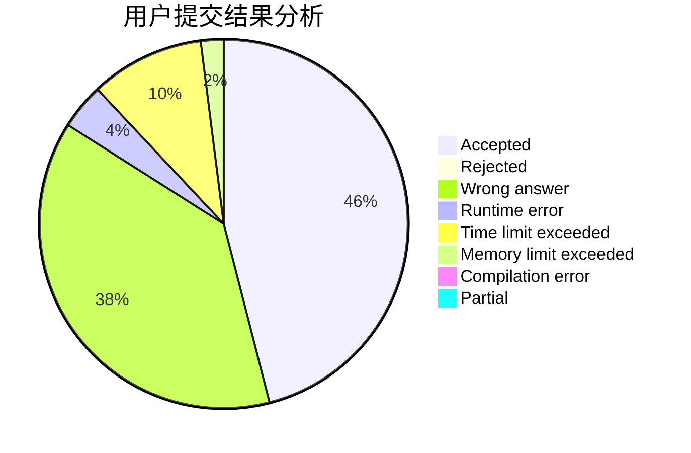
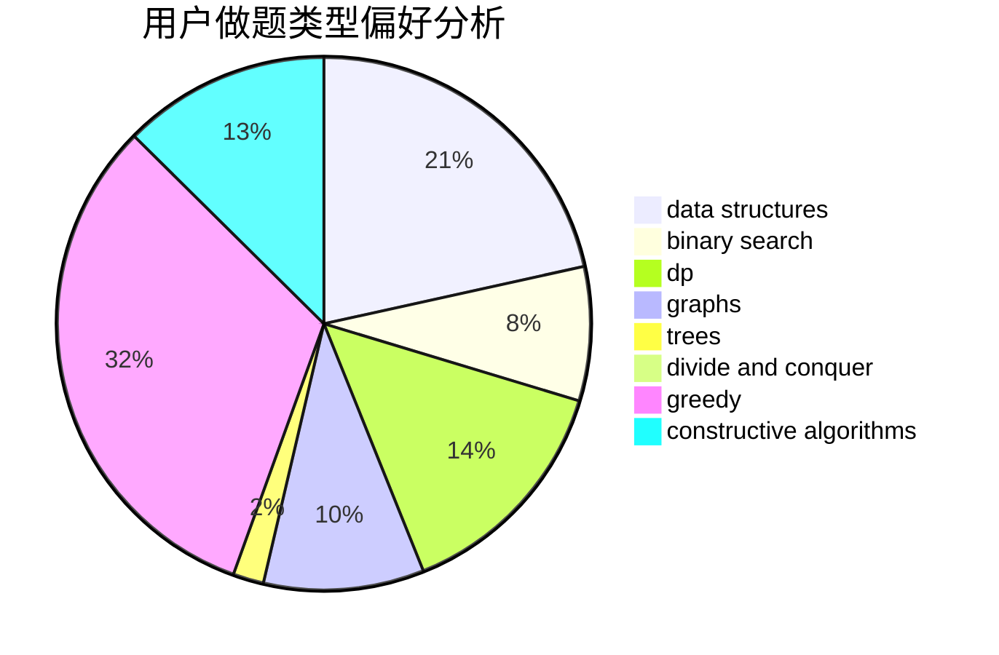
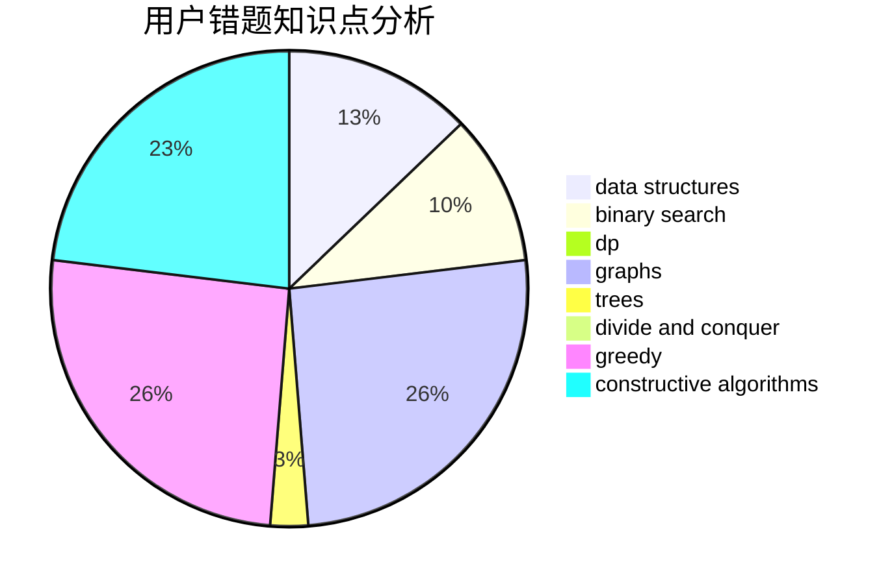

# GG_LC

<!-- tabs:start -->

#### **用户提交结果分析**

#### **用户做题类型偏好分析**

#### **用户错题知识点分析**

<!-- tabs:end -->
# 推荐题目
[893D](https://codeforces.com/contest/893/problem/D)		data structures,
                        dp,
                        greedy,
                        implementation		  
[831A](https://codeforces.com/contest/831/problem/A)		implementation		  
[1255D](https://codeforces.com/contest/1255/problem/D)		dsu,graphs,sortings,trees		  
[13762](https://codeforces.com/contest/1376/problem/2)		dsu,graphs,sortings,trees		  
[893E](https://codeforces.com/contest/893/problem/E)		combinatorics,
                        dp,
                        math,
                        number theory		  
[653C](https://codeforces.com/contest/653/problem/C)		brute force,
                        implementation		  
[329B](https://codeforces.com/contest/329/problem/B)		dfs and similar,
                        shortest paths		  
[11A](https://codeforces.com/contest/11/problem/A)		constructive algorithms,
                        implementation,
                        math		  
[44E](https://codeforces.com/contest/44/problem/E)		dp		  
[220E](https://codeforces.com/contest/220/problem/E)		data structures,
                        two pointers		  
