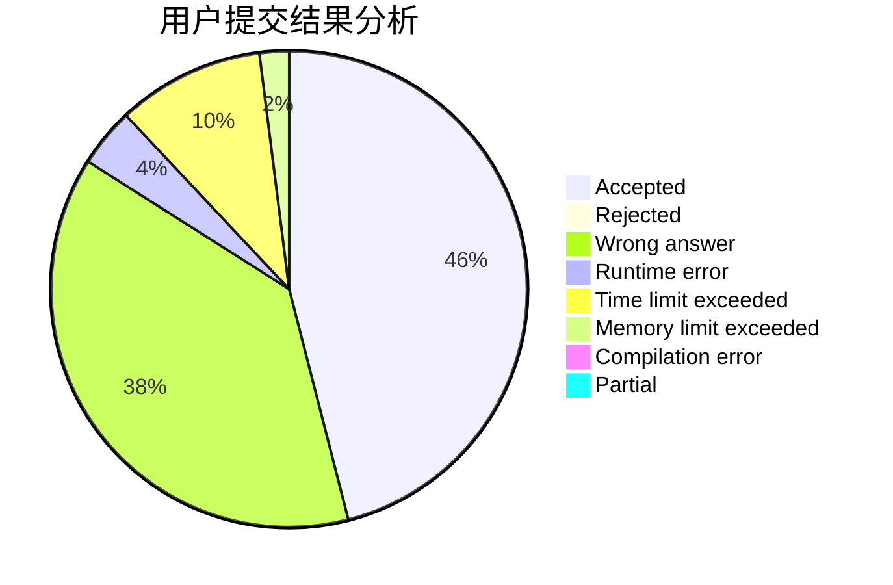
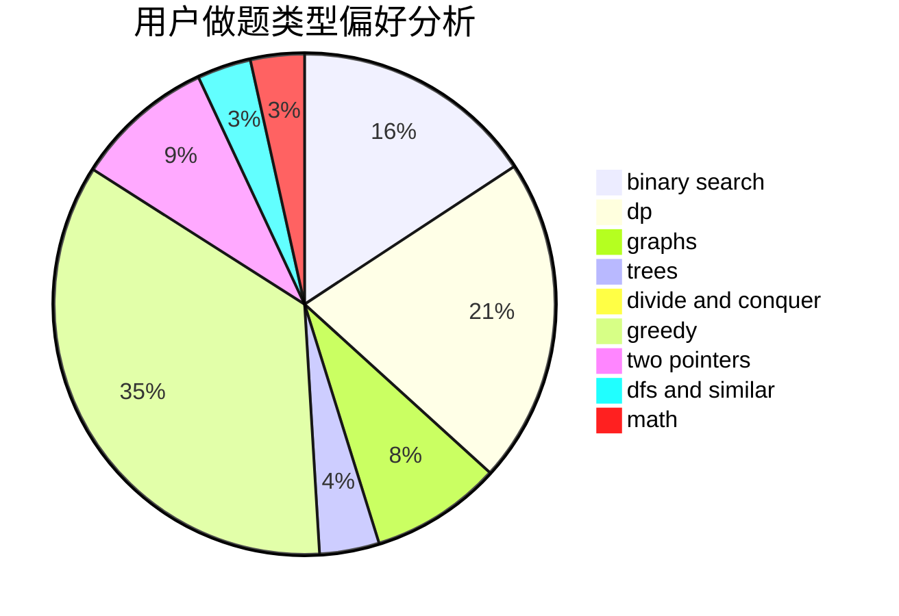

# GG_LC

<!-- tabs:start -->

#### **用户提交结果分析**

#### **用户做题类型偏好分析**

<!-- tabs:end -->
# 推荐题目
[893D](https://codeforces.com/contest/893/problem/D)
[831A](https://codeforces.com/contest/831/problem/A)
[1255D](https://codeforces.com/contest/1255/problem/D)
[13762](https://codeforces.com/contest/1376/problem/2)
[893E](https://codeforces.com/contest/893/problem/E)
[653C](https://codeforces.com/contest/653/problem/C)
[329B](https://codeforces.com/contest/329/problem/B)
[11A](https://codeforces.com/contest/11/problem/A)
[44E](https://codeforces.com/contest/44/problem/E)
[220E](https://codeforces.com/contest/220/problem/E)
