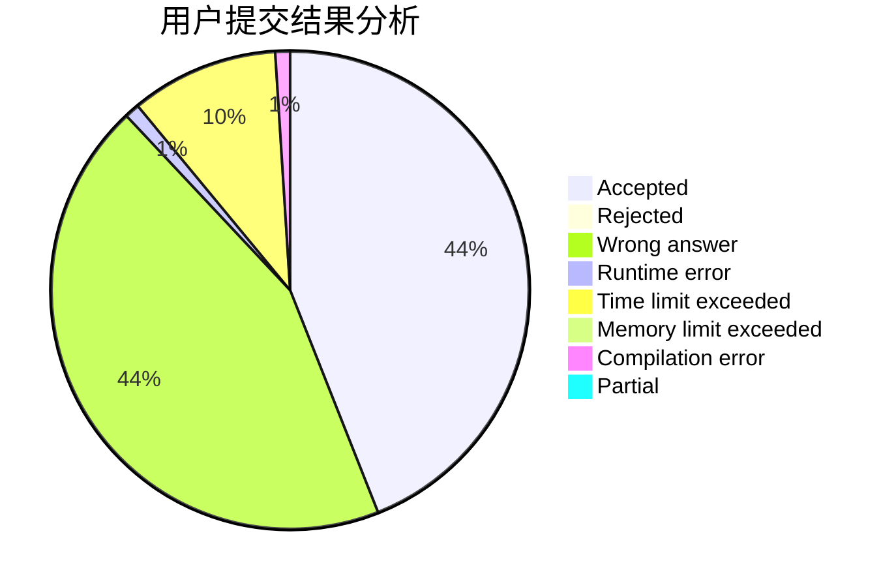
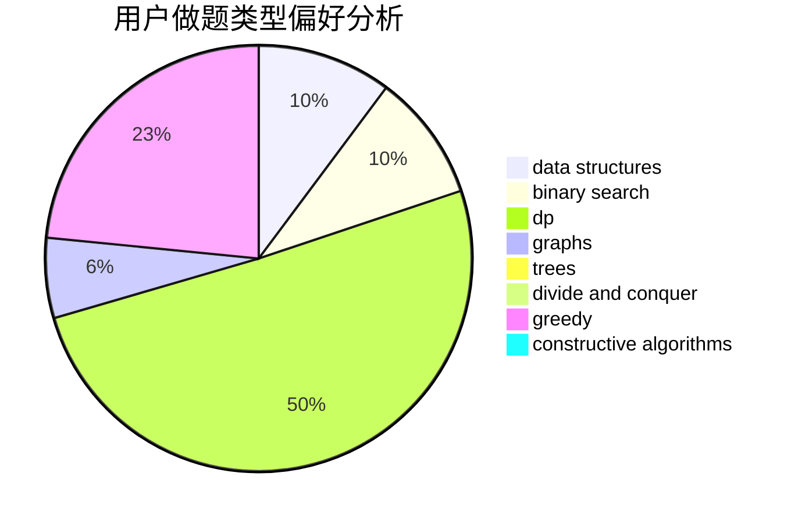
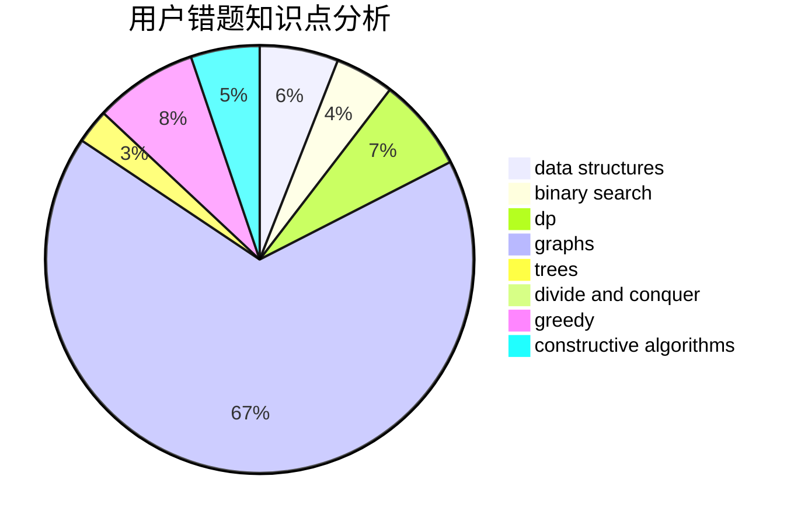

# GIFBMP

<!-- tabs:start -->

#### **用户提交结果分析**

#### **用户做题类型偏好分析**

#### **用户错题知识点分析**

<!-- tabs:end -->
# 推荐题目
[1304C](https://codeforces.com/contest/1304/problem/C)		dp,
                        greedy,
                        implementation,
                        sortings,
                        two pointers		  
[872B](https://codeforces.com/contest/872/problem/B)		dsu,graphs,sortings,trees		  
[446E](https://codeforces.com/contest/446/problem/E)		math,
                        matrices		  
[1268A](https://codeforces.com/contest/1268/problem/A)		constructive algorithms,
                        greedy,
                        implementation,
                        strings		  
[498E](https://codeforces.com/contest/498/problem/E)		dp,
                        matrices		  
[591D](https://codeforces.com/contest/591/problem/D)		dsu,graphs,sortings,trees		  
[1083B](https://codeforces.com/contest/1083/problem/B)		greedy,
                        strings		  
[717I](https://codeforces.com/contest/717/problem/I)		geometry		  
[1013C](https://codeforces.com/contest/1013/problem/C)		dsu,graphs,sortings,trees		  
[203B](https://codeforces.com/contest/203/problem/B)		brute force,
                        implementation		  
