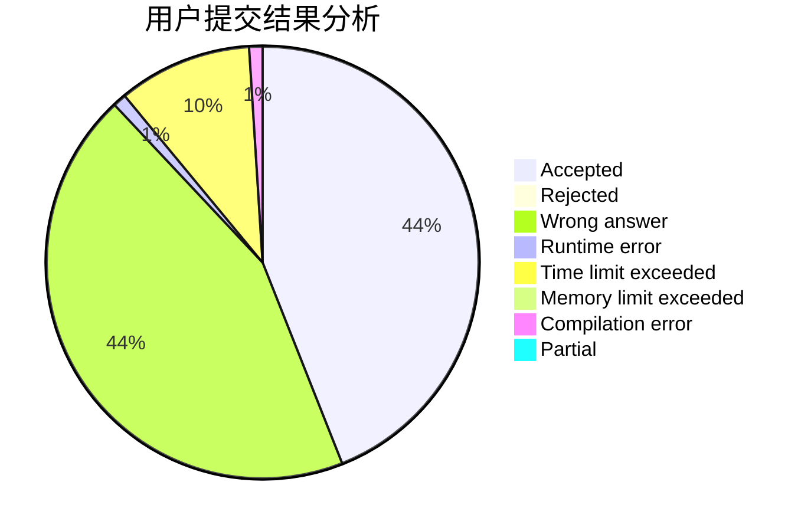
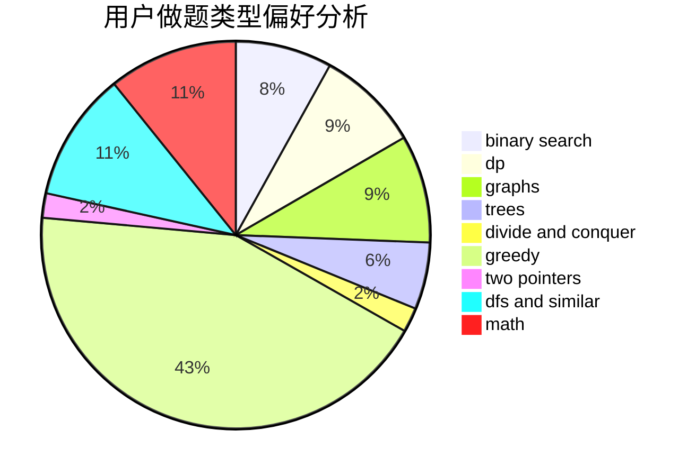

# GIFBMP

<!-- tabs:start -->

#### **用户提交结果分析**

#### **用户做题类型偏好分析**

<!-- tabs:end -->
# 推荐题目
[13131](https://codeforces.com/contest/1313/problem/1)
[893D](https://codeforces.com/contest/893/problem/D)
[467A](https://codeforces.com/contest/467/problem/A)
[1277B](https://codeforces.com/contest/1277/problem/B)
[519E](https://codeforces.com/contest/519/problem/E)
[611B](https://codeforces.com/contest/611/problem/B)
[1083E](https://codeforces.com/contest/1083/problem/E)
[735C](https://codeforces.com/contest/735/problem/C)
[10151](https://codeforces.com/contest/1015/problem/1)
[227A](https://codeforces.com/contest/227/problem/A)
