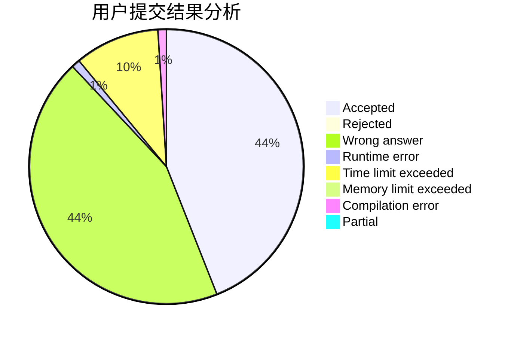
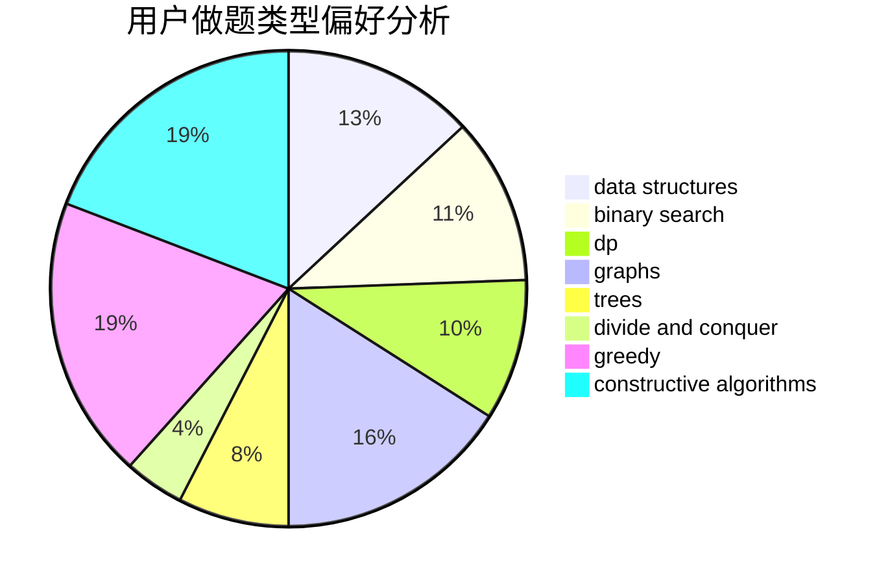
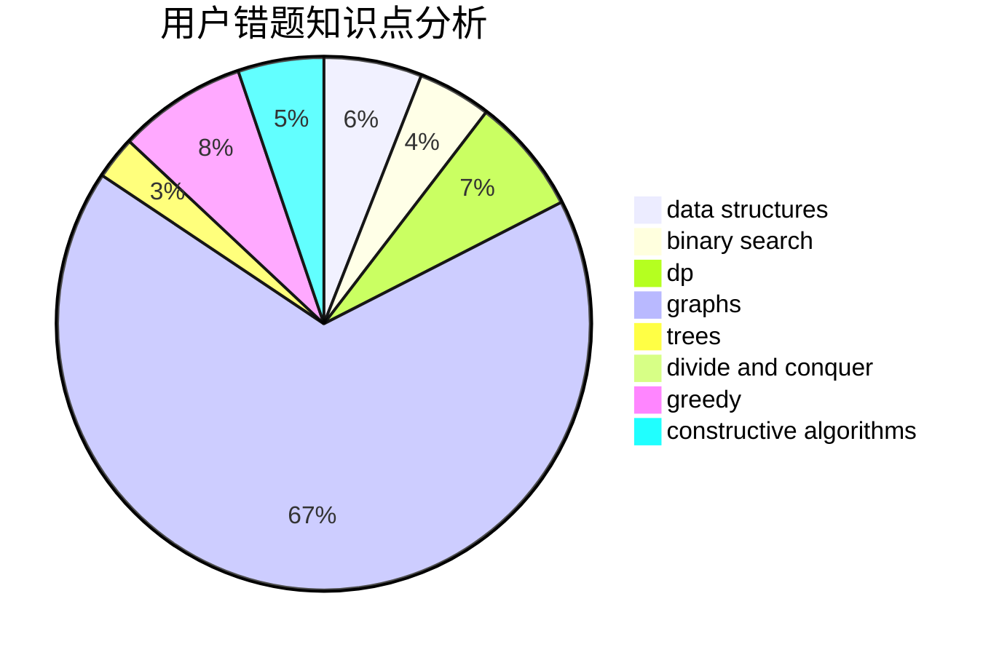

# GIFBMP

<!-- tabs:start -->

#### **用户提交结果分析**

#### **用户做题类型偏好分析**

#### **用户错题知识点分析**

<!-- tabs:end -->
# 推荐题目
[13131](https://codeforces.com/contest/1313/problem/1)		dsu,graphs,sortings,trees		  
[893D](https://codeforces.com/contest/893/problem/D)		data structures,
                        dp,
                        greedy,
                        implementation		  
[467A](https://codeforces.com/contest/467/problem/A)		implementation		  
[1277B](https://codeforces.com/contest/1277/problem/B)		greedy,
                        number theory		  
[519E](https://codeforces.com/contest/519/problem/E)		binary search,
                        data structures,
                        dfs and similar,
                        dp,
                        trees		  
[611B](https://codeforces.com/contest/611/problem/B)		bitmasks,
                        brute force,
                        implementation		  
[1083E](https://codeforces.com/contest/1083/problem/E)		data structures,
                        dp,
                        geometry		  
[735C](https://codeforces.com/contest/735/problem/C)		combinatorics,
                        constructive algorithms,
                        greedy,
                        math		  
[10151](https://codeforces.com/contest/1015/problem/1)		dsu,graphs,sortings,trees		  
[227A](https://codeforces.com/contest/227/problem/A)		geometry		  
