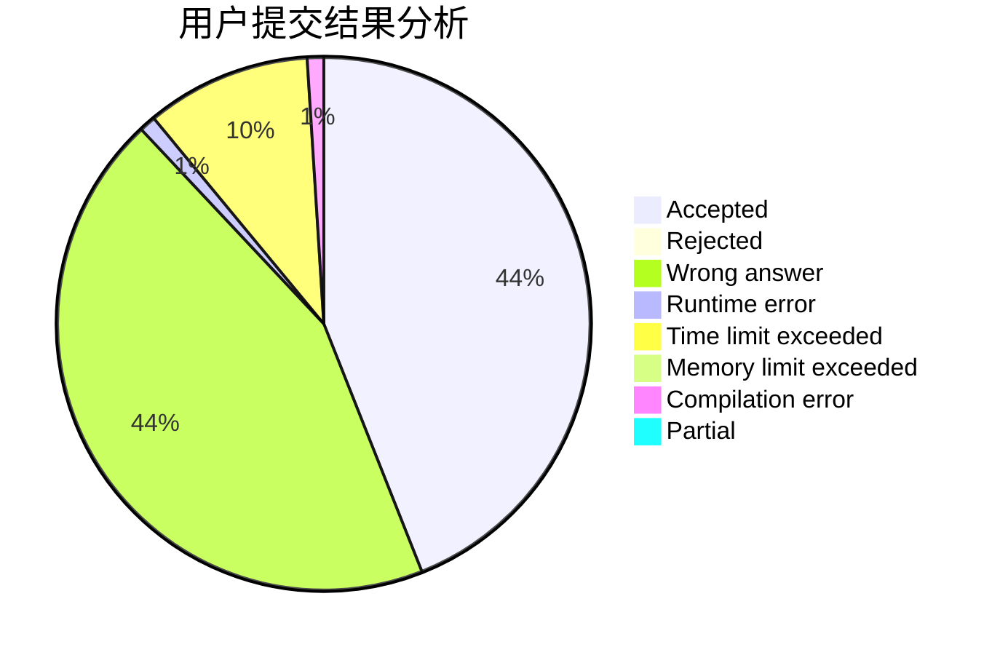
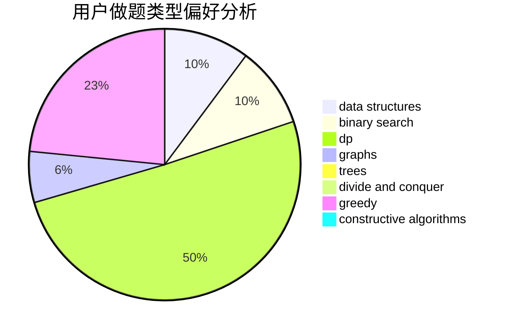
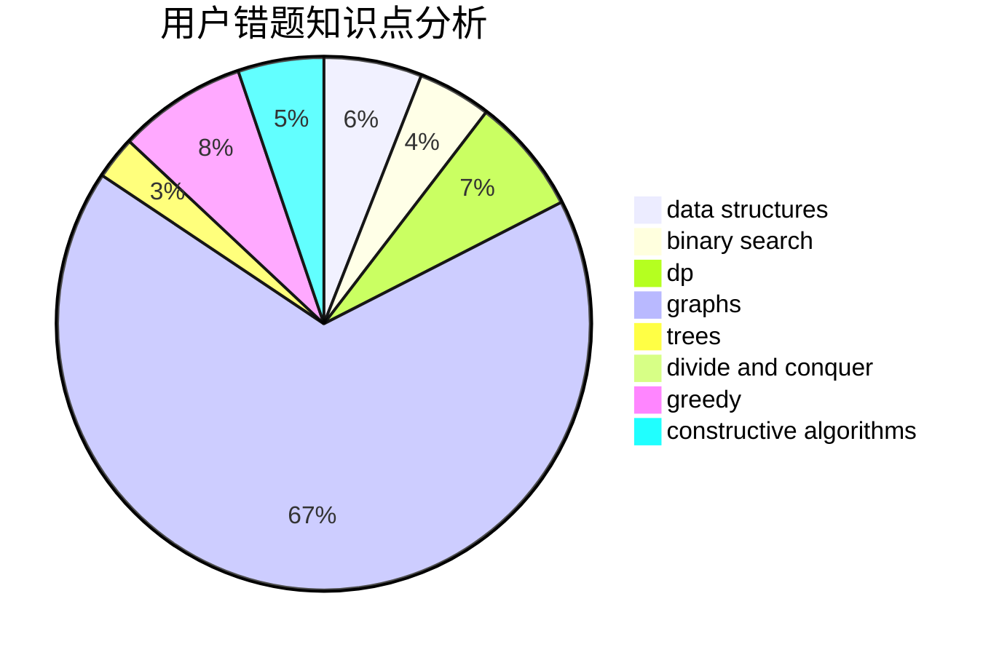

# GIFBMP
<!-- tabs:start -->
#### **用户提交结果分析**

#### **用户做题类型偏好分析**

#### **用户错题知识点分析**

<!-- tabs:end -->
# 推荐题目
[Air Conditioner](http://codeforces.com/problemset/problem/1304/C)		dp,
                        greedy,
                        implementation,
                        sortings,
                        two pointers		  
[DZY Loves Bridges](http://codeforces.com/problemset/problem/446/E)		math,
                        matrices		  
[Partial Teacher](http://codeforces.com/problemset/problem/67/A)		dp,
                        graphs,
                        greedy,
                        implementation		  
[Chip 'n Dale Rescue Rangers](https://codeforces.com/contest/591/problem/D)		binary search,
                        geometry,
                        math		  
[Photo of The Sky](https://codeforces.com/contest/1013/problem/C)		brute force,
                        implementation,
                        math,
                        sortings		  
[Nauuo and Pictures (hard version)](https://codeforces.com/contest/1173/problem/E2)		dp,
                        probabilities		  
[Merge Sort](http://codeforces.com/problemset/problem/873/D)		constructive algorithms,
                        divide and conquer		  
[Arrangement](http://codeforces.com/problemset/problem/107/C)		bitmasks,
                        dp		  
[Maximum of Maximums of Minimums](https://codeforces.com/contest/872/problem/B)		greedy		  
[Find a Gift](http://codeforces.com/problemset/problem/1354/G)		binary search,
                        interactive,
                        probabilities		  
<!-- tabs:start -->
#### **data structures**
[Moonwalk challenge](http://codeforces.com/problemset/problem/1045/J)		data structures,
                        strings,
                        trees		  
[Thor](https://codeforces.com/contest/705/problem/C)		brute force,
                        data structures,
                        implementation		  
[Irreducible Anagrams](https://codeforces.com/contest/1291/problem/D)		binary search,
                        constructive algorithms,
                        data structures,
                        strings,
                        two pointers		  
[Applejack and Storages](http://codeforces.com/problemset/problem/1393/B)		constructive algorithms,
                        data structures,
                        greedy,
                        implementation		  
[Subset Sums](http://codeforces.com/problemset/problem/348/C)		brute force,
                        data structures		  
[Maximum width](http://codeforces.com/problemset/problem/1492/C)		binary search,
                        data structures,
                        dp,
                        greedy,
                        two pointers		  
[Old Floppy Drive](http://codeforces.com/problemset/problem/1490/G)		binary search,
                        data structures,
                        math		  
[Odd Mineral Resource](http://codeforces.com/problemset/problem/1479/D)		binary search,
                        bitmasks,
                        brute force,
                        data structures,
                        probabilities,
                        trees		  
[Meximization](http://codeforces.com/problemset/problem/1497/A)		brute force,
                        data structures,
                        greedy,
                        sortings		  
[Pekora and Trampoline](http://codeforces.com/problemset/problem/1491/C)		brute force,
                        data structures,
                        dp,
                        greedy,
                        implementation		  
#### **binary search**
[Chip 'n Dale Rescue Rangers](https://codeforces.com/contest/591/problem/D)		binary search,
                        geometry,
                        math		  
[Find a Gift](http://codeforces.com/problemset/problem/1354/G)		binary search,
                        interactive,
                        probabilities		  
[Peter and Snow Blower](http://codeforces.com/problemset/problem/613/A)		binary search,
                        geometry,
                        ternary search		  
[Classical?](http://codeforces.com/problemset/problem/1285/F)		binary search,
                        combinatorics,
                        number theory		  
[Mr. Kitayuta vs. Bamboos](http://codeforces.com/problemset/problem/505/E)		binary search,
                        greedy		  
[Irreducible Anagrams](https://codeforces.com/contest/1291/problem/D)		binary search,
                        constructive algorithms,
                        data structures,
                        strings,
                        two pointers		  
[Serval and Snake](http://codeforces.com/problemset/problem/1153/E)		binary search,
                        brute force,
                        interactive		  
[Maximum width](http://codeforces.com/problemset/problem/1492/C)		binary search,
                        data structures,
                        dp,
                        greedy,
                        two pointers		  
[Pairs](http://codeforces.com/problemset/problem/1463/D)		binary search,
                        constructive algorithms,
                        greedy,
                        two pointers		  
[Old Floppy Drive](http://codeforces.com/problemset/problem/1490/G)		binary search,
                        data structures,
                        math		  
#### **dp**
[Air Conditioner](http://codeforces.com/problemset/problem/1304/C)		dp,
                        greedy,
                        implementation,
                        sortings,
                        two pointers		  
[Partial Teacher](http://codeforces.com/problemset/problem/67/A)		dp,
                        graphs,
                        greedy,
                        implementation		  
[Nauuo and Pictures (hard version)](https://codeforces.com/contest/1173/problem/E2)		dp,
                        probabilities		  
[Arrangement](http://codeforces.com/problemset/problem/107/C)		bitmasks,
                        dp		  
[Stairs and Lines](http://codeforces.com/problemset/problem/498/E)		dp,
                        matrices		  
[Double Elimination](https://codeforces.com/contest/1314/problem/B)		dp,
                        implementation		  
[Daniel and Spring Cleaning](http://codeforces.com/problemset/problem/1245/F)		bitmasks,
                        brute force,
                        combinatorics,
                        dp		  
[Reberland Linguistics](http://codeforces.com/problemset/problem/666/A)		dp,
                        implementation,
                        strings		  
[Red and Blue](http://codeforces.com/problemset/problem/1469/B)		dp,
                        greedy		  
[Nauuo and Circle](https://codeforces.com/contest/1173/problem/D)		combinatorics,
                        dfs and similar,
                        dp,
                        trees		  
#### **graph**
[Partial Teacher](http://codeforces.com/problemset/problem/67/A)		dp,
                        graphs,
                        greedy,
                        implementation		  
[Nash Matrix](http://codeforces.com/problemset/problem/1316/D)		constructive algorithms,
                        dfs and similar,
                        graphs,
                        implementation		  
[Catowice City](http://codeforces.com/problemset/problem/1239/D)		2-sat,
                        dfs and similar,
                        graph matchings,
                        graphs		  
[Minimum Ties](http://codeforces.com/problemset/problem/1487/C)		brute force,
                        constructive algorithms,
                        dfs and similar,
                        graphs,
                        greedy,
                        implementation,
                        math		  
[Chef Monocarp](http://codeforces.com/problemset/problem/1437/C)		dp,
                        flows,
                        graph matchings,
                        greedy,
                        math,
                        sortings		  
[Strange Housing](http://codeforces.com/problemset/problem/1470/D)		constructive algorithms,
                        dfs and similar,
                        graph matchings,
                        graphs,
                        greedy		  
[Longest Simple Cycle](http://codeforces.com/problemset/problem/1476/C)		dp,
                        graphs,
                        greedy		  
[Shortest and Longest LIS](http://codeforces.com/problemset/problem/1304/D)		constructive algorithms,
                        graphs,
                        greedy,
                        two pointers		  
[Ball in Berland](http://codeforces.com/problemset/problem/1475/C)		combinatorics,
                        graphs,
                        math		  
[Kyoya and Train](http://codeforces.com/problemset/problem/553/E)		dp,
                        fft,
                        graphs,
                        math,
                        probabilities		  
#### **trees**
[Moonwalk challenge](http://codeforces.com/problemset/problem/1045/J)		data structures,
                        strings,
                        trees		  
[Nauuo and Circle](https://codeforces.com/contest/1173/problem/D)		combinatorics,
                        dfs and similar,
                        dp,
                        trees		  
[Fib-tree](http://codeforces.com/problemset/problem/1491/E)		brute force,
                        dfs and similar,
                        divide and conquer,
                        number theory,
                        trees		  
[Odd Mineral Resource](http://codeforces.com/problemset/problem/1479/D)		binary search,
                        bitmasks,
                        brute force,
                        data structures,
                        probabilities,
                        trees		  
[Yet Another Card Deck](http://codeforces.com/problemset/problem/1511/C)		brute force,
                        data structures,
                        implementation,
                        trees		  
[Diameter Cuts](http://codeforces.com/problemset/problem/1499/F)		combinatorics,
                        dfs and similar,
                        dp,
                        trees		  
[13th Labour of Heracles](http://codeforces.com/problemset/problem/1466/D)		data structures,
                        greedy,
                        sortings,
                        trees		  
[BFS Trees](http://codeforces.com/problemset/problem/1495/D)		combinatorics,
                        dfs and similar,
                        graphs,
                        math,
                        shortest paths,
                        trees		  
[Sum of Prefix Sums](http://codeforces.com/problemset/problem/1303/G)		data structures,
                        divide and conquer,
                        geometry,
                        trees		  
[Number of Simple Paths](http://codeforces.com/problemset/problem/1454/E)		combinatorics,
                        dfs and similar,
                        graphs,
                        trees		  
#### **divide and conquer**
[Merge Sort](http://codeforces.com/problemset/problem/873/D)		constructive algorithms,
                        divide and conquer		  
[Fib-tree](http://codeforces.com/problemset/problem/1491/E)		brute force,
                        dfs and similar,
                        divide and conquer,
                        number theory,
                        trees		  
[Divide and Summarize](http://codeforces.com/problemset/problem/1461/D)		binary search,
                        brute force,
                        data structures,
                        divide and conquer,
                        implementation,
                        sortings		  
[Song of the Sirens](http://codeforces.com/problemset/problem/1466/G)		combinatorics,
                        divide and conquer,
                        hashing,
                        math,
                        string suffix structures,
                        strings		  
[Permutation Transformation](http://codeforces.com/problemset/problem/1490/D)		dfs and similar,
                        divide and conquer,
                        implementation		  
[Skyline Photo](https://codeforces.com/contest/1483/problem/C)		data structures,
                        divide and conquer,
                        dp		  
[Sum of Prefix Sums](http://codeforces.com/problemset/problem/1303/G)		data structures,
                        divide and conquer,
                        geometry,
                        trees		  
[Dogeforces](http://codeforces.com/problemset/problem/1494/D)		constructive algorithms,
                        data structures,
                        dfs and similar,
                        divide and conquer,
                        dsu,
                        greedy,
                        sortings,
                        trees		  
[Logistical Questions](http://codeforces.com/problemset/problem/566/C)		dfs and similar,
                        divide and conquer,
                        trees		  
[Fruit Sequences](http://codeforces.com/problemset/problem/1428/F)		binary search,
                        data structures,
                        divide and conquer,
                        dp,
                        two pointers		  
#### **greedy**
[Air Conditioner](http://codeforces.com/problemset/problem/1304/C)		dp,
                        greedy,
                        implementation,
                        sortings,
                        two pointers		  
[Partial Teacher](http://codeforces.com/problemset/problem/67/A)		dp,
                        graphs,
                        greedy,
                        implementation		  
[Maximum of Maximums of Minimums](https://codeforces.com/contest/872/problem/B)		greedy		  
[The Fair Nut and Strings](http://codeforces.com/problemset/problem/1083/B)		greedy,
                        strings		  
[Game with Telephone Numbers](http://codeforces.com/problemset/problem/1155/B)		games,
                        greedy,
                        implementation		  
[Strange Game On Matrix](http://codeforces.com/problemset/problem/873/C)		greedy,
                        two pointers		  
[Red and Blue](http://codeforces.com/problemset/problem/1469/B)		dp,
                        greedy		  
[Mr. Kitayuta vs. Bamboos](http://codeforces.com/problemset/problem/505/E)		binary search,
                        greedy		  
[Long Beautiful Integer](http://codeforces.com/problemset/problem/1268/A)		constructive algorithms,
                        greedy,
                        implementation,
                        strings		  
[Applejack and Storages](http://codeforces.com/problemset/problem/1393/B)		constructive algorithms,
                        data structures,
                        greedy,
                        implementation		  
#### **constructive algorithms**
[Merge Sort](http://codeforces.com/problemset/problem/873/D)		constructive algorithms,
                        divide and conquer		  
[Dasha and Chess](http://codeforces.com/problemset/problem/1100/D)		constructive algorithms,
                        games,
                        interactive		  
[Nash Matrix](http://codeforces.com/problemset/problem/1316/D)		constructive algorithms,
                        dfs and similar,
                        graphs,
                        implementation		  
[Long Beautiful Integer](http://codeforces.com/problemset/problem/1268/A)		constructive algorithms,
                        greedy,
                        implementation,
                        strings		  
[Irreducible Anagrams](https://codeforces.com/contest/1291/problem/D)		binary search,
                        constructive algorithms,
                        data structures,
                        strings,
                        two pointers		  
[Applejack and Storages](http://codeforces.com/problemset/problem/1393/B)		constructive algorithms,
                        data structures,
                        greedy,
                        implementation		  
[Anti-knapsack](http://codeforces.com/problemset/problem/1493/A)		constructive algorithms,
                        greedy		  
[Pairs](http://codeforces.com/problemset/problem/1463/D)		binary search,
                        constructive algorithms,
                        greedy,
                        two pointers		  
[XOR-gun](https://codeforces.com/contest/1456/problem/B)		bitmasks,
                        brute force,
                        constructive algorithms		  
[Genius's Gambit](http://codeforces.com/problemset/problem/1492/D)		bitmasks,
                        constructive algorithms,
                        greedy,
                        math		  
#### **sortings**
[Air Conditioner](http://codeforces.com/problemset/problem/1304/C)		dp,
                        greedy,
                        implementation,
                        sortings,
                        two pointers		  
[Photo of The Sky](https://codeforces.com/contest/1013/problem/C)		brute force,
                        implementation,
                        math,
                        sortings		  
[Diamond Miner](https://codeforces.com/contest/1496/problem/C)		geometry,
                        greedy,
                        math,
                        sortings		  
[Meximization](http://codeforces.com/problemset/problem/1497/A)		brute force,
                        data structures,
                        greedy,
                        sortings		  
[Avoiding Zero](http://codeforces.com/problemset/problem/1427/A)		math,
                        sortings		  
[Divide and Summarize](http://codeforces.com/problemset/problem/1461/D)		binary search,
                        brute force,
                        data structures,
                        divide and conquer,
                        implementation,
                        sortings		  
[Chef Monocarp](http://codeforces.com/problemset/problem/1437/C)		dp,
                        flows,
                        graph matchings,
                        greedy,
                        math,
                        sortings		  
[Replacing Elements](http://codeforces.com/problemset/problem/1473/A)		greedy,
                        implementation,
                        math,
                        sortings		  
[Eastern Exhibition](http://codeforces.com/problemset/problem/1486/B)		binary search,
                        geometry,
                        shortest paths,
                        sortings		  
[The Great Hero](http://codeforces.com/problemset/problem/1480/B)		greedy,
                        implementation,
                        sortings		  
<!-- tabs:end -->
