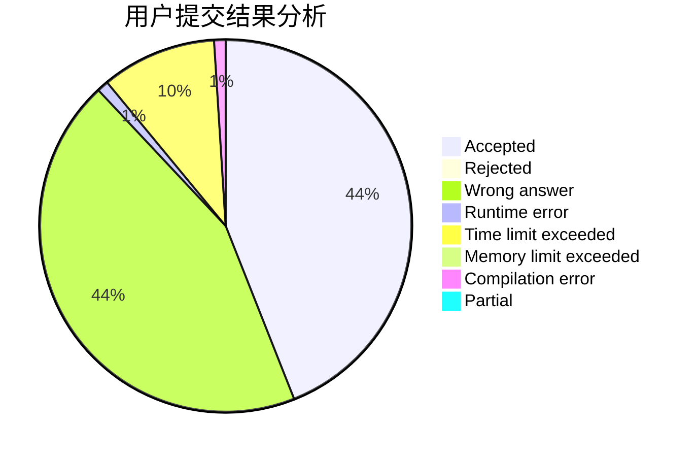
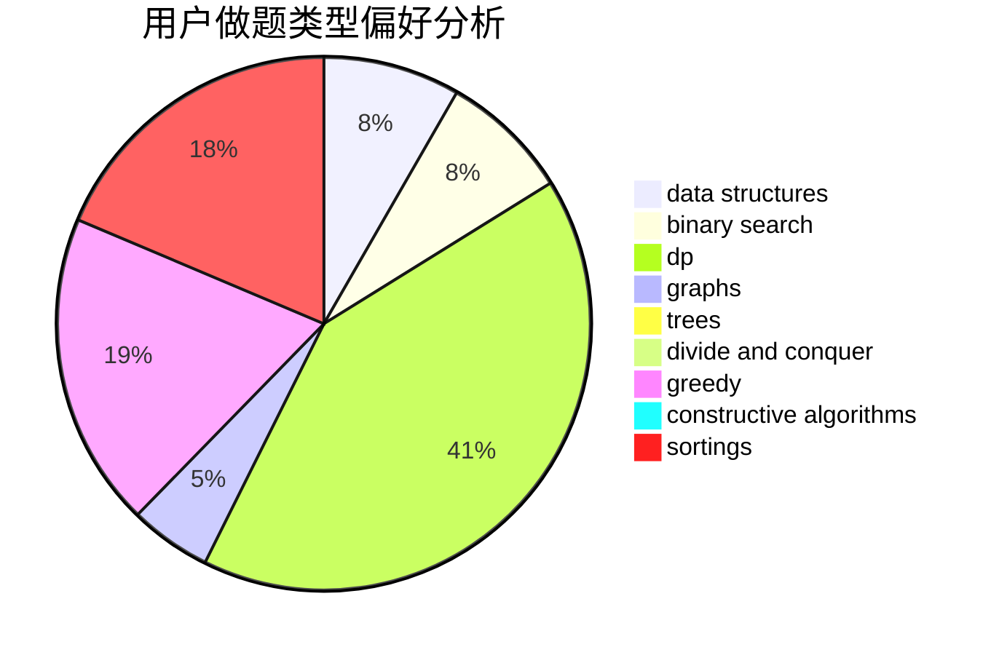
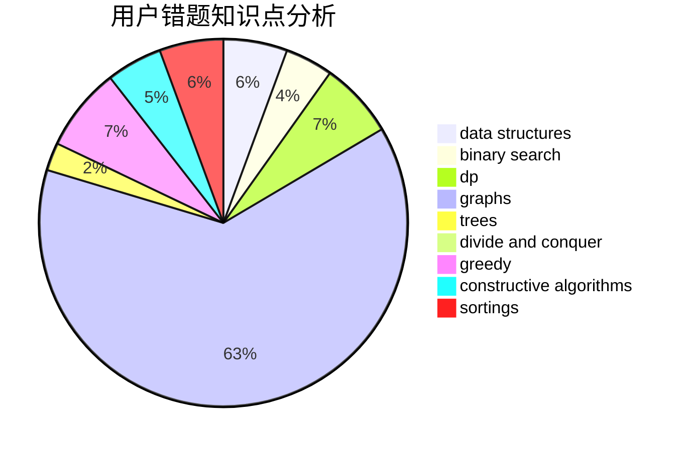

# GIFBMP
<!-- tabs:start -->
#### **用户提交结果分析**

#### **用户做题类型偏好分析**

#### **用户错题知识点分析**

<!-- tabs:end -->
# 推荐题目
[1304C](http://codeforces.com/problemset/problem/1304/C)		dp,
                        greedy,
                        implementation,
                        sortings,
                        two pointers		  
[446E](http://codeforces.com/problemset/problem/446/E)		math,
                        matrices		  
[67A](http://codeforces.com/problemset/problem/67/A)		dp,
                        graphs,
                        greedy,
                        implementation		  
[591D](https://codeforces.com/contest/591/problem/D)		binary search,
                        geometry,
                        math		  
[1013C](https://codeforces.com/contest/1013/problem/C)		brute force,
                        implementation,
                        math,
                        sortings		  
[1173E2](https://codeforces.com/contest/1173/problem/E2)		dp,
                        probabilities		  
[873D](http://codeforces.com/problemset/problem/873/D)		constructive algorithms,
                        divide and conquer		  
[107C](http://codeforces.com/problemset/problem/107/C)		bitmasks,
                        dp		  
[872B](https://codeforces.com/contest/872/problem/B)		greedy		  
[1354G](http://codeforces.com/problemset/problem/1354/G)		binary search,
                        interactive,
                        probabilities		  
<!-- tabs:start -->
#### **data structures**
[1045J](http://codeforces.com/problemset/problem/1045/J)		data structures,
                        strings,
                        trees		  
[705C](https://codeforces.com/contest/705/problem/C)		brute force,
                        data structures,
                        implementation		  
[1291D](https://codeforces.com/contest/1291/problem/D)		binary search,
                        constructive algorithms,
                        data structures,
                        strings,
                        two pointers		  
[1393B](http://codeforces.com/problemset/problem/1393/B)		constructive algorithms,
                        data structures,
                        greedy,
                        implementation		  
[348C](http://codeforces.com/problemset/problem/348/C)		brute force,
                        data structures		  
[1492C](http://codeforces.com/problemset/problem/1492/C)		binary search,
                        data structures,
                        dp,
                        greedy,
                        two pointers		  
[1490G](http://codeforces.com/problemset/problem/1490/G)		binary search,
                        data structures,
                        math		  
[1479D](http://codeforces.com/problemset/problem/1479/D)		binary search,
                        bitmasks,
                        brute force,
                        data structures,
                        probabilities,
                        trees		  
[1497A](http://codeforces.com/problemset/problem/1497/A)		brute force,
                        data structures,
                        greedy,
                        sortings		  
[1491C](http://codeforces.com/problemset/problem/1491/C)		brute force,
                        data structures,
                        dp,
                        greedy,
                        implementation		  
#### **binary search**
[591D](https://codeforces.com/contest/591/problem/D)		binary search,
                        geometry,
                        math		  
[1354G](http://codeforces.com/problemset/problem/1354/G)		binary search,
                        interactive,
                        probabilities		  
[613A](http://codeforces.com/problemset/problem/613/A)		binary search,
                        geometry,
                        ternary search		  
[1285F](http://codeforces.com/problemset/problem/1285/F)		binary search,
                        combinatorics,
                        number theory		  
[505E](http://codeforces.com/problemset/problem/505/E)		binary search,
                        greedy		  
[1291D](https://codeforces.com/contest/1291/problem/D)		binary search,
                        constructive algorithms,
                        data structures,
                        strings,
                        two pointers		  
[1153E](http://codeforces.com/problemset/problem/1153/E)		binary search,
                        brute force,
                        interactive		  
[1492C](http://codeforces.com/problemset/problem/1492/C)		binary search,
                        data structures,
                        dp,
                        greedy,
                        two pointers		  
[1463D](http://codeforces.com/problemset/problem/1463/D)		binary search,
                        constructive algorithms,
                        greedy,
                        two pointers		  
[1490G](http://codeforces.com/problemset/problem/1490/G)		binary search,
                        data structures,
                        math		  
#### **dp**
[1304C](http://codeforces.com/problemset/problem/1304/C)		dp,
                        greedy,
                        implementation,
                        sortings,
                        two pointers		  
[67A](http://codeforces.com/problemset/problem/67/A)		dp,
                        graphs,
                        greedy,
                        implementation		  
[1173E2](https://codeforces.com/contest/1173/problem/E2)		dp,
                        probabilities		  
[107C](http://codeforces.com/problemset/problem/107/C)		bitmasks,
                        dp		  
[498E](http://codeforces.com/problemset/problem/498/E)		dp,
                        matrices		  
[1314B](https://codeforces.com/contest/1314/problem/B)		dp,
                        implementation		  
[1245F](http://codeforces.com/problemset/problem/1245/F)		bitmasks,
                        brute force,
                        combinatorics,
                        dp		  
[666A](http://codeforces.com/problemset/problem/666/A)		dp,
                        implementation,
                        strings		  
[1469B](http://codeforces.com/problemset/problem/1469/B)		dp,
                        greedy		  
[1173D](https://codeforces.com/contest/1173/problem/D)		combinatorics,
                        dfs and similar,
                        dp,
                        trees		  
#### **graph**
[67A](http://codeforces.com/problemset/problem/67/A)		dp,
                        graphs,
                        greedy,
                        implementation		  
[1316D](http://codeforces.com/problemset/problem/1316/D)		constructive algorithms,
                        dfs and similar,
                        graphs,
                        implementation		  
[1239D](http://codeforces.com/problemset/problem/1239/D)		2-sat,
                        dfs and similar,
                        graph matchings,
                        graphs		  
[1487C](http://codeforces.com/problemset/problem/1487/C)		brute force,
                        constructive algorithms,
                        dfs and similar,
                        graphs,
                        greedy,
                        implementation,
                        math		  
[1437C](http://codeforces.com/problemset/problem/1437/C)		dp,
                        flows,
                        graph matchings,
                        greedy,
                        math,
                        sortings		  
[1470D](http://codeforces.com/problemset/problem/1470/D)		constructive algorithms,
                        dfs and similar,
                        graph matchings,
                        graphs,
                        greedy		  
[1476C](http://codeforces.com/problemset/problem/1476/C)		dp,
                        graphs,
                        greedy		  
[1304D](http://codeforces.com/problemset/problem/1304/D)		constructive algorithms,
                        graphs,
                        greedy,
                        two pointers		  
[1475C](http://codeforces.com/problemset/problem/1475/C)		combinatorics,
                        graphs,
                        math		  
[553E](http://codeforces.com/problemset/problem/553/E)		dp,
                        fft,
                        graphs,
                        math,
                        probabilities		  
#### **trees**
[1045J](http://codeforces.com/problemset/problem/1045/J)		data structures,
                        strings,
                        trees		  
[1173D](https://codeforces.com/contest/1173/problem/D)		combinatorics,
                        dfs and similar,
                        dp,
                        trees		  
[1491E](http://codeforces.com/problemset/problem/1491/E)		brute force,
                        dfs and similar,
                        divide and conquer,
                        number theory,
                        trees		  
[1479D](http://codeforces.com/problemset/problem/1479/D)		binary search,
                        bitmasks,
                        brute force,
                        data structures,
                        probabilities,
                        trees		  
[1511C](http://codeforces.com/problemset/problem/1511/C)		brute force,
                        data structures,
                        implementation,
                        trees		  
[1499F](http://codeforces.com/problemset/problem/1499/F)		combinatorics,
                        dfs and similar,
                        dp,
                        trees		  
[1491E](http://codeforces.com/problemset/problem/1491/E)		brute force,
                        dfs and similar,
                        divide and conquer,
                        number theory,
                        trees		  
[1466D](http://codeforces.com/problemset/problem/1466/D)		data structures,
                        greedy,
                        sortings,
                        trees		  
[1495D](http://codeforces.com/problemset/problem/1495/D)		combinatorics,
                        dfs and similar,
                        graphs,
                        math,
                        shortest paths,
                        trees		  
[1303G](http://codeforces.com/problemset/problem/1303/G)		data structures,
                        divide and conquer,
                        geometry,
                        trees		  
#### **divide and conquer**
[873D](http://codeforces.com/problemset/problem/873/D)		constructive algorithms,
                        divide and conquer		  
[1491E](http://codeforces.com/problemset/problem/1491/E)		brute force,
                        dfs and similar,
                        divide and conquer,
                        number theory,
                        trees		  
[1461D](http://codeforces.com/problemset/problem/1461/D)		binary search,
                        brute force,
                        data structures,
                        divide and conquer,
                        implementation,
                        sortings		  
[1466G](http://codeforces.com/problemset/problem/1466/G)		combinatorics,
                        divide and conquer,
                        hashing,
                        math,
                        string suffix structures,
                        strings		  
[1490D](http://codeforces.com/problemset/problem/1490/D)		dfs and similar,
                        divide and conquer,
                        implementation		  
[1483C](https://codeforces.com/contest/1483/problem/C)		data structures,
                        divide and conquer,
                        dp		  
[1491E](http://codeforces.com/problemset/problem/1491/E)		brute force,
                        dfs and similar,
                        divide and conquer,
                        number theory,
                        trees		  
[1303G](http://codeforces.com/problemset/problem/1303/G)		data structures,
                        divide and conquer,
                        geometry,
                        trees		  
[1494D](http://codeforces.com/problemset/problem/1494/D)		constructive algorithms,
                        data structures,
                        dfs and similar,
                        divide and conquer,
                        dsu,
                        greedy,
                        sortings,
                        trees		  
[1482E](http://codeforces.com/problemset/problem/1482/E)		data structures,
                        divide and conquer,
                        dp		  
#### **greedy**
[1304C](http://codeforces.com/problemset/problem/1304/C)		dp,
                        greedy,
                        implementation,
                        sortings,
                        two pointers		  
[67A](http://codeforces.com/problemset/problem/67/A)		dp,
                        graphs,
                        greedy,
                        implementation		  
[872B](https://codeforces.com/contest/872/problem/B)		greedy		  
[1083B](http://codeforces.com/problemset/problem/1083/B)		greedy,
                        strings		  
[1155B](http://codeforces.com/problemset/problem/1155/B)		games,
                        greedy,
                        implementation		  
[873C](http://codeforces.com/problemset/problem/873/C)		greedy,
                        two pointers		  
[1469B](http://codeforces.com/problemset/problem/1469/B)		dp,
                        greedy		  
[505E](http://codeforces.com/problemset/problem/505/E)		binary search,
                        greedy		  
[1268A](http://codeforces.com/problemset/problem/1268/A)		constructive algorithms,
                        greedy,
                        implementation,
                        strings		  
[1393B](http://codeforces.com/problemset/problem/1393/B)		constructive algorithms,
                        data structures,
                        greedy,
                        implementation		  
#### **constructive algorithms**
[873D](http://codeforces.com/problemset/problem/873/D)		constructive algorithms,
                        divide and conquer		  
[1100D](http://codeforces.com/problemset/problem/1100/D)		constructive algorithms,
                        games,
                        interactive		  
[1316D](http://codeforces.com/problemset/problem/1316/D)		constructive algorithms,
                        dfs and similar,
                        graphs,
                        implementation		  
[1268A](http://codeforces.com/problemset/problem/1268/A)		constructive algorithms,
                        greedy,
                        implementation,
                        strings		  
[1291D](https://codeforces.com/contest/1291/problem/D)		binary search,
                        constructive algorithms,
                        data structures,
                        strings,
                        two pointers		  
[1393B](http://codeforces.com/problemset/problem/1393/B)		constructive algorithms,
                        data structures,
                        greedy,
                        implementation		  
[1493A](http://codeforces.com/problemset/problem/1493/A)		constructive algorithms,
                        greedy		  
[1463D](http://codeforces.com/problemset/problem/1463/D)		binary search,
                        constructive algorithms,
                        greedy,
                        two pointers		  
[1456B](https://codeforces.com/contest/1456/problem/B)		bitmasks,
                        brute force,
                        constructive algorithms		  
[1492D](http://codeforces.com/problemset/problem/1492/D)		bitmasks,
                        constructive algorithms,
                        greedy,
                        math		  
#### **sortings**
[1304C](http://codeforces.com/problemset/problem/1304/C)		dp,
                        greedy,
                        implementation,
                        sortings,
                        two pointers		  
[1013C](https://codeforces.com/contest/1013/problem/C)		brute force,
                        implementation,
                        math,
                        sortings		  
[1496C](https://codeforces.com/contest/1496/problem/C)		geometry,
                        greedy,
                        math,
                        sortings		  
[1495A](http://codeforces.com/problemset/problem/1495/A)		geometry,
                        greedy,
                        math,
                        sortings		  
[1497A](http://codeforces.com/problemset/problem/1497/A)		brute force,
                        data structures,
                        greedy,
                        sortings		  
[1427A](http://codeforces.com/problemset/problem/1427/A)		math,
                        sortings		  
[1461D](http://codeforces.com/problemset/problem/1461/D)		binary search,
                        brute force,
                        data structures,
                        divide and conquer,
                        implementation,
                        sortings		  
[1437C](http://codeforces.com/problemset/problem/1437/C)		dp,
                        flows,
                        graph matchings,
                        greedy,
                        math,
                        sortings		  
[1473A](http://codeforces.com/problemset/problem/1473/A)		greedy,
                        implementation,
                        math,
                        sortings		  
[1486B](http://codeforces.com/problemset/problem/1486/B)		binary search,
                        geometry,
                        shortest paths,
                        sortings		  
<!-- tabs:end -->
