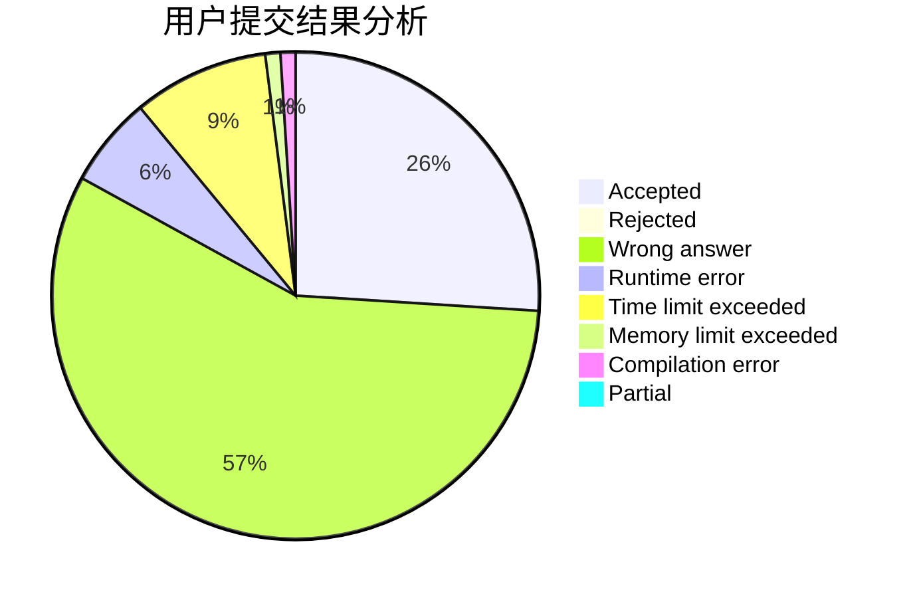
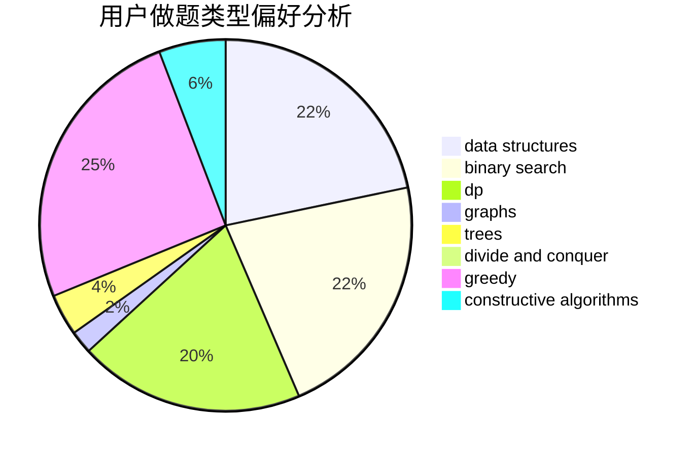
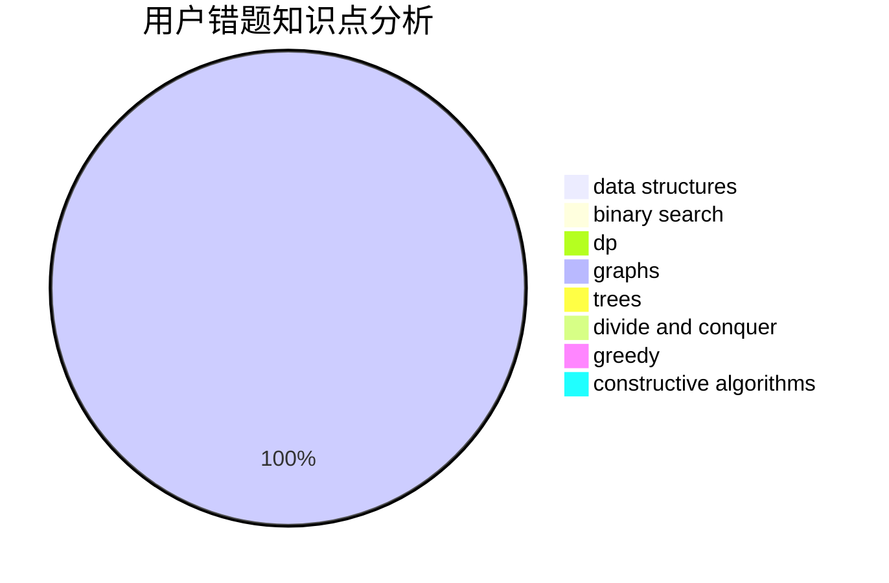

# GNAQ

<!-- tabs:start -->

#### **用户提交结果分析**

#### **用户做题类型偏好分析**

#### **用户错题知识点分析**

<!-- tabs:end -->
# 推荐题目
[257D](https://codeforces.com/contest/257/problem/D)		greedy,
                        math		  
[1066E](https://codeforces.com/contest/1066/problem/E)		data structures,
                        implementation,
                        math		  
[1474C](https://codeforces.com/contest/1474/problem/C)		brute force,
                        constructive algorithms,
                        data structures,
                        greedy,
                        implementation,
                        sortings		  
[1218C](https://codeforces.com/contest/1218/problem/C)		dp		  
[828B](https://codeforces.com/contest/828/problem/B)		implementation		  
[364D](https://codeforces.com/contest/364/problem/D)		brute force,
                        math,
                        probabilities		  
[1020C](https://codeforces.com/contest/1020/problem/C)		dsu,graphs,sortings,trees		  
[875B](https://codeforces.com/contest/875/problem/B)		dsu,
                        implementation,
                        sortings,
                        two pointers		  
[875A](https://codeforces.com/contest/875/problem/A)		brute force,
                        math		  
[197D](https://codeforces.com/contest/197/problem/D)		dsu,graphs,sortings,trees		  
