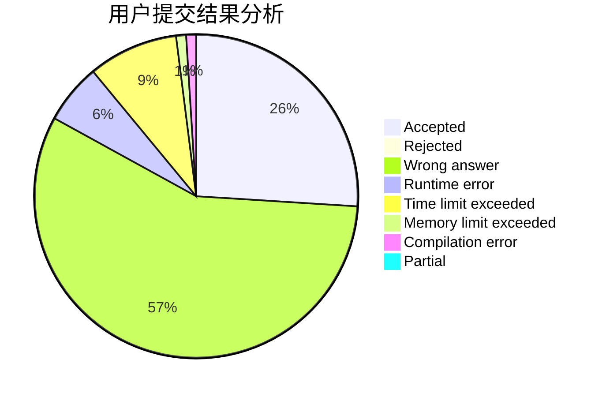
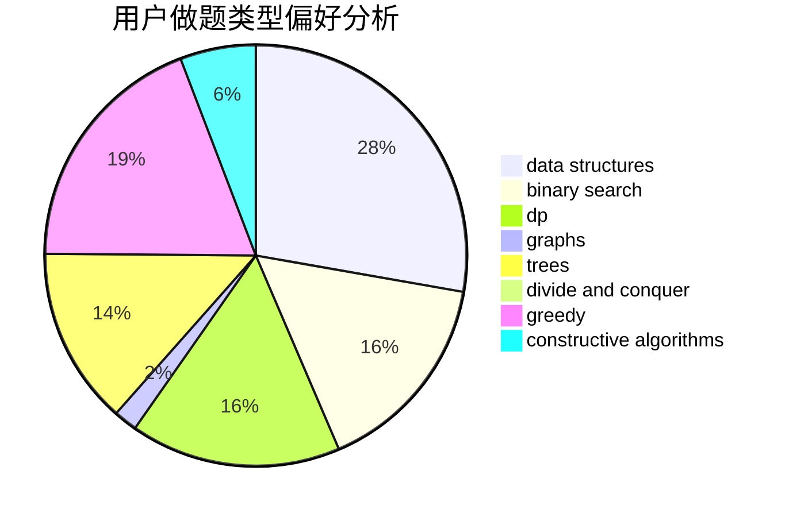
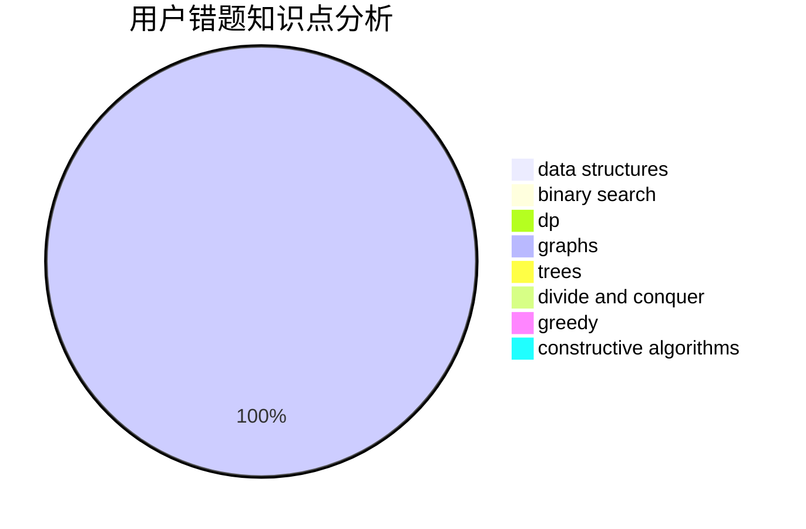

# GNAQ

<!-- tabs:start -->

#### **用户提交结果分析**

#### **用户做题类型偏好分析**

#### **用户错题知识点分析**

<!-- tabs:end -->
# 推荐题目
[274D](https://codeforces.com/contest/274/problem/D)		dfs and similar,
                        graphs,
                        greedy,
                        sortings		  
[1067B](https://codeforces.com/contest/1067/problem/B)		dfs and similar,
                        graphs,
                        shortest paths		  
[1482H](https://codeforces.com/contest/1482/problem/H)		data structures,
                        string suffix structures,
                        trees		  
[1225E](https://codeforces.com/contest/1225/problem/E)		binary search,
                        dp		  
[846E](https://codeforces.com/contest/846/problem/E)		dfs and similar,
                        greedy,
                        trees		  
[392A](https://codeforces.com/contest/392/problem/A)		math		  
[1023A](https://codeforces.com/contest/1023/problem/A)		brute force,
                        implementation,
                        strings		  
[895B](https://codeforces.com/contest/895/problem/B)		binary search,
                        math,
                        sortings,
                        two pointers		  
[894E](https://codeforces.com/contest/894/problem/E)		dp,
                        graphs		  
[219C](https://codeforces.com/contest/219/problem/C)		brute force,
                        dp,
                        greedy		  
