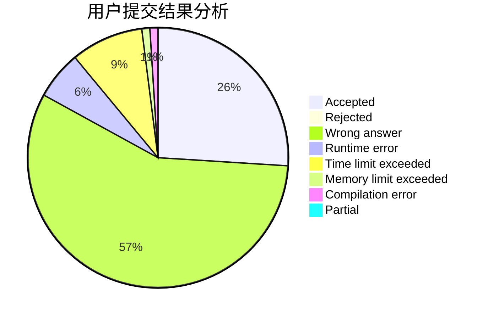
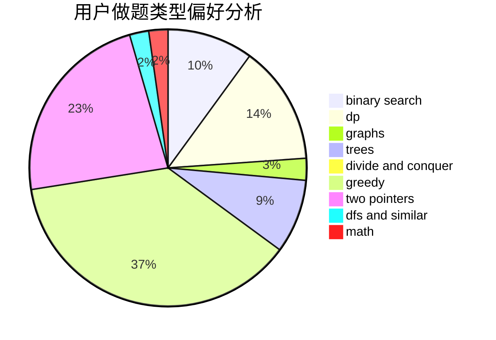

# GNAQ

<!-- tabs:start -->

#### **用户提交结果分析**

#### **用户做题类型偏好分析**

<!-- tabs:end -->
# 推荐题目
[274D](https://codeforces.com/contest/274/problem/D)
[1067B](https://codeforces.com/contest/1067/problem/B)
[1482H](https://codeforces.com/contest/1482/problem/H)
[1225E](https://codeforces.com/contest/1225/problem/E)
[846E](https://codeforces.com/contest/846/problem/E)
[392A](https://codeforces.com/contest/392/problem/A)
[1023A](https://codeforces.com/contest/1023/problem/A)
[895B](https://codeforces.com/contest/895/problem/B)
[894E](https://codeforces.com/contest/894/problem/E)
[219C](https://codeforces.com/contest/219/problem/C)
