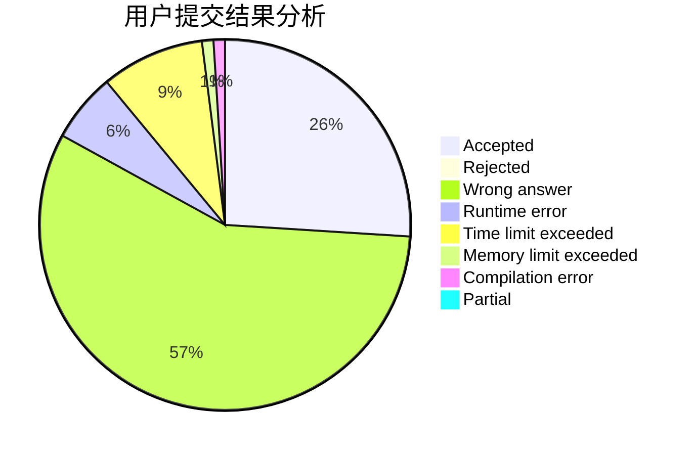
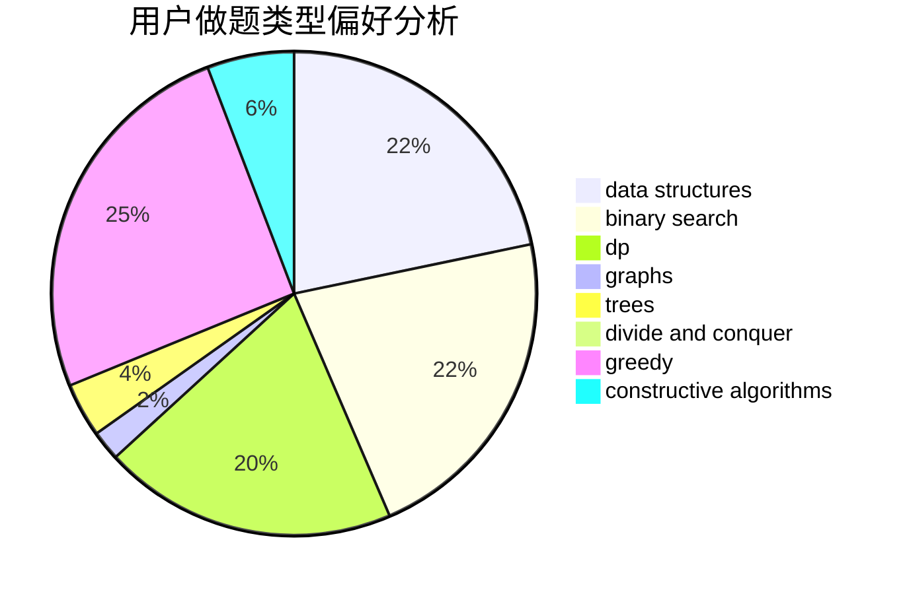
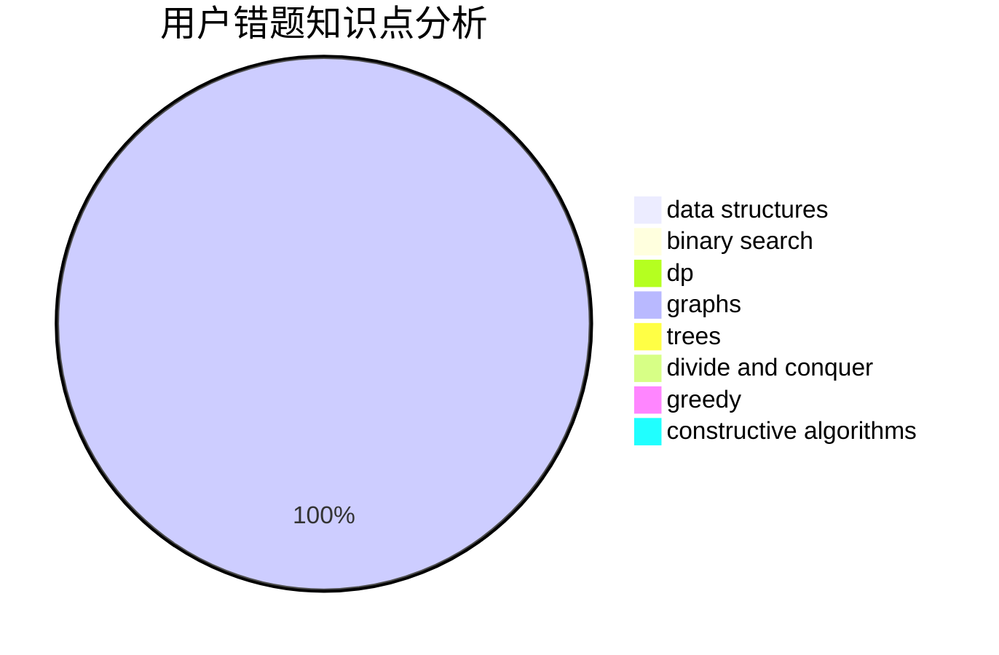

# GNAQ
<!-- tabs:start -->
#### **用户提交结果分析**

#### **用户做题类型偏好分析**

#### **用户错题知识点分析**

<!-- tabs:end -->
# 推荐题目
[Sum](http://codeforces.com/problemset/problem/257/D)		greedy,
                        math		  
[Binary Numbers AND Sum](http://codeforces.com/problemset/problem/1066/E)		data structures,
                        implementation,
                        math		  
[Elections](https://codeforces.com/contest/1020/problem/C)		greedy		  
[Delivery Club](http://codeforces.com/problemset/problem/875/E)		binary search,
                        data structures,
                        dp		  
[Infinite Maze](https://codeforces.com/contest/197/problem/D)		dfs and similar,
                        graphs		  
[Block Tower](http://codeforces.com/problemset/problem/327/D)		constructive algorithms,
                        dfs and similar,
                        graphs		  
[Jumping Transformers](http://codeforces.com/problemset/problem/1218/C)		dp		  
[Classroom Watch](http://codeforces.com/problemset/problem/875/A)		brute force,
                        math		  
[Socks](http://codeforces.com/problemset/problem/731/C)		dfs and similar,
                        dsu,
                        graphs,
                        greedy		  
[Santa's Bot](http://codeforces.com/problemset/problem/1279/D)		combinatorics,
                        math,
                        probabilities		  
<!-- tabs:start -->
#### **data structures**
[Binary Numbers AND Sum](http://codeforces.com/problemset/problem/1066/E)		data structures,
                        implementation,
                        math		  
[Delivery Club](http://codeforces.com/problemset/problem/875/E)		binary search,
                        data structures,
                        dp		  
[High Cry](http://codeforces.com/problemset/problem/875/D)		binary search,
                        bitmasks,
                        combinatorics,
                        data structures,
                        divide and conquer		  
[Queue in the Train](https://codeforces.com/contest/1248/problem/E)		data structures,
                        greedy,
                        implementation		  
[Array Destruction](http://codeforces.com/problemset/problem/1474/C)		brute force,
                        constructive algorithms,
                        data structures,
                        greedy,
                        implementation,
                        sortings		  
[Bipartite Checking](http://codeforces.com/problemset/problem/813/F)		data structures,
                        dsu,
                        graphs		  
[Dogeforces](http://codeforces.com/problemset/problem/1494/D)		constructive algorithms,
                        data structures,
                        dfs and similar,
                        divide and conquer,
                        dsu,
                        greedy,
                        sortings,
                        trees		  
[Maximum width](http://codeforces.com/problemset/problem/1492/C)		binary search,
                        data structures,
                        dp,
                        greedy,
                        two pointers		  
[Old Floppy Drive](http://codeforces.com/problemset/problem/1490/G)		binary search,
                        data structures,
                        math		  
[Odd Mineral Resource](http://codeforces.com/problemset/problem/1479/D)		binary search,
                        bitmasks,
                        brute force,
                        data structures,
                        probabilities,
                        trees		  
#### **binary search**
[Delivery Club](http://codeforces.com/problemset/problem/875/E)		binary search,
                        data structures,
                        dp		  
[High Cry](http://codeforces.com/problemset/problem/875/D)		binary search,
                        bitmasks,
                        combinatorics,
                        data structures,
                        divide and conquer		  
[Count Triangles](http://codeforces.com/problemset/problem/1355/C)		binary search,
                        implementation,
                        math,
                        two pointers		  
[Maximum width](http://codeforces.com/problemset/problem/1492/C)		binary search,
                        data structures,
                        dp,
                        greedy,
                        two pointers		  
[Pairs](http://codeforces.com/problemset/problem/1463/D)		binary search,
                        constructive algorithms,
                        greedy,
                        two pointers		  
[Old Floppy Drive](http://codeforces.com/problemset/problem/1490/G)		binary search,
                        data structures,
                        math		  
[Odd Mineral Resource](http://codeforces.com/problemset/problem/1479/D)		binary search,
                        bitmasks,
                        brute force,
                        data structures,
                        probabilities,
                        trees		  
[Complicated Computations](http://codeforces.com/problemset/problem/1436/E)		binary search,
                        data structures,
                        two pointers		  
[Divide and Summarize](http://codeforces.com/problemset/problem/1461/D)		binary search,
                        brute force,
                        data structures,
                        divide and conquer,
                        implementation,
                        sortings		  
[K-beautiful Strings](http://codeforces.com/problemset/problem/1493/C)		binary search,
                        brute force,
                        constructive algorithms,
                        greedy,
                        strings		  
#### **dp**
[Delivery Club](http://codeforces.com/problemset/problem/875/E)		binary search,
                        data structures,
                        dp		  
[Jumping Transformers](http://codeforces.com/problemset/problem/1218/C)		dp		  
[Writing Code](https://codeforces.com/contest/544/problem/C)		dp		  
[Remove One Element](http://codeforces.com/problemset/problem/1272/D)		brute force,
                        dp		  
[Genetic engineering](http://codeforces.com/problemset/problem/86/C)		dp,
                        string suffix structures,
                        trees		  
[Maximum width](http://codeforces.com/problemset/problem/1492/C)		binary search,
                        data structures,
                        dp,
                        greedy,
                        two pointers		  
[Bouncing Ball](https://codeforces.com/contest/1457/problem/C)		brute force,
                        dp,
                        implementation		  
[Pekora and Trampoline](http://codeforces.com/problemset/problem/1491/C)		brute force,
                        data structures,
                        dp,
                        greedy,
                        implementation		  
[Chef Monocarp](http://codeforces.com/problemset/problem/1437/C)		dp,
                        flows,
                        graph matchings,
                        greedy,
                        math,
                        sortings		  
[Binary Removals](http://codeforces.com/problemset/problem/1499/B)		brute force,
                        dp,
                        greedy,
                        implementation		  
#### **graph**
[Infinite Maze](https://codeforces.com/contest/197/problem/D)		dfs and similar,
                        graphs		  
[Block Tower](http://codeforces.com/problemset/problem/327/D)		constructive algorithms,
                        dfs and similar,
                        graphs		  
[Socks](http://codeforces.com/problemset/problem/731/C)		dfs and similar,
                        dsu,
                        graphs,
                        greedy		  
[Roads in Berland](http://codeforces.com/problemset/problem/25/C)		graphs,
                        shortest paths		  
[Bipartite Checking](http://codeforces.com/problemset/problem/813/F)		data structures,
                        dsu,
                        graphs		  
[Bertown roads](http://codeforces.com/problemset/problem/118/E)		dfs and similar,
                        graphs		  
[National Property](http://codeforces.com/problemset/problem/875/C)		2-sat,
                        dfs and similar,
                        graphs,
                        implementation		  
[Minimum Ties](http://codeforces.com/problemset/problem/1487/C)		brute force,
                        constructive algorithms,
                        dfs and similar,
                        graphs,
                        greedy,
                        implementation,
                        math		  
[Chef Monocarp](http://codeforces.com/problemset/problem/1437/C)		dp,
                        flows,
                        graph matchings,
                        greedy,
                        math,
                        sortings		  
[Strange Housing](http://codeforces.com/problemset/problem/1470/D)		constructive algorithms,
                        dfs and similar,
                        graph matchings,
                        graphs,
                        greedy		  
#### **trees**
[Dogeforces](http://codeforces.com/problemset/problem/1494/D)		constructive algorithms,
                        data structures,
                        dfs and similar,
                        divide and conquer,
                        dsu,
                        greedy,
                        sortings,
                        trees		  
[Genetic engineering](http://codeforces.com/problemset/problem/86/C)		dp,
                        string suffix structures,
                        trees		  
[Odd Mineral Resource](http://codeforces.com/problemset/problem/1479/D)		binary search,
                        bitmasks,
                        brute force,
                        data structures,
                        probabilities,
                        trees		  
[Yet Another Card Deck](http://codeforces.com/problemset/problem/1511/C)		brute force,
                        data structures,
                        implementation,
                        trees		  
[Diameter Cuts](http://codeforces.com/problemset/problem/1499/F)		combinatorics,
                        dfs and similar,
                        dp,
                        trees		  
[Fib-tree](http://codeforces.com/problemset/problem/1491/E)		brute force,
                        dfs and similar,
                        divide and conquer,
                        number theory,
                        trees		  
[13th Labour of Heracles](http://codeforces.com/problemset/problem/1466/D)		data structures,
                        greedy,
                        sortings,
                        trees		  
[BFS Trees](http://codeforces.com/problemset/problem/1495/D)		combinatorics,
                        dfs and similar,
                        graphs,
                        math,
                        shortest paths,
                        trees		  
[Sum of Prefix Sums](http://codeforces.com/problemset/problem/1303/G)		data structures,
                        divide and conquer,
                        geometry,
                        trees		  
[Number of Simple Paths](http://codeforces.com/problemset/problem/1454/E)		combinatorics,
                        dfs and similar,
                        graphs,
                        trees		  
#### **divide and conquer**
[High Cry](http://codeforces.com/problemset/problem/875/D)		binary search,
                        bitmasks,
                        combinatorics,
                        data structures,
                        divide and conquer		  
[Dogeforces](http://codeforces.com/problemset/problem/1494/D)		constructive algorithms,
                        data structures,
                        dfs and similar,
                        divide and conquer,
                        dsu,
                        greedy,
                        sortings,
                        trees		  
[Divide and Summarize](http://codeforces.com/problemset/problem/1461/D)		binary search,
                        brute force,
                        data structures,
                        divide and conquer,
                        implementation,
                        sortings		  
[Song of the Sirens](http://codeforces.com/problemset/problem/1466/G)		combinatorics,
                        divide and conquer,
                        hashing,
                        math,
                        string suffix structures,
                        strings		  
[Permutation Transformation](http://codeforces.com/problemset/problem/1490/D)		dfs and similar,
                        divide and conquer,
                        implementation		  
[Skyline Photo](https://codeforces.com/contest/1483/problem/C)		data structures,
                        divide and conquer,
                        dp		  
[Fib-tree](http://codeforces.com/problemset/problem/1491/E)		brute force,
                        dfs and similar,
                        divide and conquer,
                        number theory,
                        trees		  
[Sum of Prefix Sums](http://codeforces.com/problemset/problem/1303/G)		data structures,
                        divide and conquer,
                        geometry,
                        trees		  
[Dogeforces](http://codeforces.com/problemset/problem/1494/D)		constructive algorithms,
                        data structures,
                        dfs and similar,
                        divide and conquer,
                        dsu,
                        greedy,
                        sortings,
                        trees		  
[Skyline Photo](http://codeforces.com/problemset/problem/1482/E)		data structures,
                        divide and conquer,
                        dp		  
#### **greedy**
[Sum](http://codeforces.com/problemset/problem/257/D)		greedy,
                        math		  
[Elections](https://codeforces.com/contest/1020/problem/C)		greedy		  
[Socks](http://codeforces.com/problemset/problem/731/C)		dfs and similar,
                        dsu,
                        graphs,
                        greedy		  
[Queue in the Train](https://codeforces.com/contest/1248/problem/E)		data structures,
                        greedy,
                        implementation		  
[Array Destruction](http://codeforces.com/problemset/problem/1474/C)		brute force,
                        constructive algorithms,
                        data structures,
                        greedy,
                        implementation,
                        sortings		  
[Dogeforces](http://codeforces.com/problemset/problem/1494/D)		constructive algorithms,
                        data structures,
                        dfs and similar,
                        divide and conquer,
                        dsu,
                        greedy,
                        sortings,
                        trees		  
[New Year and the Treasure Geolocation](http://codeforces.com/problemset/problem/1091/B)		brute force,
                        constructive algorithms,
                        greedy,
                        implementation		  
[Regular Bracket Sequence](http://codeforces.com/problemset/problem/1469/A)		constructive algorithms,
                        greedy		  
[Beautiful Regional Contest](https://codeforces.com/contest/1265/problem/C)		greedy,
                        implementation		  
[Maximum width](http://codeforces.com/problemset/problem/1492/C)		binary search,
                        data structures,
                        dp,
                        greedy,
                        two pointers		  
#### **constructive algorithms**
[Block Tower](http://codeforces.com/problemset/problem/327/D)		constructive algorithms,
                        dfs and similar,
                        graphs		  
[Array Destruction](http://codeforces.com/problemset/problem/1474/C)		brute force,
                        constructive algorithms,
                        data structures,
                        greedy,
                        implementation,
                        sortings		  
[Dogeforces](http://codeforces.com/problemset/problem/1494/D)		constructive algorithms,
                        data structures,
                        dfs and similar,
                        divide and conquer,
                        dsu,
                        greedy,
                        sortings,
                        trees		  
[New Year and the Treasure Geolocation](http://codeforces.com/problemset/problem/1091/B)		brute force,
                        constructive algorithms,
                        greedy,
                        implementation		  
[Regular Bracket Sequence](http://codeforces.com/problemset/problem/1469/A)		constructive algorithms,
                        greedy		  
[Anti-knapsack](http://codeforces.com/problemset/problem/1493/A)		constructive algorithms,
                        greedy		  
[Pairs](http://codeforces.com/problemset/problem/1463/D)		binary search,
                        constructive algorithms,
                        greedy,
                        two pointers		  
[XOR-gun](https://codeforces.com/contest/1456/problem/B)		bitmasks,
                        brute force,
                        constructive algorithms		  
[Genius's Gambit](http://codeforces.com/problemset/problem/1492/D)		bitmasks,
                        constructive algorithms,
                        greedy,
                        math		  
[3-Coloring](https://codeforces.com/contest/1504/problem/D)		constructive algorithms,
                        games,
                        interactive		  
#### **sortings**
[Sorting the Coins](http://codeforces.com/problemset/problem/875/B)		dsu,
                        implementation,
                        sortings,
                        two pointers		  
[Array Destruction](http://codeforces.com/problemset/problem/1474/C)		brute force,
                        constructive algorithms,
                        data structures,
                        greedy,
                        implementation,
                        sortings		  
[WeirdSort](http://codeforces.com/problemset/problem/1311/B)		dfs and similar,
                        sortings		  
[Dogeforces](http://codeforces.com/problemset/problem/1494/D)		constructive algorithms,
                        data structures,
                        dfs and similar,
                        divide and conquer,
                        dsu,
                        greedy,
                        sortings,
                        trees		  
[Diamond Miner](https://codeforces.com/contest/1496/problem/C)		geometry,
                        greedy,
                        math,
                        sortings		  
[Diamond Miner](http://codeforces.com/problemset/problem/1495/A)		geometry,
                        greedy,
                        math,
                        sortings		  
[Meximization](http://codeforces.com/problemset/problem/1497/A)		brute force,
                        data structures,
                        greedy,
                        sortings		  
[Avoiding Zero](http://codeforces.com/problemset/problem/1427/A)		math,
                        sortings		  
[Divide and Summarize](http://codeforces.com/problemset/problem/1461/D)		binary search,
                        brute force,
                        data structures,
                        divide and conquer,
                        implementation,
                        sortings		  
[Chef Monocarp](http://codeforces.com/problemset/problem/1437/C)		dp,
                        flows,
                        graph matchings,
                        greedy,
                        math,
                        sortings		  
<!-- tabs:end -->
