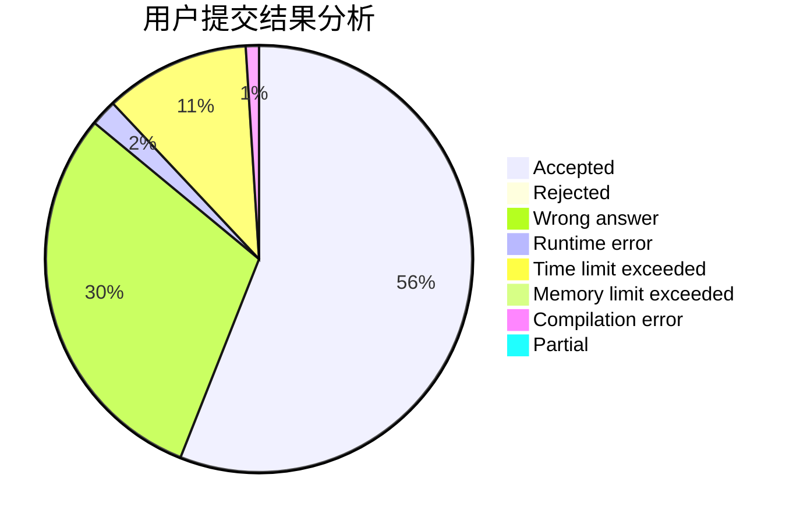
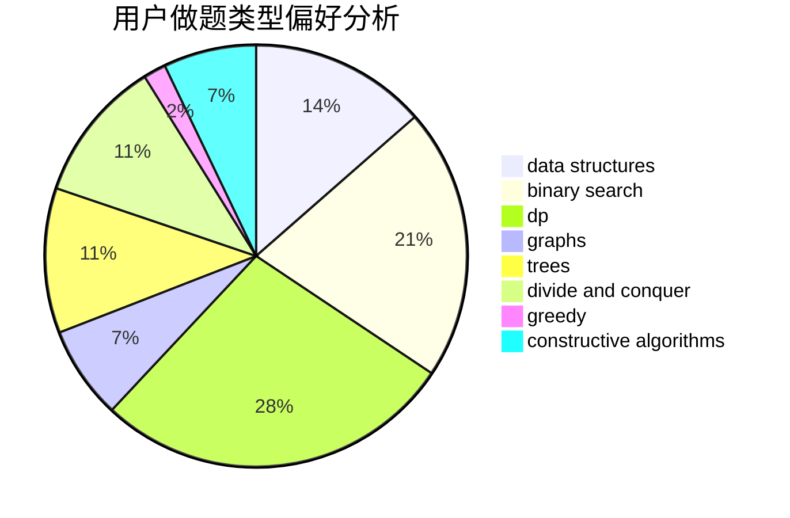
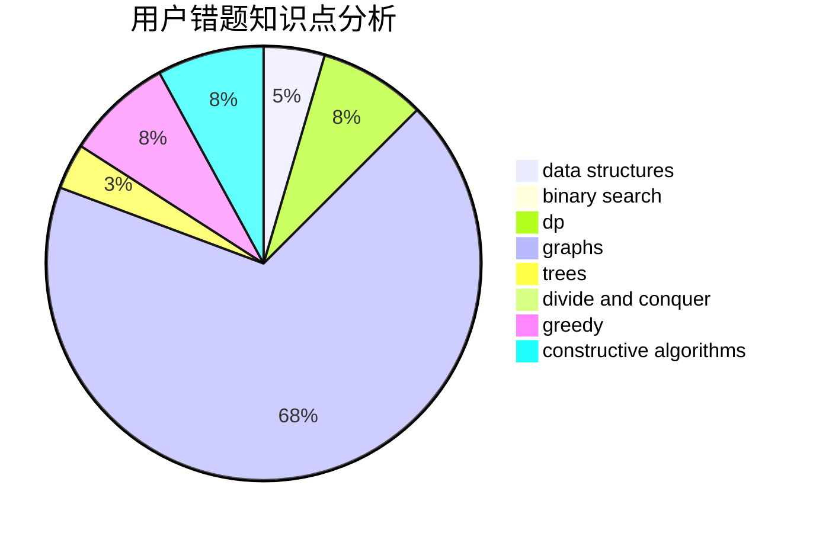

# GSHgsh

<!-- tabs:start -->

#### **用户提交结果分析**

#### **用户做题类型偏好分析**

#### **用户错题知识点分析**

<!-- tabs:end -->
# 推荐题目
[896A](https://codeforces.com/contest/896/problem/A)		binary search,
                        dfs and similar		  
[871A](https://codeforces.com/contest/871/problem/A)		dsu,graphs,sortings,trees		  
[780B](https://codeforces.com/contest/780/problem/B)		binary search		  
[1144A](https://codeforces.com/contest/1144/problem/A)		implementation,
                        strings		  
[203B](https://codeforces.com/contest/203/problem/B)		brute force,
                        implementation		  
[24D](https://codeforces.com/contest/24/problem/D)		dp,
                        math,
                        probabilities		  
[641F](https://codeforces.com/contest/641/problem/F)		nan		  
[896B](https://codeforces.com/contest/896/problem/B)		binary search,
                        constructive algorithms,
                        games,
                        greedy,
                        interactive		  
[108C](https://codeforces.com/contest/108/problem/C)		dsu,graphs,sortings,trees		  
[230B](https://codeforces.com/contest/230/problem/B)		binary search,
                        implementation,
                        math,
                        number theory		  
