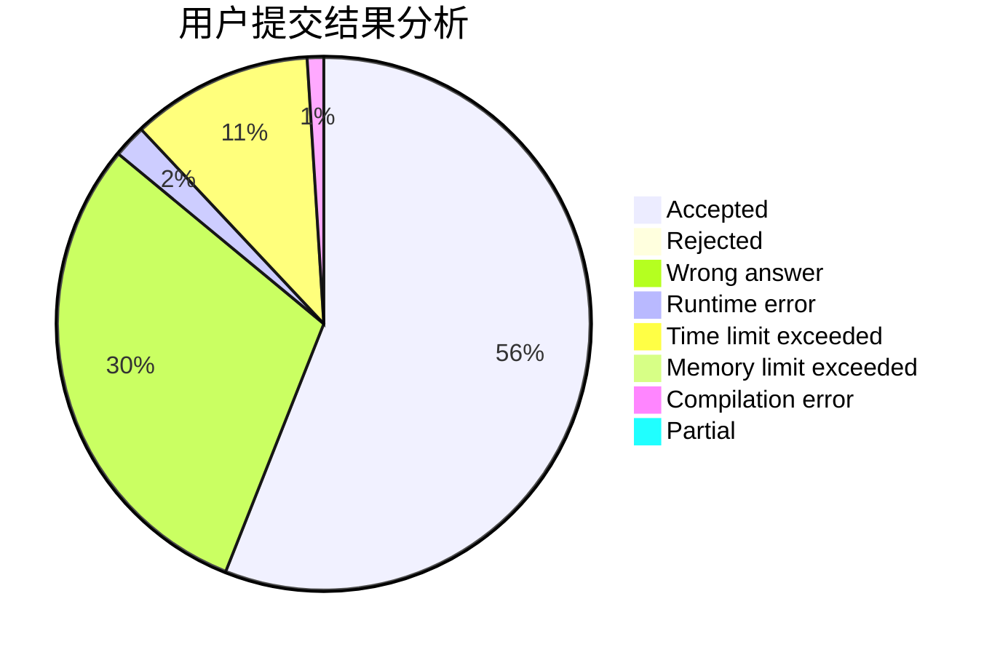
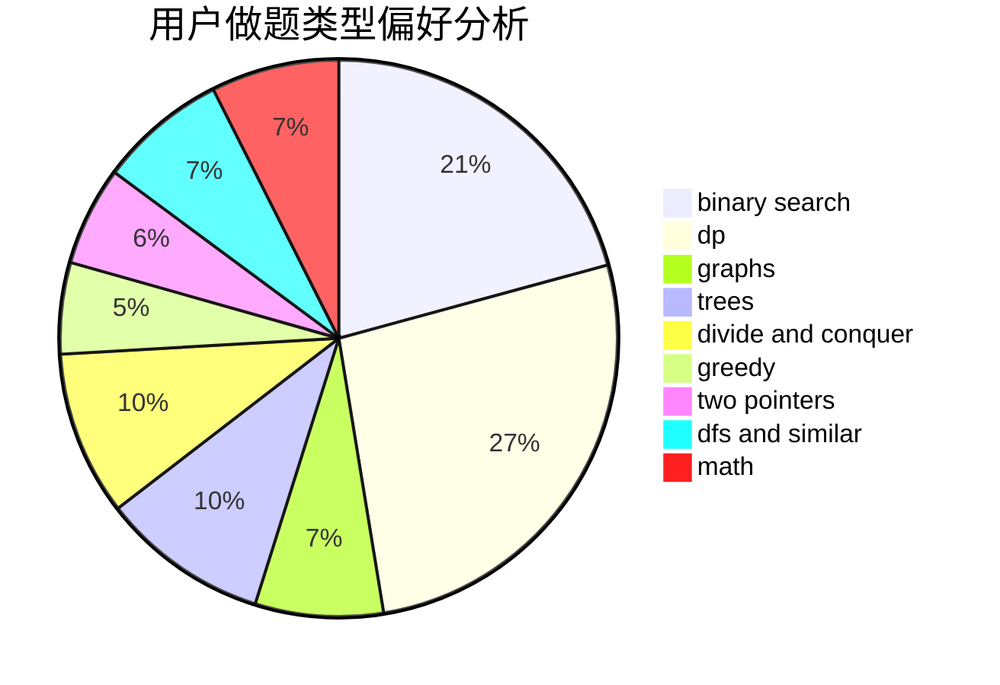

# GSHgsh

<!-- tabs:start -->

#### **用户提交结果分析**

#### **用户做题类型偏好分析**

<!-- tabs:end -->
# 推荐题目
[896A](https://codeforces.com/contest/896/problem/A)
[871A](https://codeforces.com/contest/871/problem/A)
[780B](https://codeforces.com/contest/780/problem/B)
[1144A](https://codeforces.com/contest/1144/problem/A)
[203B](https://codeforces.com/contest/203/problem/B)
[24D](https://codeforces.com/contest/24/problem/D)
[641F](https://codeforces.com/contest/641/problem/F)
[896B](https://codeforces.com/contest/896/problem/B)
[108C](https://codeforces.com/contest/108/problem/C)
[230B](https://codeforces.com/contest/230/problem/B)
