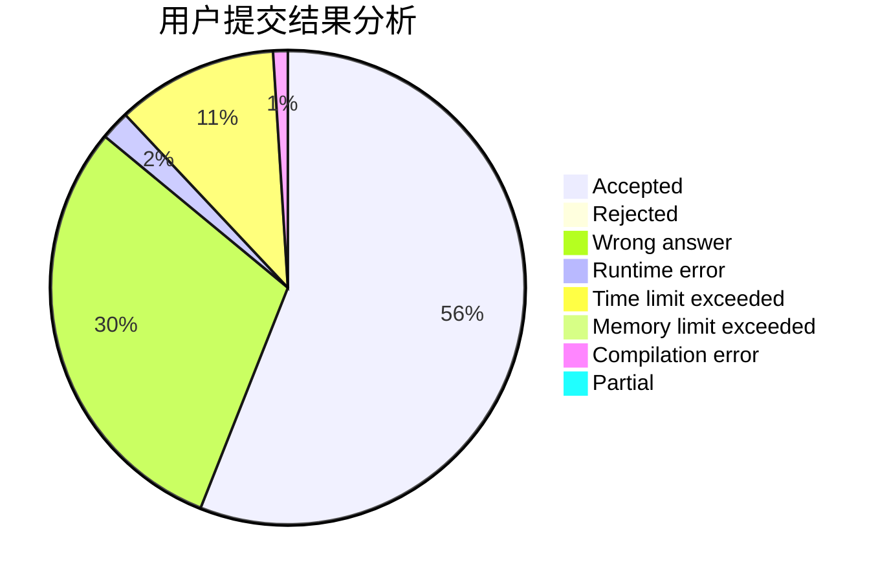
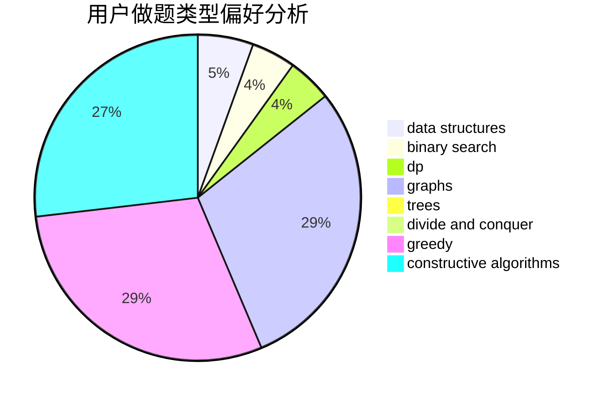
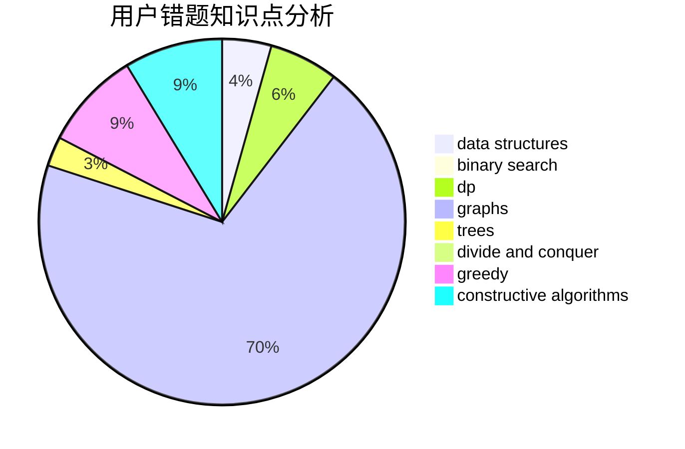

# GSHgsh

<!-- tabs:start -->

#### **用户提交结果分析**

#### **用户做题类型偏好分析**

#### **用户错题知识点分析**

<!-- tabs:end -->
# 推荐题目
[875F](https://codeforces.com/contest/875/problem/F)		dsu,
                        graphs,
                        greedy		  
[852I](https://codeforces.com/contest/852/problem/I)		brute force,
                        dfs and similar,
                        graphs,
                        trees		  
[761A](https://codeforces.com/contest/761/problem/A)		brute force,
                        constructive algorithms,
                        implementation,
                        math		  
[1141F2](https://codeforces.com/contest/1141F/problem/2)		data structures,
                        greedy		  
[177A2](https://codeforces.com/contest/177A/problem/2)		implementation		  
[22A](https://codeforces.com/contest/22/problem/A)		brute force		  
[61E](https://codeforces.com/contest/61/problem/E)		data structures,
                        trees		  
[876A](https://codeforces.com/contest/876/problem/A)		math		  
[1089K](https://codeforces.com/contest/1089/problem/K)		data structures		  
[208D](https://codeforces.com/contest/208/problem/D)		implementation		  
