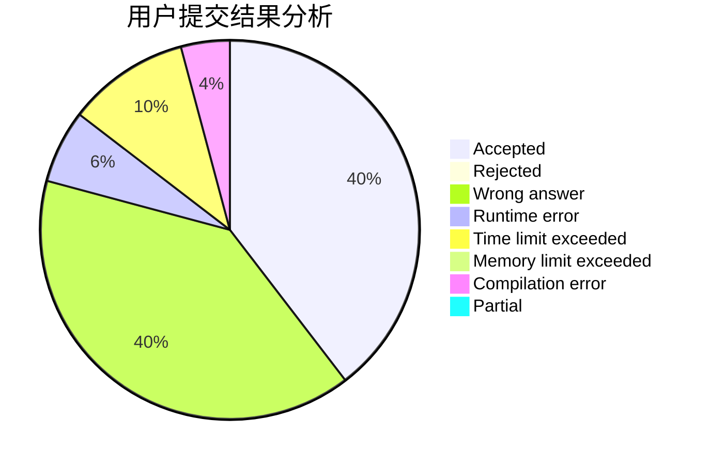
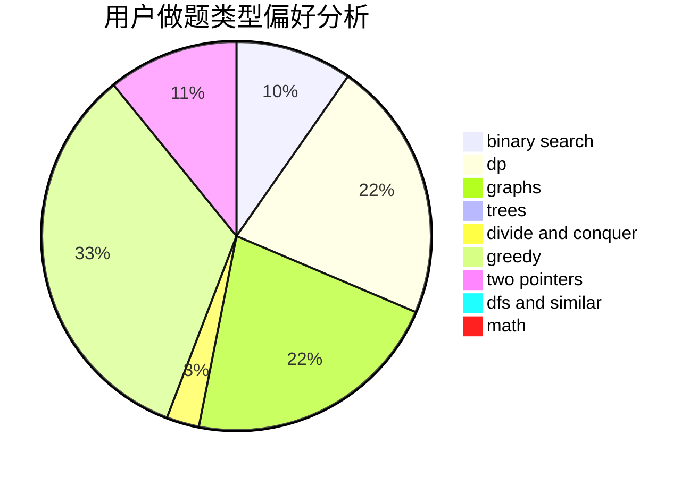

# GSYL

<!-- tabs:start -->

#### **用户提交结果分析**

#### **用户做题类型偏好分析**

<!-- tabs:end -->
# 推荐题目
[1181B](https://codeforces.com/contest/1181/problem/B)
[198C](https://codeforces.com/contest/198/problem/C)
[292A](https://codeforces.com/contest/292/problem/A)
[896D](https://codeforces.com/contest/896/problem/D)
[635A](https://codeforces.com/contest/635/problem/A)
[879A](https://codeforces.com/contest/879/problem/A)
[850F](https://codeforces.com/contest/850/problem/F)
[802N](https://codeforces.com/contest/802/problem/N)
[897B](https://codeforces.com/contest/897/problem/B)
[822B](https://codeforces.com/contest/822/problem/B)
