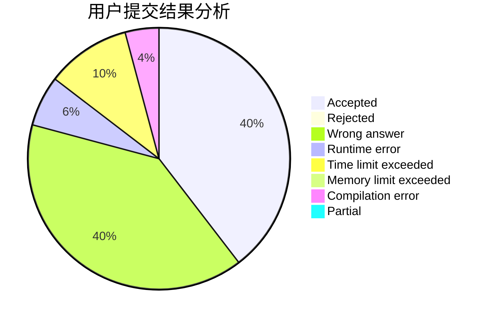
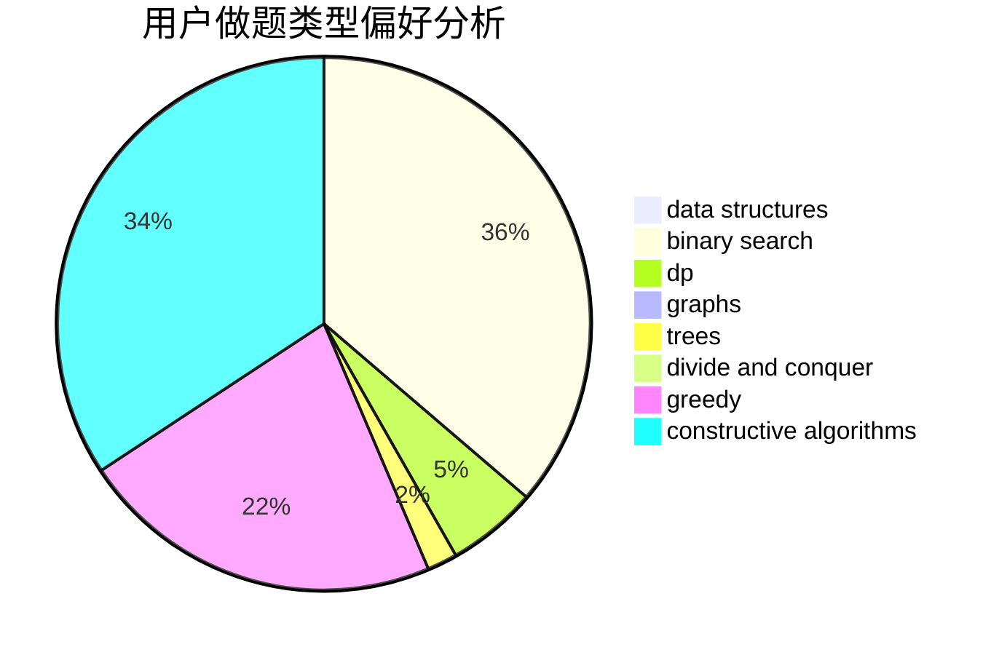
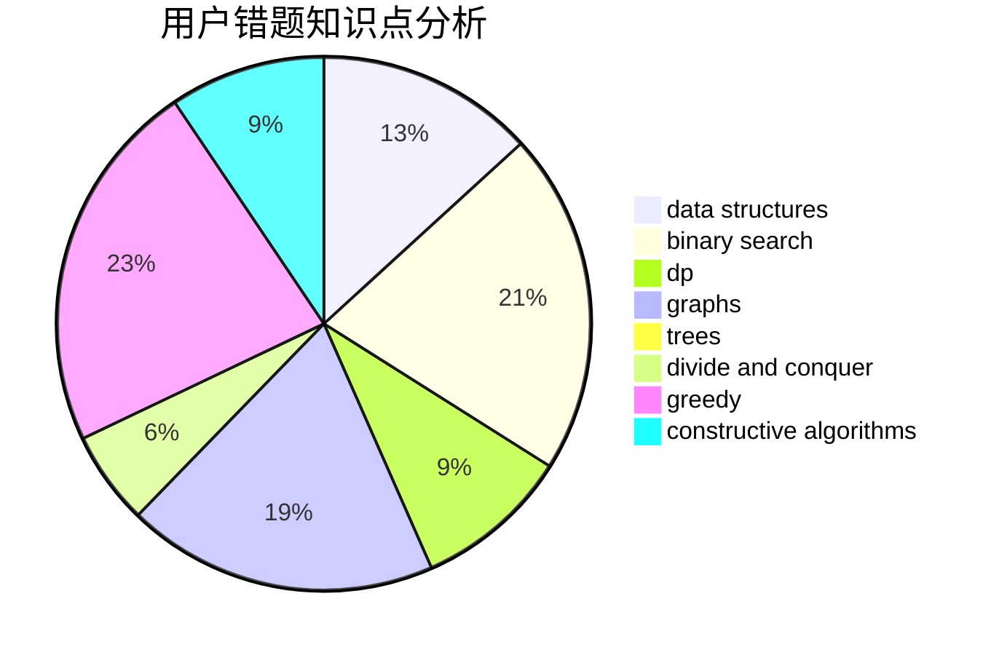

# GSYL

<!-- tabs:start -->

#### **用户提交结果分析**

#### **用户做题类型偏好分析**

#### **用户错题知识点分析**

<!-- tabs:end -->
# 推荐题目
[1178F2](https://codeforces.com/contest/1178F/problem/2)		dp		  
[171C](https://codeforces.com/contest/171/problem/C)		*special problem,
                        implementation		  
[277B](https://codeforces.com/contest/277/problem/B)		constructive algorithms,
                        geometry		  
[876C](https://codeforces.com/contest/876/problem/C)		dsu,graphs,sortings,trees		  
[617B](https://codeforces.com/contest/617/problem/B)		combinatorics		  
[861A](https://codeforces.com/contest/861/problem/A)		dsu,graphs,sortings,trees		  
[832D](https://codeforces.com/contest/832/problem/D)		dfs and similar,
                        graphs,
                        trees		  
[786C](https://codeforces.com/contest/786/problem/C)		data structures,
                        divide and conquer		  
[876F](https://codeforces.com/contest/876/problem/F)		dsu,graphs,sortings,trees		  
[807A](https://codeforces.com/contest/807/problem/A)		implementation,
                        sortings		  
