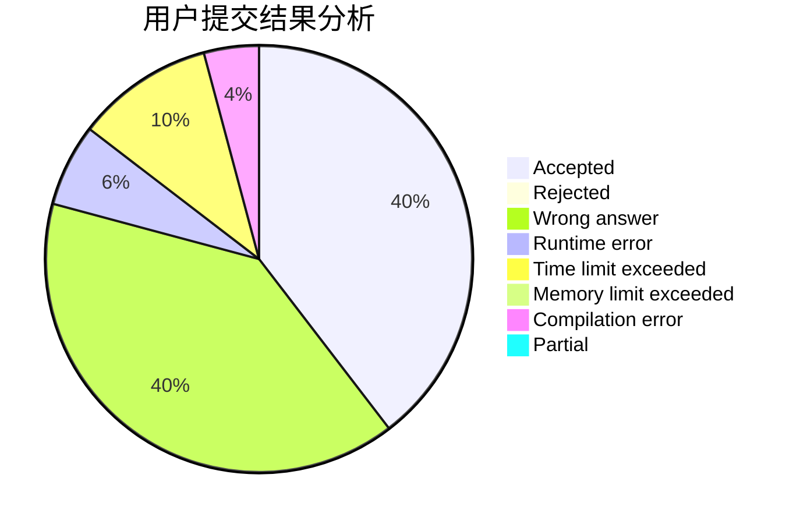
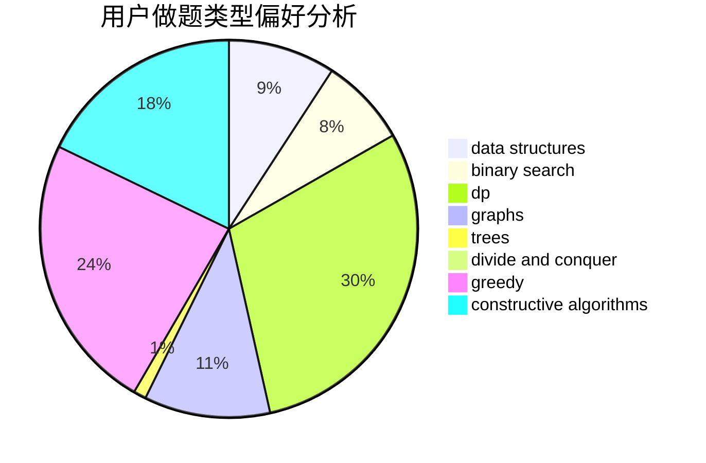
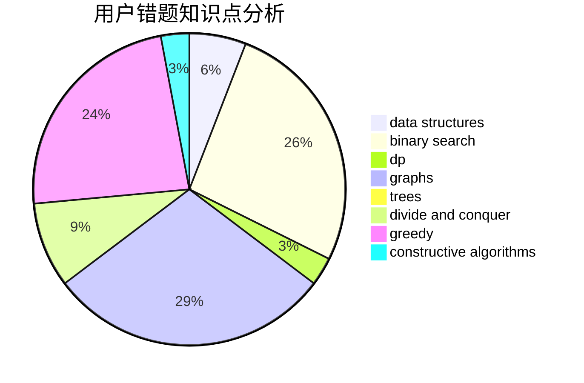

# GSYL

<!-- tabs:start -->

#### **用户提交结果分析**

#### **用户做题类型偏好分析**

#### **用户错题知识点分析**

<!-- tabs:end -->
# 推荐题目
[1181B](https://codeforces.com/contest/1181/problem/B)		greedy,
                        implementation,
                        strings		  
[198C](https://codeforces.com/contest/198/problem/C)		binary search,
                        geometry		  
[292A](https://codeforces.com/contest/292/problem/A)		implementation		  
[896D](https://codeforces.com/contest/896/problem/D)		chinese remainder theorem,
                        combinatorics,
                        math,
                        number theory		  
[635A](https://codeforces.com/contest/635/problem/A)		brute force,
                        implementation		  
[879A](https://codeforces.com/contest/879/problem/A)		implementation		  
[850F](https://codeforces.com/contest/850/problem/F)		math		  
[802N](https://codeforces.com/contest/802/problem/N)		binary search,
                        flows,
                        graphs		  
[897B](https://codeforces.com/contest/897/problem/B)		brute force		  
[822B](https://codeforces.com/contest/822/problem/B)		brute force,
                        implementation,
                        strings		  
