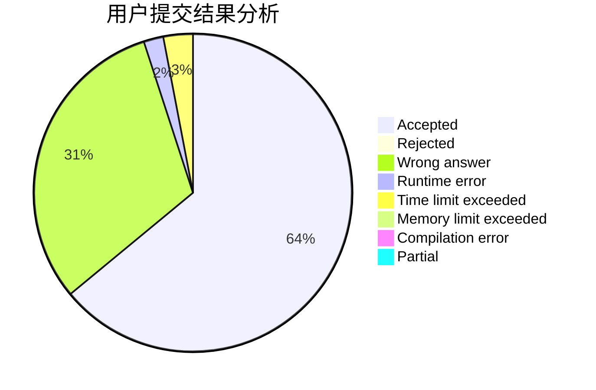
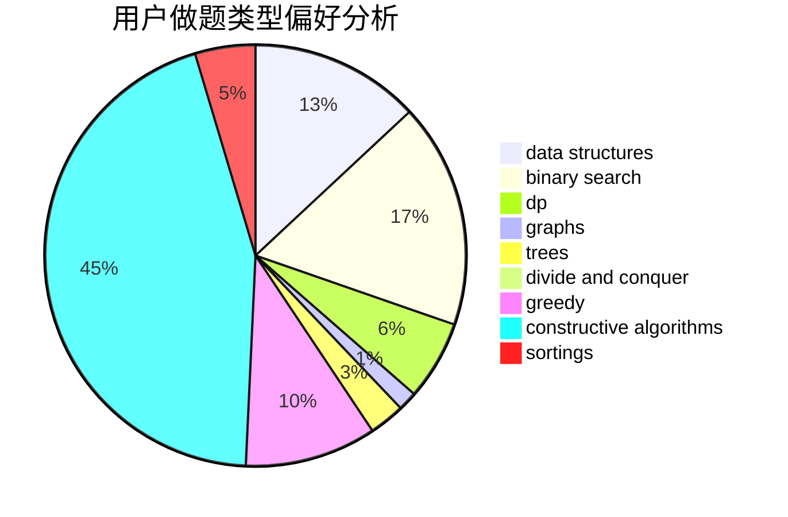
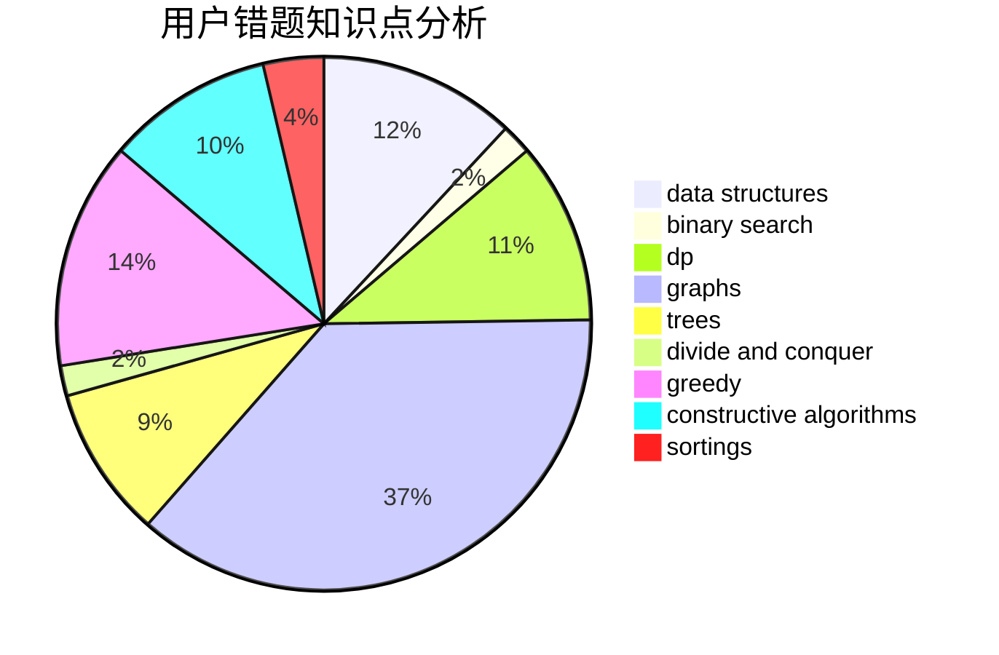

# 2020gangbazi
<!-- tabs:start -->
#### **用户提交结果分析**

#### **用户做题类型偏好分析**

#### **用户错题知识点分析**

<!-- tabs:end -->
# 推荐题目
[1277F](https://codeforces.com/contest/1277/problem/F)		brute force,
                        combinatorics,
                        constructive algorithms,
                        data structures,
                        greedy,
                        math		  
[1278A](http://codeforces.com/problemset/problem/1278/A)		brute force,
                        implementation,
                        strings		  
[1280F](http://codeforces.com/problemset/problem/1280/F)		combinatorics,
                        constructive algorithms,
                        math		  
[1071C](https://codeforces.com/contest/1071/problem/C)		constructive algorithms		  
[1279E](http://codeforces.com/problemset/problem/1279/E)		combinatorics,
                        dp		  
[1281F](https://codeforces.com/contest/1281/problem/F)		dp,
                        greedy,
                        trees		  
[115B](http://codeforces.com/problemset/problem/115/B)		greedy,
                        sortings		  
[1279D](http://codeforces.com/problemset/problem/1279/D)		combinatorics,
                        math,
                        probabilities		  
[1281B](http://codeforces.com/problemset/problem/1281/B)		greedy		  
[1281E](https://codeforces.com/contest/1281/problem/E)		dfs and similar,
                        graphs,
                        greedy,
                        trees		  
<!-- tabs:start -->
#### **data structures**
[1277F](https://codeforces.com/contest/1277/problem/F)		brute force,
                        combinatorics,
                        constructive algorithms,
                        data structures,
                        greedy,
                        math		  
[1277D](http://codeforces.com/problemset/problem/1277/D)		data structures,
                        hashing,
                        implementation,
                        math		  
[1278C](http://codeforces.com/problemset/problem/1278/C)		data structures,
                        dp,
                        greedy,
                        implementation		  
[1279C](http://codeforces.com/problemset/problem/1279/C)		data structures,
                        implementation		  
[1278D](http://codeforces.com/problemset/problem/1278/D)		data structures,
                        dsu,
                        graphs,
                        trees		  
[1073G](http://codeforces.com/problemset/problem/1073/G)		data structures,
                        string suffix structures		  
[1492C](http://codeforces.com/problemset/problem/1492/C)		binary search,
                        data structures,
                        dp,
                        greedy,
                        two pointers		  
[1490G](http://codeforces.com/problemset/problem/1490/G)		binary search,
                        data structures,
                        math		  
[1479D](http://codeforces.com/problemset/problem/1479/D)		binary search,
                        bitmasks,
                        brute force,
                        data structures,
                        probabilities,
                        trees		  
[1497A](http://codeforces.com/problemset/problem/1497/A)		brute force,
                        data structures,
                        greedy,
                        sortings		  
#### **binary search**
[1279F](http://codeforces.com/problemset/problem/1279/F)		binary search,
                        dp		  
[1279B](http://codeforces.com/problemset/problem/1279/B)		binary search,
                        brute force,
                        implementation		  
[1240E](https://codeforces.com/contest/1240/problem/E)		binary search,
                        math,
                        number theory		  
[1492C](http://codeforces.com/problemset/problem/1492/C)		binary search,
                        data structures,
                        dp,
                        greedy,
                        two pointers		  
[1463D](http://codeforces.com/problemset/problem/1463/D)		binary search,
                        constructive algorithms,
                        greedy,
                        two pointers		  
[1490G](http://codeforces.com/problemset/problem/1490/G)		binary search,
                        data structures,
                        math		  
[1479D](http://codeforces.com/problemset/problem/1479/D)		binary search,
                        bitmasks,
                        brute force,
                        data structures,
                        probabilities,
                        trees		  
[1436E](http://codeforces.com/problemset/problem/1436/E)		binary search,
                        data structures,
                        two pointers		  
[1461D](http://codeforces.com/problemset/problem/1461/D)		binary search,
                        brute force,
                        data structures,
                        divide and conquer,
                        implementation,
                        sortings		  
[1493C](http://codeforces.com/problemset/problem/1493/C)		binary search,
                        brute force,
                        constructive algorithms,
                        greedy,
                        strings		  
#### **dp**
[1279E](http://codeforces.com/problemset/problem/1279/E)		combinatorics,
                        dp		  
[1281F](https://codeforces.com/contest/1281/problem/F)		dp,
                        greedy,
                        trees		  
[1278C](http://codeforces.com/problemset/problem/1278/C)		data structures,
                        dp,
                        greedy,
                        implementation		  
[1279F](http://codeforces.com/problemset/problem/1279/F)		binary search,
                        dp		  
[1277C](https://codeforces.com/contest/1277/problem/C)		dp,
                        greedy		  
[1280D](http://codeforces.com/problemset/problem/1280/D)		dp,
                        greedy,
                        trees		  
[1278F](http://codeforces.com/problemset/problem/1278/F)		combinatorics,
                        dp,
                        math,
                        number theory,
                        probabilities		  
[1492C](http://codeforces.com/problemset/problem/1492/C)		binary search,
                        data structures,
                        dp,
                        greedy,
                        two pointers		  
[1457C](https://codeforces.com/contest/1457/problem/C)		brute force,
                        dp,
                        implementation		  
[1491C](http://codeforces.com/problemset/problem/1491/C)		brute force,
                        data structures,
                        dp,
                        greedy,
                        implementation		  
#### **graph**
[1281E](https://codeforces.com/contest/1281/problem/E)		dfs and similar,
                        graphs,
                        greedy,
                        trees		  
[1277E](https://codeforces.com/contest/1277/problem/E)		combinatorics,
                        dfs and similar,
                        dsu,
                        graphs		  
[1280C](http://codeforces.com/problemset/problem/1280/C)		dfs and similar,
                        graphs,
                        greedy,
                        trees		  
[1278D](http://codeforces.com/problemset/problem/1278/D)		data structures,
                        dsu,
                        graphs,
                        trees		  
[1487C](http://codeforces.com/problemset/problem/1487/C)		brute force,
                        constructive algorithms,
                        dfs and similar,
                        graphs,
                        greedy,
                        implementation,
                        math		  
[1437C](http://codeforces.com/problemset/problem/1437/C)		dp,
                        flows,
                        graph matchings,
                        greedy,
                        math,
                        sortings		  
[1470D](http://codeforces.com/problemset/problem/1470/D)		constructive algorithms,
                        dfs and similar,
                        graph matchings,
                        graphs,
                        greedy		  
[1476C](http://codeforces.com/problemset/problem/1476/C)		dp,
                        graphs,
                        greedy		  
[1304D](http://codeforces.com/problemset/problem/1304/D)		constructive algorithms,
                        graphs,
                        greedy,
                        two pointers		  
[1475C](http://codeforces.com/problemset/problem/1475/C)		combinatorics,
                        graphs,
                        math		  
#### **trees**
[1281F](https://codeforces.com/contest/1281/problem/F)		dp,
                        greedy,
                        trees		  
[1281E](https://codeforces.com/contest/1281/problem/E)		dfs and similar,
                        graphs,
                        greedy,
                        trees		  
[1278E](http://codeforces.com/problemset/problem/1278/E)		constructive algorithms,
                        dfs and similar,
                        divide and conquer,
                        trees		  
[1280C](http://codeforces.com/problemset/problem/1280/C)		dfs and similar,
                        graphs,
                        greedy,
                        trees		  
[1278D](http://codeforces.com/problemset/problem/1278/D)		data structures,
                        dsu,
                        graphs,
                        trees		  
[1280D](http://codeforces.com/problemset/problem/1280/D)		dp,
                        greedy,
                        trees		  
[1479D](http://codeforces.com/problemset/problem/1479/D)		binary search,
                        bitmasks,
                        brute force,
                        data structures,
                        probabilities,
                        trees		  
[1511C](http://codeforces.com/problemset/problem/1511/C)		brute force,
                        data structures,
                        implementation,
                        trees		  
[1499F](http://codeforces.com/problemset/problem/1499/F)		combinatorics,
                        dfs and similar,
                        dp,
                        trees		  
[1491E](http://codeforces.com/problemset/problem/1491/E)		brute force,
                        dfs and similar,
                        divide and conquer,
                        number theory,
                        trees		  
#### **divide and conquer**
[1278E](http://codeforces.com/problemset/problem/1278/E)		constructive algorithms,
                        dfs and similar,
                        divide and conquer,
                        trees		  
[1461D](http://codeforces.com/problemset/problem/1461/D)		binary search,
                        brute force,
                        data structures,
                        divide and conquer,
                        implementation,
                        sortings		  
[1466G](http://codeforces.com/problemset/problem/1466/G)		combinatorics,
                        divide and conquer,
                        hashing,
                        math,
                        string suffix structures,
                        strings		  
[1490D](http://codeforces.com/problemset/problem/1490/D)		dfs and similar,
                        divide and conquer,
                        implementation		  
[1483C](https://codeforces.com/contest/1483/problem/C)		data structures,
                        divide and conquer,
                        dp		  
[1491E](http://codeforces.com/problemset/problem/1491/E)		brute force,
                        dfs and similar,
                        divide and conquer,
                        number theory,
                        trees		  
[1303G](http://codeforces.com/problemset/problem/1303/G)		data structures,
                        divide and conquer,
                        geometry,
                        trees		  
[1494D](http://codeforces.com/problemset/problem/1494/D)		constructive algorithms,
                        data structures,
                        dfs and similar,
                        divide and conquer,
                        dsu,
                        greedy,
                        sortings,
                        trees		  
[1482E](http://codeforces.com/problemset/problem/1482/E)		data structures,
                        divide and conquer,
                        dp		  
[566C](http://codeforces.com/problemset/problem/566/C)		dfs and similar,
                        divide and conquer,
                        trees		  
#### **greedy**
[1277F](https://codeforces.com/contest/1277/problem/F)		brute force,
                        combinatorics,
                        constructive algorithms,
                        data structures,
                        greedy,
                        math		  
[1281F](https://codeforces.com/contest/1281/problem/F)		dp,
                        greedy,
                        trees		  
[115B](http://codeforces.com/problemset/problem/115/B)		greedy,
                        sortings		  
[1281B](http://codeforces.com/problemset/problem/1281/B)		greedy		  
[1281E](https://codeforces.com/contest/1281/problem/E)		dfs and similar,
                        graphs,
                        greedy,
                        trees		  
[1278C](http://codeforces.com/problemset/problem/1278/C)		data structures,
                        dp,
                        greedy,
                        implementation		  
[1060B](http://codeforces.com/problemset/problem/1060/B)		greedy		  
[1250B](http://codeforces.com/problemset/problem/1250/B)		brute force,
                        constructive algorithms,
                        greedy,
                        math		  
[1280C](http://codeforces.com/problemset/problem/1280/C)		dfs and similar,
                        graphs,
                        greedy,
                        trees		  
[1207B](http://codeforces.com/problemset/problem/1207/B)		constructive algorithms,
                        greedy,
                        implementation		  
#### **constructive algorithms**
[1277F](https://codeforces.com/contest/1277/problem/F)		brute force,
                        combinatorics,
                        constructive algorithms,
                        data structures,
                        greedy,
                        math		  
[1280F](http://codeforces.com/problemset/problem/1280/F)		combinatorics,
                        constructive algorithms,
                        math		  
[1071C](https://codeforces.com/contest/1071/problem/C)		constructive algorithms		  
[1227B](http://codeforces.com/problemset/problem/1227/B)		constructive algorithms		  
[1250B](http://codeforces.com/problemset/problem/1250/B)		brute force,
                        constructive algorithms,
                        greedy,
                        math		  
[1278E](http://codeforces.com/problemset/problem/1278/E)		constructive algorithms,
                        dfs and similar,
                        divide and conquer,
                        trees		  
[1207B](http://codeforces.com/problemset/problem/1207/B)		constructive algorithms,
                        greedy,
                        implementation		  
[1004C](http://codeforces.com/problemset/problem/1004/C)		constructive algorithms,
                        implementation		  
[1493A](http://codeforces.com/problemset/problem/1493/A)		constructive algorithms,
                        greedy		  
[1463D](http://codeforces.com/problemset/problem/1463/D)		binary search,
                        constructive algorithms,
                        greedy,
                        two pointers		  
#### **sortings**
[115B](http://codeforces.com/problemset/problem/115/B)		greedy,
                        sortings		  
[1496C](https://codeforces.com/contest/1496/problem/C)		geometry,
                        greedy,
                        math,
                        sortings		  
[1495A](http://codeforces.com/problemset/problem/1495/A)		geometry,
                        greedy,
                        math,
                        sortings		  
[1497A](http://codeforces.com/problemset/problem/1497/A)		brute force,
                        data structures,
                        greedy,
                        sortings		  
[1427A](http://codeforces.com/problemset/problem/1427/A)		math,
                        sortings		  
[1461D](http://codeforces.com/problemset/problem/1461/D)		binary search,
                        brute force,
                        data structures,
                        divide and conquer,
                        implementation,
                        sortings		  
[1437C](http://codeforces.com/problemset/problem/1437/C)		dp,
                        flows,
                        graph matchings,
                        greedy,
                        math,
                        sortings		  
[1473A](http://codeforces.com/problemset/problem/1473/A)		greedy,
                        implementation,
                        math,
                        sortings		  
[1486B](http://codeforces.com/problemset/problem/1486/B)		binary search,
                        geometry,
                        shortest paths,
                        sortings		  
[1480B](http://codeforces.com/problemset/problem/1480/B)		greedy,
                        implementation,
                        sortings		  
<!-- tabs:end -->
