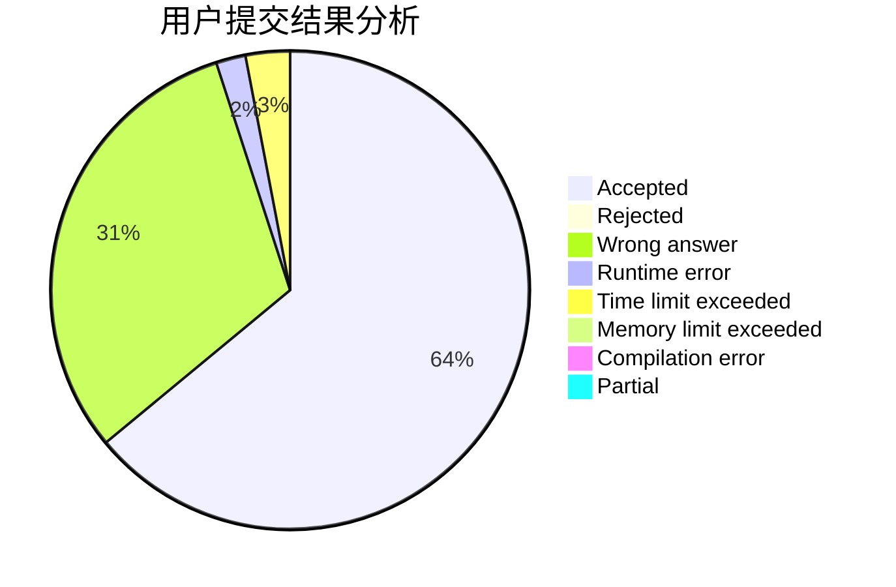
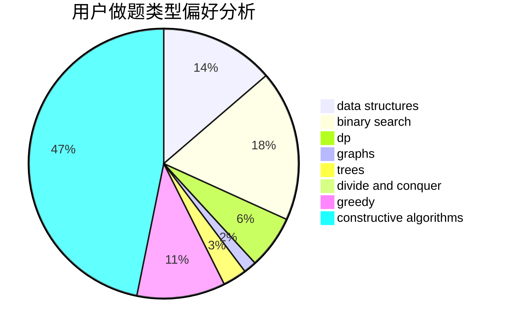
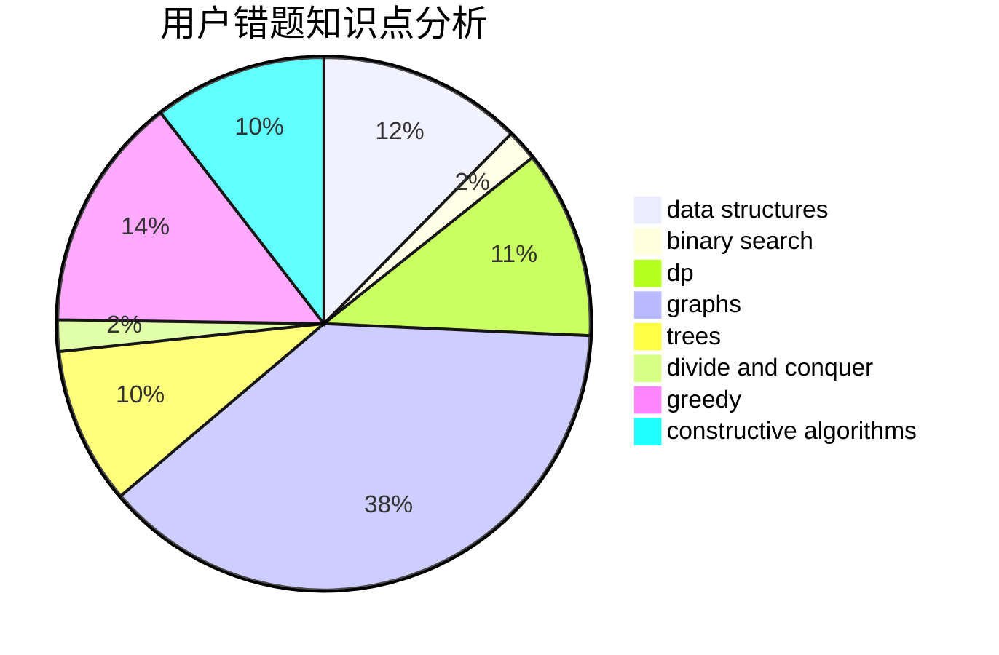

# 2020gangbazi

<!-- tabs:start -->

#### **用户提交结果分析**

#### **用户做题类型偏好分析**

#### **用户错题知识点分析**

<!-- tabs:end -->
# 推荐题目
[1281E](https://codeforces.com/contest/1281/problem/E)		dsu,graphs,sortings,trees		  
[1277F](https://codeforces.com/contest/1277/problem/F)		dsu,graphs,sortings,trees		  
[1278F](https://codeforces.com/contest/1278/problem/F)		combinatorics,
                        dp,
                        math,
                        number theory,
                        probabilities		  
[1281A](https://codeforces.com/contest/1281/problem/A)		implementation		  
[1280F](https://codeforces.com/contest/1280/problem/F)		combinatorics,
                        constructive algorithms,
                        math		  
[1207B](https://codeforces.com/contest/1207/problem/B)		constructive algorithms,
                        greedy,
                        implementation		  
[1071C](https://codeforces.com/contest/1071/problem/C)		dsu,graphs,sortings,trees		  
[1060B](https://codeforces.com/contest/1060/problem/B)		greedy		  
[1277C](https://codeforces.com/contest/1277/problem/C)		dsu,graphs,sortings,trees		  
[1280C](https://codeforces.com/contest/1280/problem/C)		dfs and similar,
                        graphs,
                        greedy,
                        trees		  
