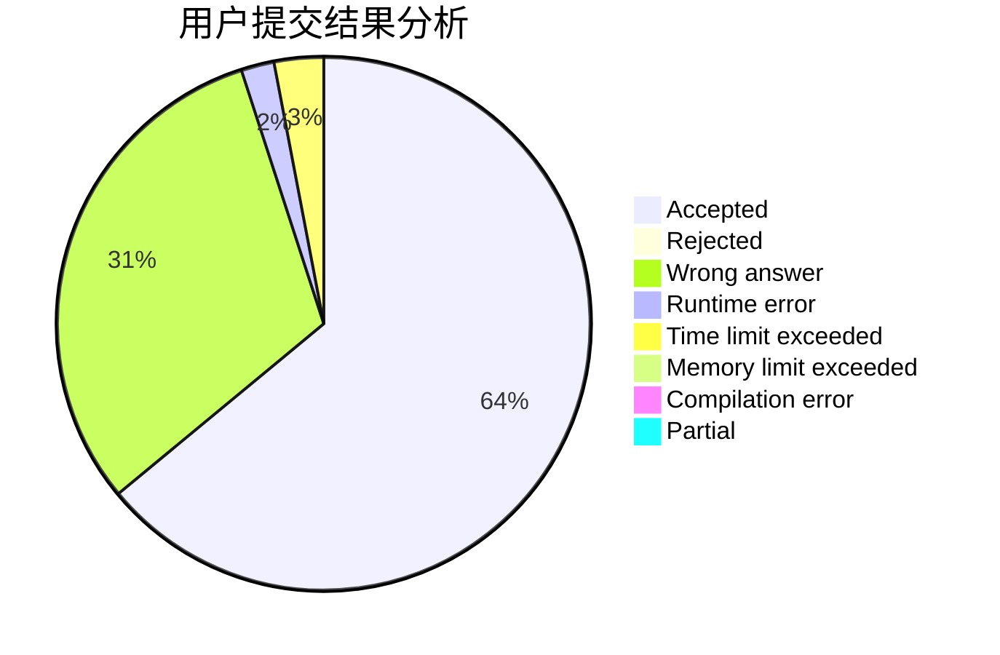
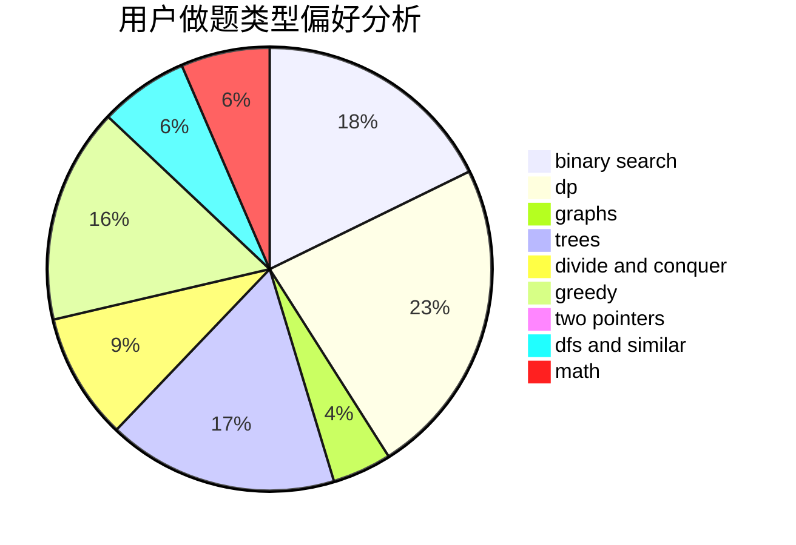

# 2020gangbazi

<!-- tabs:start -->

#### **用户提交结果分析**

#### **用户做题类型偏好分析**

<!-- tabs:end -->
# 推荐题目
[1288A](https://codeforces.com/contest/1288/problem/A)
[1284B](https://codeforces.com/contest/1284/problem/B)
[1285A](https://codeforces.com/contest/1285/problem/A)
[1287A](https://codeforces.com/contest/1287/problem/A)
[12871](https://codeforces.com/contest/1287/problem/1)
[1211B](https://codeforces.com/contest/1211/problem/B)
[1072B](https://codeforces.com/contest/1072/problem/B)
[1060E](https://codeforces.com/contest/1060/problem/E)
[1283E](https://codeforces.com/contest/1283/problem/E)
[1286D](https://codeforces.com/contest/1286/problem/D)
