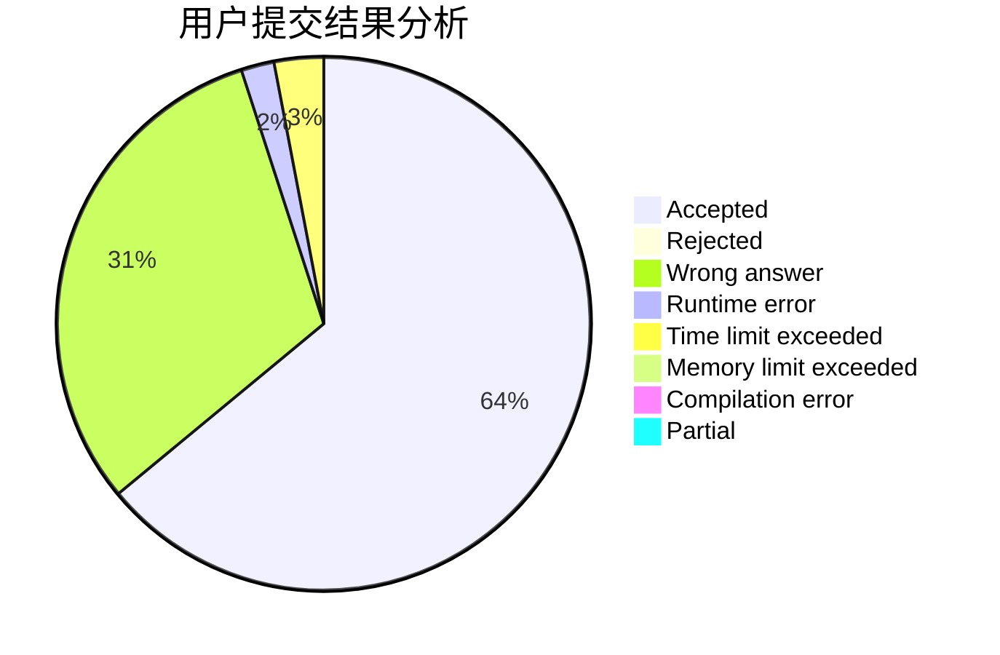
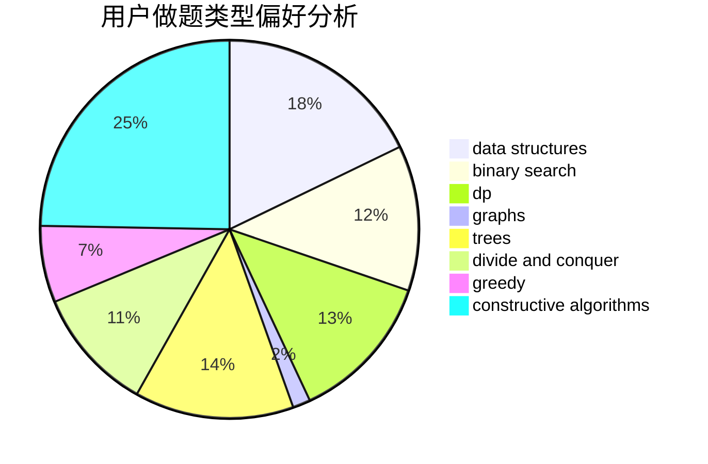
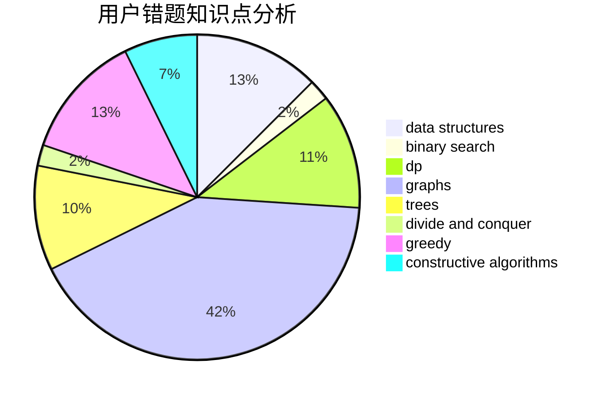

# 2020gangbazi

<!-- tabs:start -->

#### **用户提交结果分析**

#### **用户做题类型偏好分析**

#### **用户错题知识点分析**

<!-- tabs:end -->
# 推荐题目
[1288A](https://codeforces.com/contest/1288/problem/A)		binary search,
                        brute force,
                        math,
                        ternary search		  
[1284B](https://codeforces.com/contest/1284/problem/B)		binary search,
                        combinatorics,
                        data structures,
                        dp,
                        implementation,
                        sortings		  
[1285A](https://codeforces.com/contest/1285/problem/A)		math		  
[1287A](https://codeforces.com/contest/1287/problem/A)		greedy,
                        implementation		  
[12871](https://codeforces.com/contest/1287/problem/1)		dsu,graphs,sortings,trees		  
[1211B](https://codeforces.com/contest/1211/problem/B)		*special problem,
                        implementation		  
[1072B](https://codeforces.com/contest/1072/problem/B)		dsu,graphs,sortings,trees		  
[1060E](https://codeforces.com/contest/1060/problem/E)		dfs and similar,
                        dp,
                        trees		  
[1283E](https://codeforces.com/contest/1283/problem/E)		dp,
                        greedy		  
[1286D](https://codeforces.com/contest/1286/problem/D)		data structures,
                        math,
                        matrices,
                        probabilities		  
