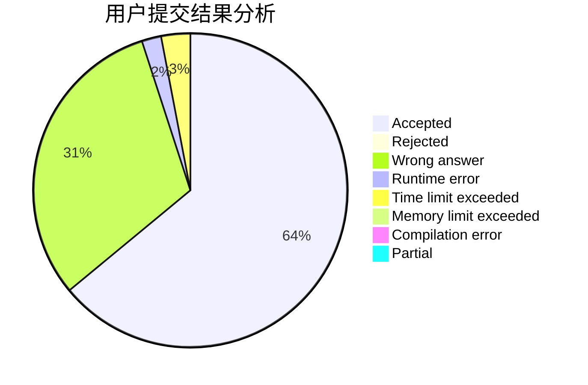
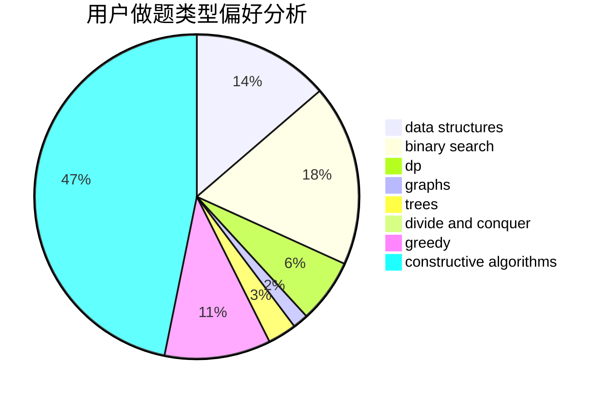
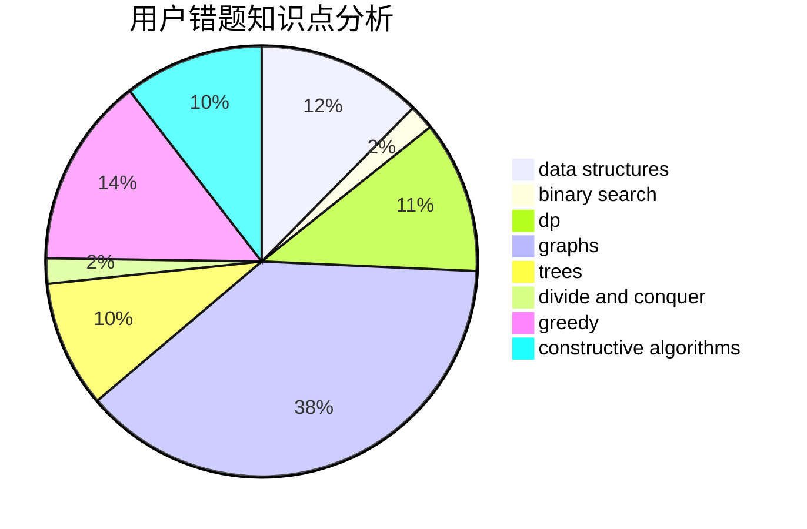

# 2020gangbazi
<!-- tabs:start -->
#### **用户提交结果分析**

#### **用户做题类型偏好分析**

#### **用户错题知识点分析**

<!-- tabs:end -->
# 推荐题目
[Beautiful Rectangle](https://codeforces.com/contest/1277/problem/F)		brute force,
                        combinatorics,
                        constructive algorithms,
                        data structures,
                        greedy,
                        math		  
[Shuffle Hashing](http://codeforces.com/problemset/problem/1278/A)		brute force,
                        implementation,
                        strings		  
[Intergalactic Sliding Puzzle](http://codeforces.com/problemset/problem/1280/F)		combinatorics,
                        constructive algorithms,
                        math		  
[Triple Flips](https://codeforces.com/contest/1071/problem/C)		constructive algorithms		  
[New Year Permutations](http://codeforces.com/problemset/problem/1279/E)		combinatorics,
                        dp		  
[Miss Punyverse](https://codeforces.com/contest/1281/problem/F)		dp,
                        greedy,
                        trees		  
[Lawnmower](http://codeforces.com/problemset/problem/115/B)		greedy,
                        sortings		  
[Santa's Bot](http://codeforces.com/problemset/problem/1279/D)		combinatorics,
                        math,
                        probabilities		  
[Azamon Web Services](http://codeforces.com/problemset/problem/1281/B)		greedy		  
[Jeremy Bearimy](https://codeforces.com/contest/1281/problem/E)		dfs and similar,
                        graphs,
                        greedy,
                        trees		  
<!-- tabs:start -->
#### **data structures**
[Beautiful Rectangle](https://codeforces.com/contest/1277/problem/F)		brute force,
                        combinatorics,
                        constructive algorithms,
                        data structures,
                        greedy,
                        math		  
[Let's Play the Words?](http://codeforces.com/problemset/problem/1277/D)		data structures,
                        hashing,
                        implementation,
                        math		  
[Berry Jam](http://codeforces.com/problemset/problem/1278/C)		data structures,
                        dp,
                        greedy,
                        implementation		  
[Stack of Presents](http://codeforces.com/problemset/problem/1279/C)		data structures,
                        implementation		  
[Segment Tree](http://codeforces.com/problemset/problem/1278/D)		data structures,
                        dsu,
                        graphs,
                        trees		  
[Yet Another LCP Problem](http://codeforces.com/problemset/problem/1073/G)		data structures,
                        string suffix structures		  
[Maximum width](http://codeforces.com/problemset/problem/1492/C)		binary search,
                        data structures,
                        dp,
                        greedy,
                        two pointers		  
[Old Floppy Drive](http://codeforces.com/problemset/problem/1490/G)		binary search,
                        data structures,
                        math		  
[Odd Mineral Resource](http://codeforces.com/problemset/problem/1479/D)		binary search,
                        bitmasks,
                        brute force,
                        data structures,
                        probabilities,
                        trees		  
[Meximization](http://codeforces.com/problemset/problem/1497/A)		brute force,
                        data structures,
                        greedy,
                        sortings		  
#### **binary search**
[New Year and Handle Change](http://codeforces.com/problemset/problem/1279/F)		binary search,
                        dp		  
[Verse For Santa](http://codeforces.com/problemset/problem/1279/B)		binary search,
                        brute force,
                        implementation		  
[Wooden Raft](https://codeforces.com/contest/1240/problem/E)		binary search,
                        math,
                        number theory		  
[Maximum width](http://codeforces.com/problemset/problem/1492/C)		binary search,
                        data structures,
                        dp,
                        greedy,
                        two pointers		  
[Pairs](http://codeforces.com/problemset/problem/1463/D)		binary search,
                        constructive algorithms,
                        greedy,
                        two pointers		  
[Old Floppy Drive](http://codeforces.com/problemset/problem/1490/G)		binary search,
                        data structures,
                        math		  
[Odd Mineral Resource](http://codeforces.com/problemset/problem/1479/D)		binary search,
                        bitmasks,
                        brute force,
                        data structures,
                        probabilities,
                        trees		  
[Complicated Computations](http://codeforces.com/problemset/problem/1436/E)		binary search,
                        data structures,
                        two pointers		  
[Divide and Summarize](http://codeforces.com/problemset/problem/1461/D)		binary search,
                        brute force,
                        data structures,
                        divide and conquer,
                        implementation,
                        sortings		  
[K-beautiful Strings](http://codeforces.com/problemset/problem/1493/C)		binary search,
                        brute force,
                        constructive algorithms,
                        greedy,
                        strings		  
#### **dp**
[New Year Permutations](http://codeforces.com/problemset/problem/1279/E)		combinatorics,
                        dp		  
[Miss Punyverse](https://codeforces.com/contest/1281/problem/F)		dp,
                        greedy,
                        trees		  
[Berry Jam](http://codeforces.com/problemset/problem/1278/C)		data structures,
                        dp,
                        greedy,
                        implementation		  
[New Year and Handle Change](http://codeforces.com/problemset/problem/1279/F)		binary search,
                        dp		  
[As Simple as One and Two](https://codeforces.com/contest/1277/problem/C)		dp,
                        greedy		  
[Cards](http://codeforces.com/problemset/problem/1278/F)		combinatorics,
                        dp,
                        math,
                        number theory,
                        probabilities		  
[Maximum width](http://codeforces.com/problemset/problem/1492/C)		binary search,
                        data structures,
                        dp,
                        greedy,
                        two pointers		  
[Bouncing Ball](https://codeforces.com/contest/1457/problem/C)		brute force,
                        dp,
                        implementation		  
[Pekora and Trampoline](http://codeforces.com/problemset/problem/1491/C)		brute force,
                        data structures,
                        dp,
                        greedy,
                        implementation		  
[Chef Monocarp](http://codeforces.com/problemset/problem/1437/C)		dp,
                        flows,
                        graph matchings,
                        greedy,
                        math,
                        sortings		  
#### **graph**
[Jeremy Bearimy](https://codeforces.com/contest/1281/problem/E)		dfs and similar,
                        graphs,
                        greedy,
                        trees		  
[Two Fairs](https://codeforces.com/contest/1277/problem/E)		combinatorics,
                        dfs and similar,
                        dsu,
                        graphs		  
[Segment Tree](http://codeforces.com/problemset/problem/1278/D)		data structures,
                        dsu,
                        graphs,
                        trees		  
[Minimum Ties](http://codeforces.com/problemset/problem/1487/C)		brute force,
                        constructive algorithms,
                        dfs and similar,
                        graphs,
                        greedy,
                        implementation,
                        math		  
[Chef Monocarp](http://codeforces.com/problemset/problem/1437/C)		dp,
                        flows,
                        graph matchings,
                        greedy,
                        math,
                        sortings		  
[Strange Housing](http://codeforces.com/problemset/problem/1470/D)		constructive algorithms,
                        dfs and similar,
                        graph matchings,
                        graphs,
                        greedy		  
[Longest Simple Cycle](http://codeforces.com/problemset/problem/1476/C)		dp,
                        graphs,
                        greedy		  
[Shortest and Longest LIS](http://codeforces.com/problemset/problem/1304/D)		constructive algorithms,
                        graphs,
                        greedy,
                        two pointers		  
[Ball in Berland](http://codeforces.com/problemset/problem/1475/C)		combinatorics,
                        graphs,
                        math		  
[Kyoya and Train](http://codeforces.com/problemset/problem/553/E)		dp,
                        fft,
                        graphs,
                        math,
                        probabilities		  
#### **trees**
[Miss Punyverse](https://codeforces.com/contest/1281/problem/F)		dp,
                        greedy,
                        trees		  
[Jeremy Bearimy](https://codeforces.com/contest/1281/problem/E)		dfs and similar,
                        graphs,
                        greedy,
                        trees		  
[Tests for problem D](http://codeforces.com/problemset/problem/1278/E)		constructive algorithms,
                        dfs and similar,
                        divide and conquer,
                        trees		  
[Segment Tree](http://codeforces.com/problemset/problem/1278/D)		data structures,
                        dsu,
                        graphs,
                        trees		  
[Odd Mineral Resource](http://codeforces.com/problemset/problem/1479/D)		binary search,
                        bitmasks,
                        brute force,
                        data structures,
                        probabilities,
                        trees		  
[Yet Another Card Deck](http://codeforces.com/problemset/problem/1511/C)		brute force,
                        data structures,
                        implementation,
                        trees		  
[Diameter Cuts](http://codeforces.com/problemset/problem/1499/F)		combinatorics,
                        dfs and similar,
                        dp,
                        trees		  
[Fib-tree](http://codeforces.com/problemset/problem/1491/E)		brute force,
                        dfs and similar,
                        divide and conquer,
                        number theory,
                        trees		  
[13th Labour of Heracles](http://codeforces.com/problemset/problem/1466/D)		data structures,
                        greedy,
                        sortings,
                        trees		  
[BFS Trees](http://codeforces.com/problemset/problem/1495/D)		combinatorics,
                        dfs and similar,
                        graphs,
                        math,
                        shortest paths,
                        trees		  
#### **divide and conquer**
[Tests for problem D](http://codeforces.com/problemset/problem/1278/E)		constructive algorithms,
                        dfs and similar,
                        divide and conquer,
                        trees		  
[Divide and Summarize](http://codeforces.com/problemset/problem/1461/D)		binary search,
                        brute force,
                        data structures,
                        divide and conquer,
                        implementation,
                        sortings		  
[Song of the Sirens](http://codeforces.com/problemset/problem/1466/G)		combinatorics,
                        divide and conquer,
                        hashing,
                        math,
                        string suffix structures,
                        strings		  
[Permutation Transformation](http://codeforces.com/problemset/problem/1490/D)		dfs and similar,
                        divide and conquer,
                        implementation		  
[Skyline Photo](https://codeforces.com/contest/1483/problem/C)		data structures,
                        divide and conquer,
                        dp		  
[Fib-tree](http://codeforces.com/problemset/problem/1491/E)		brute force,
                        dfs and similar,
                        divide and conquer,
                        number theory,
                        trees		  
[Sum of Prefix Sums](http://codeforces.com/problemset/problem/1303/G)		data structures,
                        divide and conquer,
                        geometry,
                        trees		  
[Dogeforces](http://codeforces.com/problemset/problem/1494/D)		constructive algorithms,
                        data structures,
                        dfs and similar,
                        divide and conquer,
                        dsu,
                        greedy,
                        sortings,
                        trees		  
[Logistical Questions](http://codeforces.com/problemset/problem/566/C)		dfs and similar,
                        divide and conquer,
                        trees		  
[Fruit Sequences](http://codeforces.com/problemset/problem/1428/F)		binary search,
                        data structures,
                        divide and conquer,
                        dp,
                        two pointers		  
#### **greedy**
[Beautiful Rectangle](https://codeforces.com/contest/1277/problem/F)		brute force,
                        combinatorics,
                        constructive algorithms,
                        data structures,
                        greedy,
                        math		  
[Miss Punyverse](https://codeforces.com/contest/1281/problem/F)		dp,
                        greedy,
                        trees		  
[Lawnmower](http://codeforces.com/problemset/problem/115/B)		greedy,
                        sortings		  
[Azamon Web Services](http://codeforces.com/problemset/problem/1281/B)		greedy		  
[Jeremy Bearimy](https://codeforces.com/contest/1281/problem/E)		dfs and similar,
                        graphs,
                        greedy,
                        trees		  
[Berry Jam](http://codeforces.com/problemset/problem/1278/C)		data structures,
                        dp,
                        greedy,
                        implementation		  
[Maximum Sum of Digits](http://codeforces.com/problemset/problem/1060/B)		greedy		  
[The Feast and the Bus](http://codeforces.com/problemset/problem/1250/B)		brute force,
                        constructive algorithms,
                        greedy,
                        math		  
[Square Filling](http://codeforces.com/problemset/problem/1207/B)		constructive algorithms,
                        greedy,
                        implementation		  
[As Simple as One and Two](https://codeforces.com/contest/1277/problem/C)		dp,
                        greedy		  
#### **constructive algorithms**
[Beautiful Rectangle](https://codeforces.com/contest/1277/problem/F)		brute force,
                        combinatorics,
                        constructive algorithms,
                        data structures,
                        greedy,
                        math		  
[Intergalactic Sliding Puzzle](http://codeforces.com/problemset/problem/1280/F)		combinatorics,
                        constructive algorithms,
                        math		  
[Triple Flips](https://codeforces.com/contest/1071/problem/C)		constructive algorithms		  
[Box](http://codeforces.com/problemset/problem/1227/B)		constructive algorithms		  
[The Feast and the Bus](http://codeforces.com/problemset/problem/1250/B)		brute force,
                        constructive algorithms,
                        greedy,
                        math		  
[Tests for problem D](http://codeforces.com/problemset/problem/1278/E)		constructive algorithms,
                        dfs and similar,
                        divide and conquer,
                        trees		  
[Square Filling](http://codeforces.com/problemset/problem/1207/B)		constructive algorithms,
                        greedy,
                        implementation		  
[Sonya and Robots](http://codeforces.com/problemset/problem/1004/C)		constructive algorithms,
                        implementation		  
[Anti-knapsack](http://codeforces.com/problemset/problem/1493/A)		constructive algorithms,
                        greedy		  
[Pairs](http://codeforces.com/problemset/problem/1463/D)		binary search,
                        constructive algorithms,
                        greedy,
                        two pointers		  
#### **sortings**
[Lawnmower](http://codeforces.com/problemset/problem/115/B)		greedy,
                        sortings		  
[Diamond Miner](https://codeforces.com/contest/1496/problem/C)		geometry,
                        greedy,
                        math,
                        sortings		  
[Meximization](http://codeforces.com/problemset/problem/1497/A)		brute force,
                        data structures,
                        greedy,
                        sortings		  
[Avoiding Zero](http://codeforces.com/problemset/problem/1427/A)		math,
                        sortings		  
[Divide and Summarize](http://codeforces.com/problemset/problem/1461/D)		binary search,
                        brute force,
                        data structures,
                        divide and conquer,
                        implementation,
                        sortings		  
[Chef Monocarp](http://codeforces.com/problemset/problem/1437/C)		dp,
                        flows,
                        graph matchings,
                        greedy,
                        math,
                        sortings		  
[Replacing Elements](http://codeforces.com/problemset/problem/1473/A)		greedy,
                        implementation,
                        math,
                        sortings		  
[Eastern Exhibition](http://codeforces.com/problemset/problem/1486/B)		binary search,
                        geometry,
                        shortest paths,
                        sortings		  
[The Great Hero](http://codeforces.com/problemset/problem/1480/B)		greedy,
                        implementation,
                        sortings		  
[Rescue Nibel!](http://codeforces.com/problemset/problem/1420/D)		combinatorics,
                        data structures,
                        sortings		  
<!-- tabs:end -->
