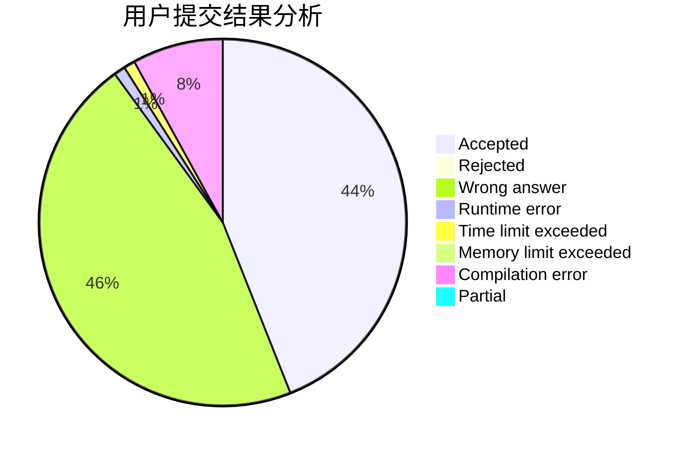
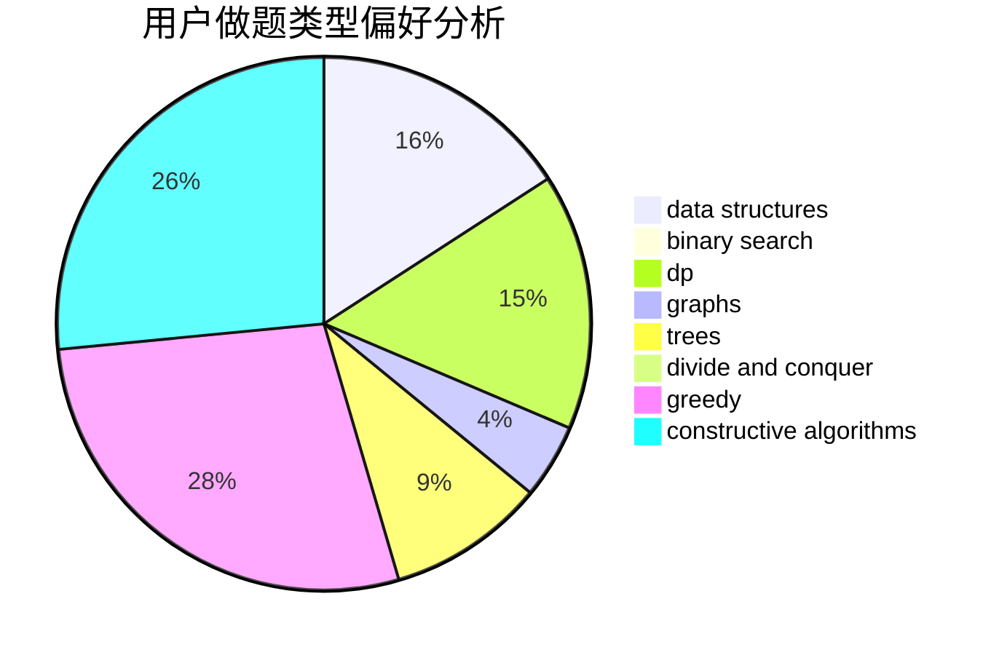

# GUESSER

<!-- tabs:start -->

#### **用户提交结果分析**

#### **用户做题类型偏好分析**

#### **用户错题知识点分析**

<!-- tabs:end -->
# 推荐题目
[1346E](https://codeforces.com/contest/1346/problem/E)		*special problem,
                        dp,
                        graphs		  
[898B](https://codeforces.com/contest/898/problem/B)		brute force,
                        implementation,
                        number theory		  
[479C](https://codeforces.com/contest/479/problem/C)		greedy,
                        sortings		  
[263C](https://codeforces.com/contest/263/problem/C)		brute force,
                        dfs and similar,
                        implementation		  
[1058D](https://codeforces.com/contest/1058/problem/D)		dsu,graphs,sortings,trees		  
[584E](https://codeforces.com/contest/584/problem/E)		constructive algorithms,
                        greedy,
                        math		  
[620D](https://codeforces.com/contest/620/problem/D)		binary search,
                        two pointers		  
[643D](https://codeforces.com/contest/643/problem/D)		nan		  
[486E](https://codeforces.com/contest/486/problem/E)		data structures,
                        dp,
                        greedy,
                        hashing,
                        math		  
[402C](https://codeforces.com/contest/402/problem/C)		brute force,
                        constructive algorithms,
                        graphs		  
