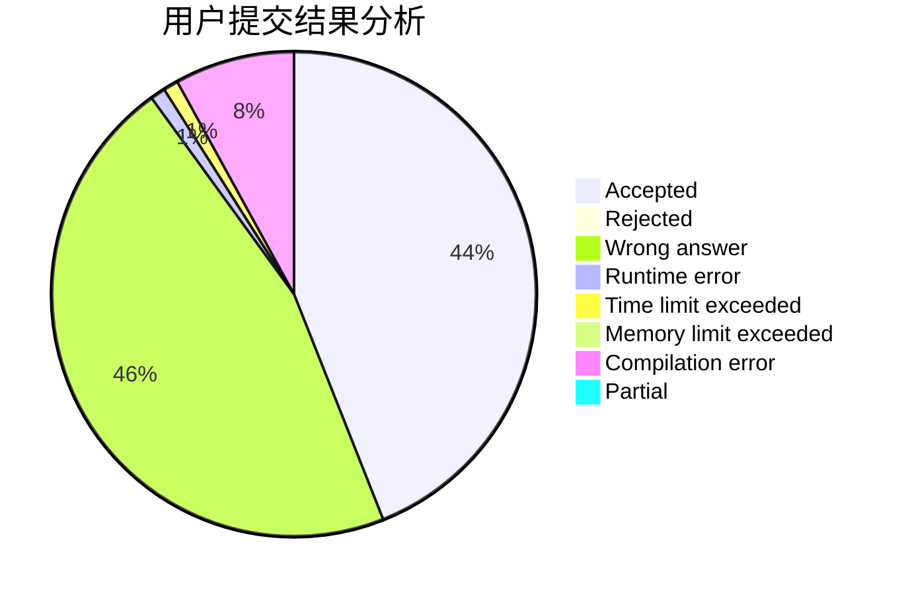
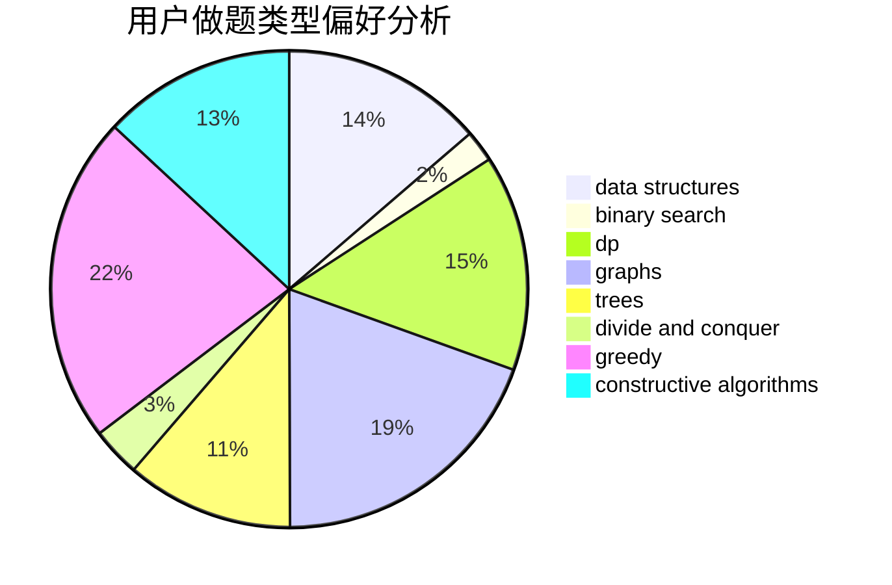

# GUESSER

<!-- tabs:start -->

#### **用户提交结果分析**

#### **用户做题类型偏好分析**

#### **用户错题知识点分析**

<!-- tabs:end -->
# 推荐题目
[1339E](https://codeforces.com/contest/1339/problem/E)		dsu,graphs,sortings,trees		  
[877C](https://codeforces.com/contest/877/problem/C)		constructive algorithms		  
[460A](https://codeforces.com/contest/460/problem/A)		brute force,
                        implementation,
                        math		  
[241E](https://codeforces.com/contest/241/problem/E)		graphs,
                        shortest paths		  
[1058A](https://codeforces.com/contest/1058/problem/A)		dsu,graphs,sortings,trees		  
[566A](https://codeforces.com/contest/566/problem/A)		dfs and similar,
                        strings,
                        trees		  
[601B](https://codeforces.com/contest/601/problem/B)		data structures,
                        math		  
[620A](https://codeforces.com/contest/620/problem/A)		implementation,
                        math		  
[467C](https://codeforces.com/contest/467/problem/C)		dp,
                        implementation		  
[372C](https://codeforces.com/contest/372/problem/C)		data structures,
                        dp,
                        math		  
