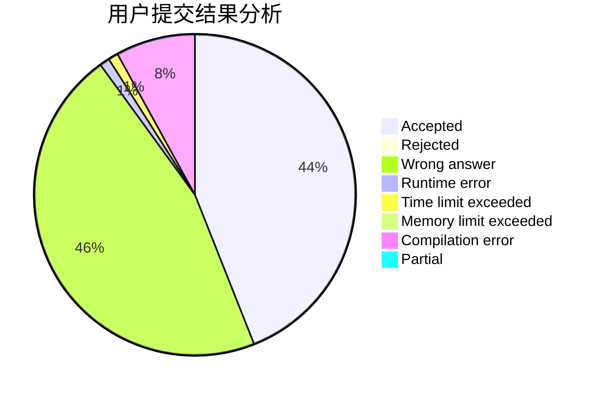
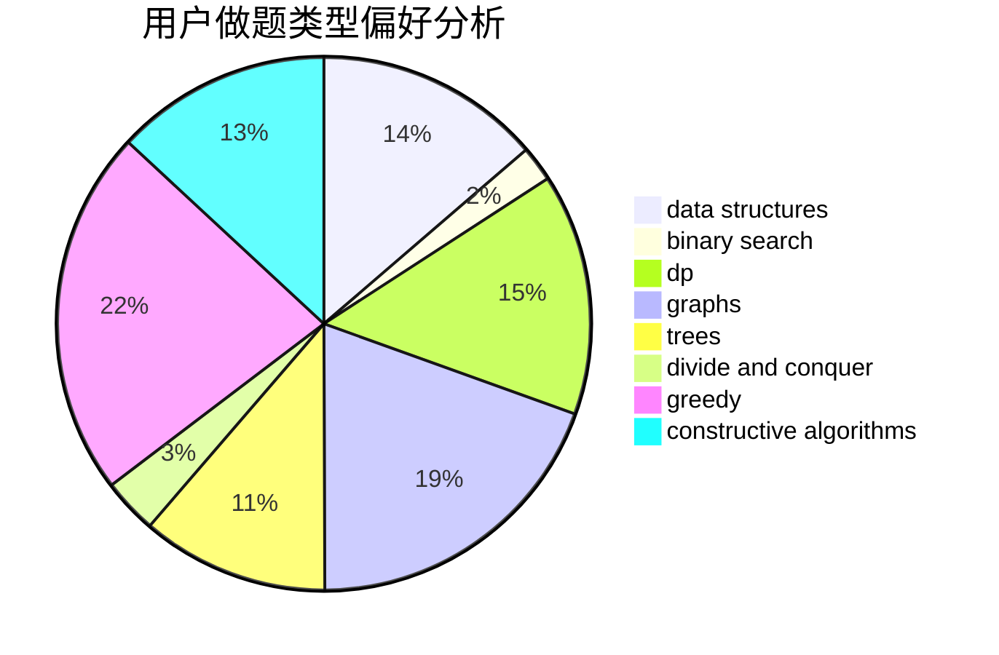

# GUESSER
<!-- tabs:start -->
#### **用户提交结果分析**

#### **用户做题类型偏好分析**

#### **用户错题知识点分析**

<!-- tabs:end -->
# 推荐题目
[Processing Queries](http://codeforces.com/problemset/problem/644/B)		*special problem,
                        constructive algorithms,
                        data structures,
                        two pointers		  
[Hulk](http://codeforces.com/problemset/problem/705/A)		implementation		  
[Perfect Triples](https://codeforces.com/contest/1339/problem/E)		bitmasks,
                        brute force,
                        constructive algorithms,
                        divide and conquer,
                        math		  
[Nikita and string](http://codeforces.com/problemset/problem/877/B)		brute force,
                        dp		  
[Palindrome XOR](http://codeforces.com/problemset/problem/1147/D)		dfs and similar,
                        graphs		  
[Slava and tanks](http://codeforces.com/problemset/problem/877/C)		constructive algorithms		  
[Matching Names](http://codeforces.com/problemset/problem/566/A)		dfs and similar,
                        strings,
                        trees		  
[Watching Fireworks is Fun](http://codeforces.com/problemset/problem/372/C)		data structures,
                        dp,
                        math		  
[Flights](http://codeforces.com/problemset/problem/241/E)		graphs,
                        shortest paths		  
[A Game on Strings](http://codeforces.com/problemset/problem/1037/G)		games		  
<!-- tabs:start -->
#### **data structures**
[Processing Queries](http://codeforces.com/problemset/problem/644/B)		*special problem,
                        constructive algorithms,
                        data structures,
                        two pointers		  
[Hulk](http://codeforces.com/problemset/problem/372/C)		data structures,
                        dp,
                        math		  
[Perfect Triples](http://codeforces.com/problemset/problem/601/B)		data structures,
                        math		  
[Nikita and string](http://codeforces.com/problemset/problem/1111/E)		data structures,
                        dfs and similar,
                        dp,
                        graphs,
                        trees		  
[Palindrome XOR](http://codeforces.com/problemset/problem/573/E)		data structures,
                        greedy		  
[Slava and tanks](http://codeforces.com/problemset/problem/1503/C)		binary search,
                        data structures,
                        dp,
                        greedy,
                        shortest paths,
                        sortings,
                        two pointers		  
[Matching Names](http://codeforces.com/problemset/problem/1492/C)		binary search,
                        data structures,
                        dp,
                        greedy,
                        two pointers		  
[Watching Fireworks is Fun](http://codeforces.com/problemset/problem/1490/G)		binary search,
                        data structures,
                        math		  
[Flights](http://codeforces.com/problemset/problem/1479/D)		binary search,
                        bitmasks,
                        brute force,
                        data structures,
                        probabilities,
                        trees		  
[A Game on Strings](http://codeforces.com/problemset/problem/1497/A)		brute force,
                        data structures,
                        greedy,
                        sortings		  
#### **binary search**
[Processing Queries](http://codeforces.com/problemset/problem/1419/D2)		binary search,
                        brute force,
                        constructive algorithms,
                        greedy,
                        sortings,
                        two pointers		  
[Hulk](http://codeforces.com/problemset/problem/1503/C)		binary search,
                        data structures,
                        dp,
                        greedy,
                        shortest paths,
                        sortings,
                        two pointers		  
[Perfect Triples](http://codeforces.com/problemset/problem/1492/C)		binary search,
                        data structures,
                        dp,
                        greedy,
                        two pointers		  
[Nikita and string](http://codeforces.com/problemset/problem/1463/D)		binary search,
                        constructive algorithms,
                        greedy,
                        two pointers		  
[Palindrome XOR](http://codeforces.com/problemset/problem/1490/G)		binary search,
                        data structures,
                        math		  
[Slava and tanks](http://codeforces.com/problemset/problem/1479/D)		binary search,
                        bitmasks,
                        brute force,
                        data structures,
                        probabilities,
                        trees		  
[Matching Names](http://codeforces.com/problemset/problem/1436/E)		binary search,
                        data structures,
                        two pointers		  
[Watching Fireworks is Fun](http://codeforces.com/problemset/problem/1461/D)		binary search,
                        brute force,
                        data structures,
                        divide and conquer,
                        implementation,
                        sortings		  
[Flights](http://codeforces.com/problemset/problem/1493/C)		binary search,
                        brute force,
                        constructive algorithms,
                        greedy,
                        strings		  
[A Game on Strings](http://codeforces.com/problemset/problem/1487/D)		binary search,
                        brute force,
                        math,
                        number theory		  
#### **dp**
[Processing Queries](http://codeforces.com/problemset/problem/877/B)		brute force,
                        dp		  
[Hulk](http://codeforces.com/problemset/problem/372/C)		data structures,
                        dp,
                        math		  
[Perfect Triples](http://codeforces.com/problemset/problem/288/E)		dp,
                        implementation,
                        math		  
[Nikita and string](http://codeforces.com/problemset/problem/1111/E)		data structures,
                        dfs and similar,
                        dp,
                        graphs,
                        trees		  
[Palindrome XOR](http://codeforces.com/problemset/problem/467/C)		dp,
                        implementation		  
[Slava and tanks](http://codeforces.com/problemset/problem/1499/B)		brute force,
                        dp,
                        greedy,
                        implementation		  
[Matching Names](http://codeforces.com/problemset/problem/1503/C)		binary search,
                        data structures,
                        dp,
                        greedy,
                        shortest paths,
                        sortings,
                        two pointers		  
[Watching Fireworks is Fun](http://codeforces.com/problemset/problem/1363/E)		dfs and similar,
                        dp,
                        greedy,
                        trees		  
[Flights](http://codeforces.com/problemset/problem/1492/C)		binary search,
                        data structures,
                        dp,
                        greedy,
                        two pointers		  
[A Game on Strings](https://codeforces.com/contest/1457/problem/C)		brute force,
                        dp,
                        implementation		  
#### **graph**
[Processing Queries](http://codeforces.com/problemset/problem/1147/D)		dfs and similar,
                        graphs		  
[Hulk](http://codeforces.com/problemset/problem/241/E)		graphs,
                        shortest paths		  
[Perfect Triples](http://codeforces.com/problemset/problem/788/C)		dfs and similar,
                        graphs,
                        shortest paths		  
[Nikita and string](http://codeforces.com/problemset/problem/1111/E)		data structures,
                        dfs and similar,
                        dp,
                        graphs,
                        trees		  
[Palindrome XOR](https://codeforces.com/contest/1496/problem/F)		combinatorics,
                        dfs and similar,
                        graphs,
                        math,
                        shortest paths,
                        trees		  
[Slava and tanks](http://codeforces.com/problemset/problem/1487/C)		brute force,
                        constructive algorithms,
                        dfs and similar,
                        graphs,
                        greedy,
                        implementation,
                        math		  
[Matching Names](http://codeforces.com/problemset/problem/1437/C)		dp,
                        flows,
                        graph matchings,
                        greedy,
                        math,
                        sortings		  
[Watching Fireworks is Fun](http://codeforces.com/problemset/problem/1470/D)		constructive algorithms,
                        dfs and similar,
                        graph matchings,
                        graphs,
                        greedy		  
[Flights](http://codeforces.com/problemset/problem/1476/C)		dp,
                        graphs,
                        greedy		  
[A Game on Strings](http://codeforces.com/problemset/problem/1304/D)		constructive algorithms,
                        graphs,
                        greedy,
                        two pointers		  
#### **trees**
[Processing Queries](http://codeforces.com/problemset/problem/566/A)		dfs and similar,
                        strings,
                        trees		  
[Hulk](http://codeforces.com/problemset/problem/1111/E)		data structures,
                        dfs and similar,
                        dp,
                        graphs,
                        trees		  
[Perfect Triples](https://codeforces.com/contest/1496/problem/F)		combinatorics,
                        dfs and similar,
                        graphs,
                        math,
                        shortest paths,
                        trees		  
[Nikita and string](http://codeforces.com/problemset/problem/1363/E)		dfs and similar,
                        dp,
                        greedy,
                        trees		  
[Palindrome XOR](http://codeforces.com/problemset/problem/1479/D)		binary search,
                        bitmasks,
                        brute force,
                        data structures,
                        probabilities,
                        trees		  
[Slava and tanks](http://codeforces.com/problemset/problem/1511/C)		brute force,
                        data structures,
                        implementation,
                        trees		  
[Matching Names](http://codeforces.com/problemset/problem/1499/F)		combinatorics,
                        dfs and similar,
                        dp,
                        trees		  
[Watching Fireworks is Fun](http://codeforces.com/problemset/problem/1491/E)		brute force,
                        dfs and similar,
                        divide and conquer,
                        number theory,
                        trees		  
[Flights](http://codeforces.com/problemset/problem/1466/D)		data structures,
                        greedy,
                        sortings,
                        trees		  
[A Game on Strings](http://codeforces.com/problemset/problem/1495/D)		combinatorics,
                        dfs and similar,
                        graphs,
                        math,
                        shortest paths,
                        trees		  
#### **divide and conquer**
[Processing Queries](https://codeforces.com/contest/1339/problem/E)		bitmasks,
                        brute force,
                        constructive algorithms,
                        divide and conquer,
                        math		  
[Hulk](http://codeforces.com/problemset/problem/1461/D)		binary search,
                        brute force,
                        data structures,
                        divide and conquer,
                        implementation,
                        sortings		  
[Perfect Triples](http://codeforces.com/problemset/problem/1466/G)		combinatorics,
                        divide and conquer,
                        hashing,
                        math,
                        string suffix structures,
                        strings		  
[Nikita and string](http://codeforces.com/problemset/problem/1490/D)		dfs and similar,
                        divide and conquer,
                        implementation		  
[Palindrome XOR](https://codeforces.com/contest/1483/problem/C)		data structures,
                        divide and conquer,
                        dp		  
[Slava and tanks](http://codeforces.com/problemset/problem/1491/E)		brute force,
                        dfs and similar,
                        divide and conquer,
                        number theory,
                        trees		  
[Matching Names](http://codeforces.com/problemset/problem/1303/G)		data structures,
                        divide and conquer,
                        geometry,
                        trees		  
[Watching Fireworks is Fun](http://codeforces.com/problemset/problem/1494/D)		constructive algorithms,
                        data structures,
                        dfs and similar,
                        divide and conquer,
                        dsu,
                        greedy,
                        sortings,
                        trees		  
[Flights](http://codeforces.com/problemset/problem/1482/E)		data structures,
                        divide and conquer,
                        dp		  
[A Game on Strings](http://codeforces.com/problemset/problem/566/C)		dfs and similar,
                        divide and conquer,
                        trees		  
#### **greedy**
[Processing Queries](http://codeforces.com/problemset/problem/1178/C)		combinatorics,
                        greedy,
                        math		  
[Hulk](http://codeforces.com/problemset/problem/573/E)		data structures,
                        greedy		  
[Perfect Triples](http://codeforces.com/problemset/problem/1499/B)		brute force,
                        dp,
                        greedy,
                        implementation		  
[Nikita and string](http://codeforces.com/problemset/problem/1419/D2)		binary search,
                        brute force,
                        constructive algorithms,
                        greedy,
                        sortings,
                        two pointers		  
[Palindrome XOR](http://codeforces.com/problemset/problem/1198/F)		greedy,
                        number theory,
                        probabilities		  
[Slava and tanks](http://codeforces.com/problemset/problem/1260/C)		greedy,
                        math,
                        number theory		  
[Matching Names](http://codeforces.com/problemset/problem/1503/C)		binary search,
                        data structures,
                        dp,
                        greedy,
                        shortest paths,
                        sortings,
                        two pointers		  
[Watching Fireworks is Fun](http://codeforces.com/problemset/problem/1363/E)		dfs and similar,
                        dp,
                        greedy,
                        trees		  
[Flights](http://codeforces.com/problemset/problem/1236/C)		constructive algorithms,
                        greedy,
                        implementation		  
[A Game on Strings](http://codeforces.com/problemset/problem/1467/A)		constructive algorithms,
                        greedy,
                        math		  
#### **constructive algorithms**
[Processing Queries](http://codeforces.com/problemset/problem/644/B)		*special problem,
                        constructive algorithms,
                        data structures,
                        two pointers		  
[Hulk](https://codeforces.com/contest/1339/problem/E)		bitmasks,
                        brute force,
                        constructive algorithms,
                        divide and conquer,
                        math		  
[Perfect Triples](http://codeforces.com/problemset/problem/877/C)		constructive algorithms		  
[Nikita and string](http://codeforces.com/problemset/problem/659/B)		constructive algorithms,
                        sortings		  
[Palindrome XOR](http://codeforces.com/problemset/problem/1016/D)		constructive algorithms,
                        flows,
                        math		  
[Slava and tanks](http://codeforces.com/problemset/problem/1419/D2)		binary search,
                        brute force,
                        constructive algorithms,
                        greedy,
                        sortings,
                        two pointers		  
[Matching Names](http://codeforces.com/problemset/problem/1236/C)		constructive algorithms,
                        greedy,
                        implementation		  
[Watching Fireworks is Fun](http://codeforces.com/problemset/problem/1467/A)		constructive algorithms,
                        greedy,
                        math		  
[Flights](http://codeforces.com/problemset/problem/1493/A)		constructive algorithms,
                        greedy		  
[A Game on Strings](http://codeforces.com/problemset/problem/1463/D)		binary search,
                        constructive algorithms,
                        greedy,
                        two pointers		  
#### **sortings**
[Processing Queries](http://codeforces.com/problemset/problem/659/B)		constructive algorithms,
                        sortings		  
[Hulk](http://codeforces.com/problemset/problem/1419/D2)		binary search,
                        brute force,
                        constructive algorithms,
                        greedy,
                        sortings,
                        two pointers		  
[Perfect Triples](http://codeforces.com/problemset/problem/1503/C)		binary search,
                        data structures,
                        dp,
                        greedy,
                        shortest paths,
                        sortings,
                        two pointers		  
[Nikita and string](https://codeforces.com/contest/1496/problem/C)		geometry,
                        greedy,
                        math,
                        sortings		  
[Palindrome XOR](http://codeforces.com/problemset/problem/1495/A)		geometry,
                        greedy,
                        math,
                        sortings		  
[Slava and tanks](http://codeforces.com/problemset/problem/1497/A)		brute force,
                        data structures,
                        greedy,
                        sortings		  
[Matching Names](http://codeforces.com/problemset/problem/1427/A)		math,
                        sortings		  
[Watching Fireworks is Fun](http://codeforces.com/problemset/problem/1461/D)		binary search,
                        brute force,
                        data structures,
                        divide and conquer,
                        implementation,
                        sortings		  
[Flights](http://codeforces.com/problemset/problem/1437/C)		dp,
                        flows,
                        graph matchings,
                        greedy,
                        math,
                        sortings		  
[A Game on Strings](http://codeforces.com/problemset/problem/1473/A)		greedy,
                        implementation,
                        math,
                        sortings		  
<!-- tabs:end -->
