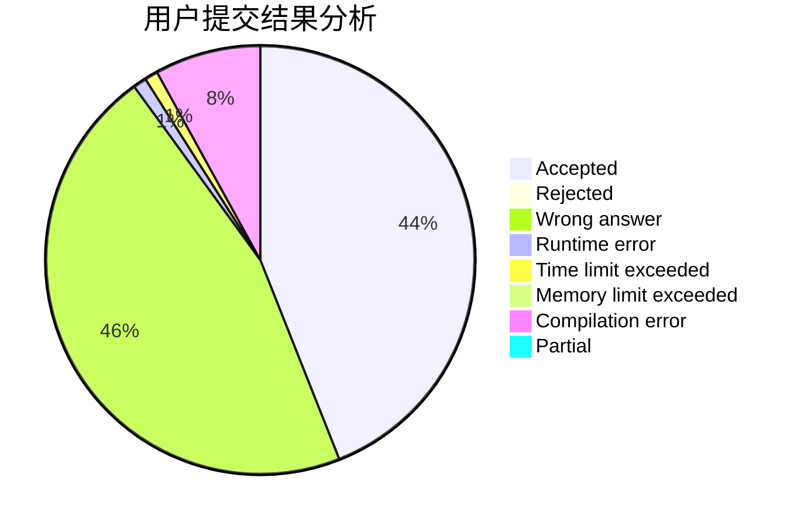
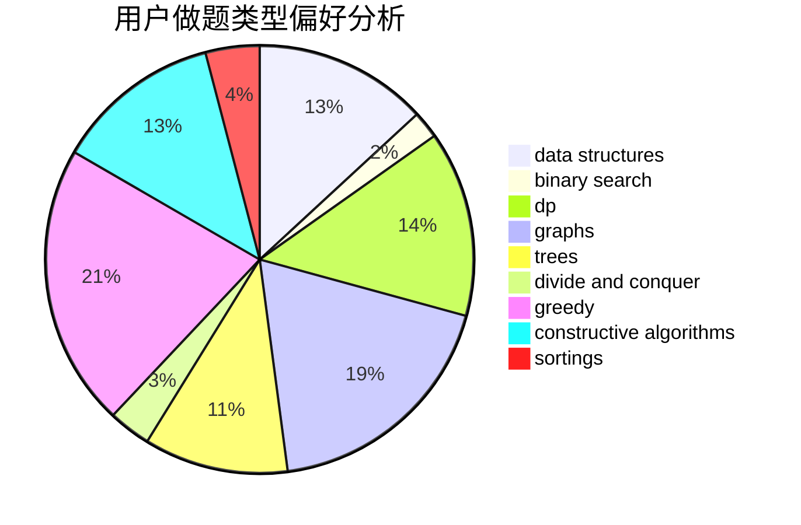

# GUESSER
<!-- tabs:start -->
#### **用户提交结果分析**

#### **用户做题类型偏好分析**

#### **用户错题知识点分析**

<!-- tabs:end -->
# 推荐题目
[644B](http://codeforces.com/problemset/problem/644/B)		*special problem,
                        constructive algorithms,
                        data structures,
                        two pointers		  
[705A](http://codeforces.com/problemset/problem/705/A)		implementation		  
[1339E](https://codeforces.com/contest/1339/problem/E)		bitmasks,
                        brute force,
                        constructive algorithms,
                        divide and conquer,
                        math		  
[877B](http://codeforces.com/problemset/problem/877/B)		brute force,
                        dp		  
[1147D](http://codeforces.com/problemset/problem/1147/D)		dfs and similar,
                        graphs		  
[877C](http://codeforces.com/problemset/problem/877/C)		constructive algorithms		  
[566A](http://codeforces.com/problemset/problem/566/A)		dfs and similar,
                        strings,
                        trees		  
[372C](http://codeforces.com/problemset/problem/372/C)		data structures,
                        dp,
                        math		  
[241E](http://codeforces.com/problemset/problem/241/E)		graphs,
                        shortest paths		  
[1037G](http://codeforces.com/problemset/problem/1037/G)		games		  
<!-- tabs:start -->
#### **data structures**
[644B](http://codeforces.com/problemset/problem/644/B)		*special problem,
                        constructive algorithms,
                        data structures,
                        two pointers		  
[372C](http://codeforces.com/problemset/problem/372/C)		data structures,
                        dp,
                        math		  
[601B](http://codeforces.com/problemset/problem/601/B)		data structures,
                        math		  
[1111E](http://codeforces.com/problemset/problem/1111/E)		data structures,
                        dfs and similar,
                        dp,
                        graphs,
                        trees		  
[573E](http://codeforces.com/problemset/problem/573/E)		data structures,
                        greedy		  
[1503C](http://codeforces.com/problemset/problem/1503/C)		binary search,
                        data structures,
                        dp,
                        greedy,
                        shortest paths,
                        sortings,
                        two pointers		  
[1492C](http://codeforces.com/problemset/problem/1492/C)		binary search,
                        data structures,
                        dp,
                        greedy,
                        two pointers		  
[1490G](http://codeforces.com/problemset/problem/1490/G)		binary search,
                        data structures,
                        math		  
[1479D](http://codeforces.com/problemset/problem/1479/D)		binary search,
                        bitmasks,
                        brute force,
                        data structures,
                        probabilities,
                        trees		  
[1497A](http://codeforces.com/problemset/problem/1497/A)		brute force,
                        data structures,
                        greedy,
                        sortings		  
#### **binary search**
[1419D2](http://codeforces.com/problemset/problem/1419/D2)		binary search,
                        brute force,
                        constructive algorithms,
                        greedy,
                        sortings,
                        two pointers		  
[1503C](http://codeforces.com/problemset/problem/1503/C)		binary search,
                        data structures,
                        dp,
                        greedy,
                        shortest paths,
                        sortings,
                        two pointers		  
[1492C](http://codeforces.com/problemset/problem/1492/C)		binary search,
                        data structures,
                        dp,
                        greedy,
                        two pointers		  
[1463D](http://codeforces.com/problemset/problem/1463/D)		binary search,
                        constructive algorithms,
                        greedy,
                        two pointers		  
[1490G](http://codeforces.com/problemset/problem/1490/G)		binary search,
                        data structures,
                        math		  
[1479D](http://codeforces.com/problemset/problem/1479/D)		binary search,
                        bitmasks,
                        brute force,
                        data structures,
                        probabilities,
                        trees		  
[1436E](http://codeforces.com/problemset/problem/1436/E)		binary search,
                        data structures,
                        two pointers		  
[1461D](http://codeforces.com/problemset/problem/1461/D)		binary search,
                        brute force,
                        data structures,
                        divide and conquer,
                        implementation,
                        sortings		  
[1493C](http://codeforces.com/problemset/problem/1493/C)		binary search,
                        brute force,
                        constructive algorithms,
                        greedy,
                        strings		  
[1487D](http://codeforces.com/problemset/problem/1487/D)		binary search,
                        brute force,
                        math,
                        number theory		  
#### **dp**
[877B](http://codeforces.com/problemset/problem/877/B)		brute force,
                        dp		  
[372C](http://codeforces.com/problemset/problem/372/C)		data structures,
                        dp,
                        math		  
[288E](http://codeforces.com/problemset/problem/288/E)		dp,
                        implementation,
                        math		  
[1111E](http://codeforces.com/problemset/problem/1111/E)		data structures,
                        dfs and similar,
                        dp,
                        graphs,
                        trees		  
[467C](http://codeforces.com/problemset/problem/467/C)		dp,
                        implementation		  
[1499B](http://codeforces.com/problemset/problem/1499/B)		brute force,
                        dp,
                        greedy,
                        implementation		  
[1503C](http://codeforces.com/problemset/problem/1503/C)		binary search,
                        data structures,
                        dp,
                        greedy,
                        shortest paths,
                        sortings,
                        two pointers		  
[1363E](http://codeforces.com/problemset/problem/1363/E)		dfs and similar,
                        dp,
                        greedy,
                        trees		  
[1492C](http://codeforces.com/problemset/problem/1492/C)		binary search,
                        data structures,
                        dp,
                        greedy,
                        two pointers		  
[1457C](https://codeforces.com/contest/1457/problem/C)		brute force,
                        dp,
                        implementation		  
#### **graph**
[1147D](http://codeforces.com/problemset/problem/1147/D)		dfs and similar,
                        graphs		  
[241E](http://codeforces.com/problemset/problem/241/E)		graphs,
                        shortest paths		  
[788C](http://codeforces.com/problemset/problem/788/C)		dfs and similar,
                        graphs,
                        shortest paths		  
[1111E](http://codeforces.com/problemset/problem/1111/E)		data structures,
                        dfs and similar,
                        dp,
                        graphs,
                        trees		  
[1496F](https://codeforces.com/contest/1496/problem/F)		combinatorics,
                        dfs and similar,
                        graphs,
                        math,
                        shortest paths,
                        trees		  
[1487C](http://codeforces.com/problemset/problem/1487/C)		brute force,
                        constructive algorithms,
                        dfs and similar,
                        graphs,
                        greedy,
                        implementation,
                        math		  
[1437C](http://codeforces.com/problemset/problem/1437/C)		dp,
                        flows,
                        graph matchings,
                        greedy,
                        math,
                        sortings		  
[1470D](http://codeforces.com/problemset/problem/1470/D)		constructive algorithms,
                        dfs and similar,
                        graph matchings,
                        graphs,
                        greedy		  
[1476C](http://codeforces.com/problemset/problem/1476/C)		dp,
                        graphs,
                        greedy		  
[1304D](http://codeforces.com/problemset/problem/1304/D)		constructive algorithms,
                        graphs,
                        greedy,
                        two pointers		  
#### **trees**
[566A](http://codeforces.com/problemset/problem/566/A)		dfs and similar,
                        strings,
                        trees		  
[1111E](http://codeforces.com/problemset/problem/1111/E)		data structures,
                        dfs and similar,
                        dp,
                        graphs,
                        trees		  
[1496F](https://codeforces.com/contest/1496/problem/F)		combinatorics,
                        dfs and similar,
                        graphs,
                        math,
                        shortest paths,
                        trees		  
[1363E](http://codeforces.com/problemset/problem/1363/E)		dfs and similar,
                        dp,
                        greedy,
                        trees		  
[1479D](http://codeforces.com/problemset/problem/1479/D)		binary search,
                        bitmasks,
                        brute force,
                        data structures,
                        probabilities,
                        trees		  
[1511C](http://codeforces.com/problemset/problem/1511/C)		brute force,
                        data structures,
                        implementation,
                        trees		  
[1499F](http://codeforces.com/problemset/problem/1499/F)		combinatorics,
                        dfs and similar,
                        dp,
                        trees		  
[1491E](http://codeforces.com/problemset/problem/1491/E)		brute force,
                        dfs and similar,
                        divide and conquer,
                        number theory,
                        trees		  
[1466D](http://codeforces.com/problemset/problem/1466/D)		data structures,
                        greedy,
                        sortings,
                        trees		  
[1495D](http://codeforces.com/problemset/problem/1495/D)		combinatorics,
                        dfs and similar,
                        graphs,
                        math,
                        shortest paths,
                        trees		  
#### **divide and conquer**
[1339E](https://codeforces.com/contest/1339/problem/E)		bitmasks,
                        brute force,
                        constructive algorithms,
                        divide and conquer,
                        math		  
[1461D](http://codeforces.com/problemset/problem/1461/D)		binary search,
                        brute force,
                        data structures,
                        divide and conquer,
                        implementation,
                        sortings		  
[1466G](http://codeforces.com/problemset/problem/1466/G)		combinatorics,
                        divide and conquer,
                        hashing,
                        math,
                        string suffix structures,
                        strings		  
[1490D](http://codeforces.com/problemset/problem/1490/D)		dfs and similar,
                        divide and conquer,
                        implementation		  
[1483C](https://codeforces.com/contest/1483/problem/C)		data structures,
                        divide and conquer,
                        dp		  
[1491E](http://codeforces.com/problemset/problem/1491/E)		brute force,
                        dfs and similar,
                        divide and conquer,
                        number theory,
                        trees		  
[1303G](http://codeforces.com/problemset/problem/1303/G)		data structures,
                        divide and conquer,
                        geometry,
                        trees		  
[1494D](http://codeforces.com/problemset/problem/1494/D)		constructive algorithms,
                        data structures,
                        dfs and similar,
                        divide and conquer,
                        dsu,
                        greedy,
                        sortings,
                        trees		  
[1482E](http://codeforces.com/problemset/problem/1482/E)		data structures,
                        divide and conquer,
                        dp		  
[566C](http://codeforces.com/problemset/problem/566/C)		dfs and similar,
                        divide and conquer,
                        trees		  
#### **greedy**
[1178C](http://codeforces.com/problemset/problem/1178/C)		combinatorics,
                        greedy,
                        math		  
[573E](http://codeforces.com/problemset/problem/573/E)		data structures,
                        greedy		  
[1499B](http://codeforces.com/problemset/problem/1499/B)		brute force,
                        dp,
                        greedy,
                        implementation		  
[1419D2](http://codeforces.com/problemset/problem/1419/D2)		binary search,
                        brute force,
                        constructive algorithms,
                        greedy,
                        sortings,
                        two pointers		  
[1198F](http://codeforces.com/problemset/problem/1198/F)		greedy,
                        number theory,
                        probabilities		  
[1260C](http://codeforces.com/problemset/problem/1260/C)		greedy,
                        math,
                        number theory		  
[1503C](http://codeforces.com/problemset/problem/1503/C)		binary search,
                        data structures,
                        dp,
                        greedy,
                        shortest paths,
                        sortings,
                        two pointers		  
[1363E](http://codeforces.com/problemset/problem/1363/E)		dfs and similar,
                        dp,
                        greedy,
                        trees		  
[1236C](http://codeforces.com/problemset/problem/1236/C)		constructive algorithms,
                        greedy,
                        implementation		  
[1467A](http://codeforces.com/problemset/problem/1467/A)		constructive algorithms,
                        greedy,
                        math		  
#### **constructive algorithms**
[644B](http://codeforces.com/problemset/problem/644/B)		*special problem,
                        constructive algorithms,
                        data structures,
                        two pointers		  
[1339E](https://codeforces.com/contest/1339/problem/E)		bitmasks,
                        brute force,
                        constructive algorithms,
                        divide and conquer,
                        math		  
[877C](http://codeforces.com/problemset/problem/877/C)		constructive algorithms		  
[659B](http://codeforces.com/problemset/problem/659/B)		constructive algorithms,
                        sortings		  
[1016D](http://codeforces.com/problemset/problem/1016/D)		constructive algorithms,
                        flows,
                        math		  
[1419D2](http://codeforces.com/problemset/problem/1419/D2)		binary search,
                        brute force,
                        constructive algorithms,
                        greedy,
                        sortings,
                        two pointers		  
[1236C](http://codeforces.com/problemset/problem/1236/C)		constructive algorithms,
                        greedy,
                        implementation		  
[1467A](http://codeforces.com/problemset/problem/1467/A)		constructive algorithms,
                        greedy,
                        math		  
[1493A](http://codeforces.com/problemset/problem/1493/A)		constructive algorithms,
                        greedy		  
[1463D](http://codeforces.com/problemset/problem/1463/D)		binary search,
                        constructive algorithms,
                        greedy,
                        two pointers		  
#### **sortings**
[659B](http://codeforces.com/problemset/problem/659/B)		constructive algorithms,
                        sortings		  
[1419D2](http://codeforces.com/problemset/problem/1419/D2)		binary search,
                        brute force,
                        constructive algorithms,
                        greedy,
                        sortings,
                        two pointers		  
[1503C](http://codeforces.com/problemset/problem/1503/C)		binary search,
                        data structures,
                        dp,
                        greedy,
                        shortest paths,
                        sortings,
                        two pointers		  
[1496C](https://codeforces.com/contest/1496/problem/C)		geometry,
                        greedy,
                        math,
                        sortings		  
[1495A](http://codeforces.com/problemset/problem/1495/A)		geometry,
                        greedy,
                        math,
                        sortings		  
[1497A](http://codeforces.com/problemset/problem/1497/A)		brute force,
                        data structures,
                        greedy,
                        sortings		  
[1427A](http://codeforces.com/problemset/problem/1427/A)		math,
                        sortings		  
[1461D](http://codeforces.com/problemset/problem/1461/D)		binary search,
                        brute force,
                        data structures,
                        divide and conquer,
                        implementation,
                        sortings		  
[1437C](http://codeforces.com/problemset/problem/1437/C)		dp,
                        flows,
                        graph matchings,
                        greedy,
                        math,
                        sortings		  
[1473A](http://codeforces.com/problemset/problem/1473/A)		greedy,
                        implementation,
                        math,
                        sortings		  
<!-- tabs:end -->
