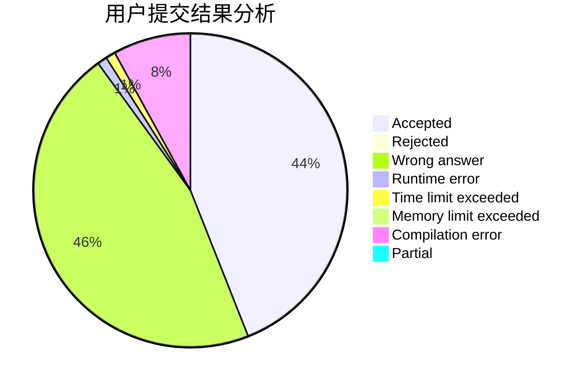
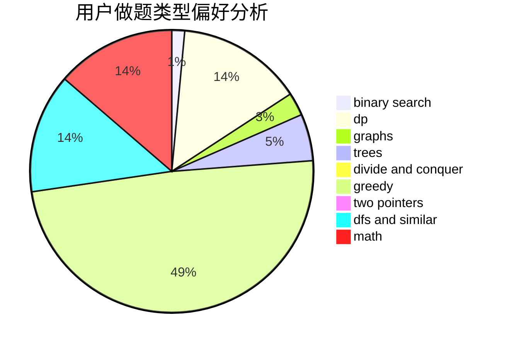

# GUESSER

<!-- tabs:start -->

#### **用户提交结果分析**

#### **用户做题类型偏好分析**

<!-- tabs:end -->
# 推荐题目
[1346E](https://codeforces.com/contest/1346/problem/E)
[898B](https://codeforces.com/contest/898/problem/B)
[479C](https://codeforces.com/contest/479/problem/C)
[263C](https://codeforces.com/contest/263/problem/C)
[1058D](https://codeforces.com/contest/1058/problem/D)
[584E](https://codeforces.com/contest/584/problem/E)
[620D](https://codeforces.com/contest/620/problem/D)
[643D](https://codeforces.com/contest/643/problem/D)
[486E](https://codeforces.com/contest/486/problem/E)
[402C](https://codeforces.com/contest/402/problem/C)
