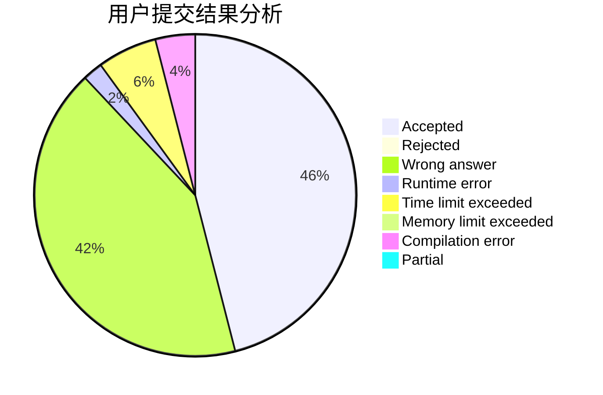
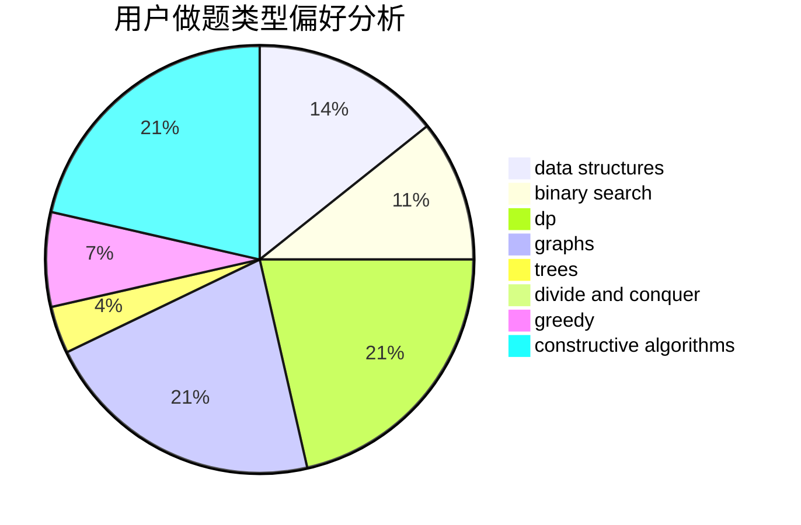
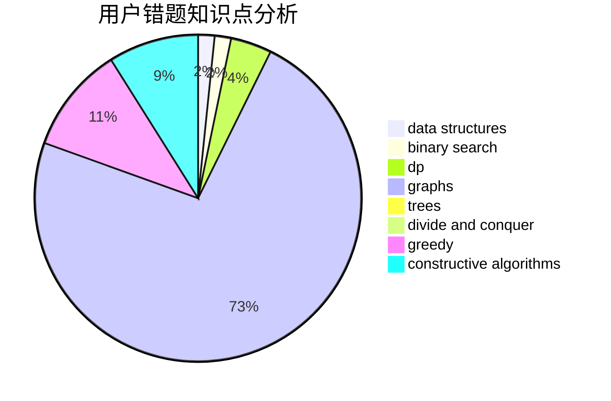

# G_X_J

<!-- tabs:start -->

#### **用户提交结果分析**

#### **用户做题类型偏好分析**

#### **用户错题知识点分析**

<!-- tabs:end -->
# 推荐题目
[465D](https://codeforces.com/contest/465/problem/D)		dsu,graphs,sortings,trees		  
[238D](https://codeforces.com/contest/238/problem/D)		data structures,
                        implementation		  
[613A](https://codeforces.com/contest/613/problem/A)		binary search,
                        geometry,
                        ternary search		  
[235E](https://codeforces.com/contest/235/problem/E)		combinatorics,
                        dp,
                        implementation,
                        math,
                        number theory		  
[13742](https://codeforces.com/contest/1374/problem/2)		dsu,graphs,sortings,trees		  
[489B](https://codeforces.com/contest/489/problem/B)		dfs and similar,
                        dp,
                        graph matchings,
                        greedy,
                        sortings,
                        two pointers		  
[1199A](https://codeforces.com/contest/1199/problem/A)		implementation		  
[1455A](https://codeforces.com/contest/1455/problem/A)		math,
                        number theory		  
[1144D](https://codeforces.com/contest/1144/problem/D)		constructive algorithms,
                        greedy		  
[679B](https://codeforces.com/contest/679/problem/B)		binary search,
                        dp,
                        greedy		  
