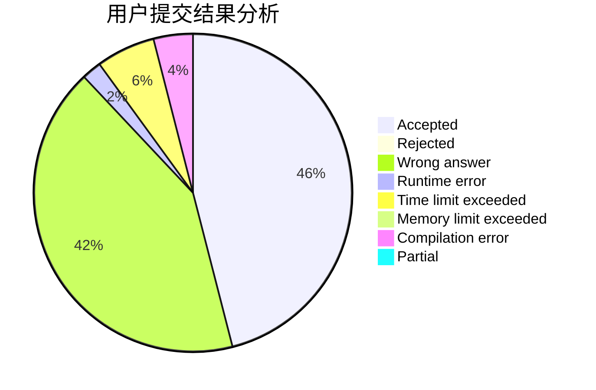
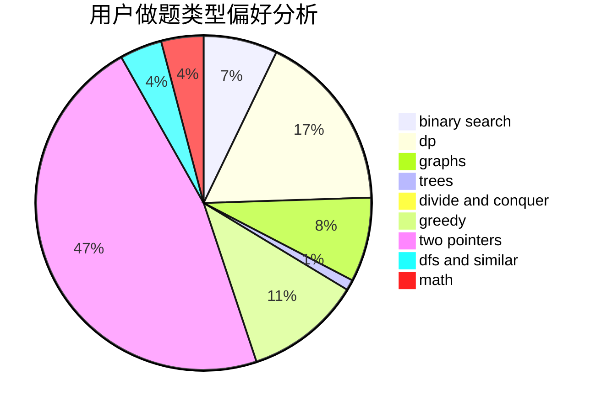

# G_X_J

<!-- tabs:start -->

#### **用户提交结果分析**

#### **用户做题类型偏好分析**

<!-- tabs:end -->
# 推荐题目
[465D](https://codeforces.com/contest/465/problem/D)
[238D](https://codeforces.com/contest/238/problem/D)
[613A](https://codeforces.com/contest/613/problem/A)
[235E](https://codeforces.com/contest/235/problem/E)
[13742](https://codeforces.com/contest/1374/problem/2)
[489B](https://codeforces.com/contest/489/problem/B)
[1199A](https://codeforces.com/contest/1199/problem/A)
[1455A](https://codeforces.com/contest/1455/problem/A)
[1144D](https://codeforces.com/contest/1144/problem/D)
[679B](https://codeforces.com/contest/679/problem/B)
