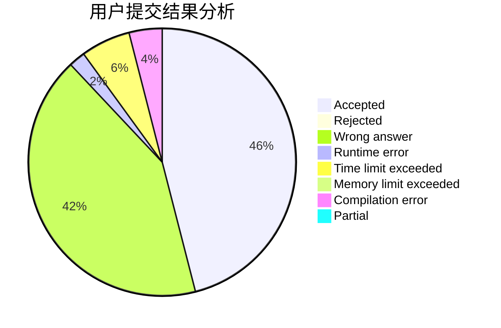
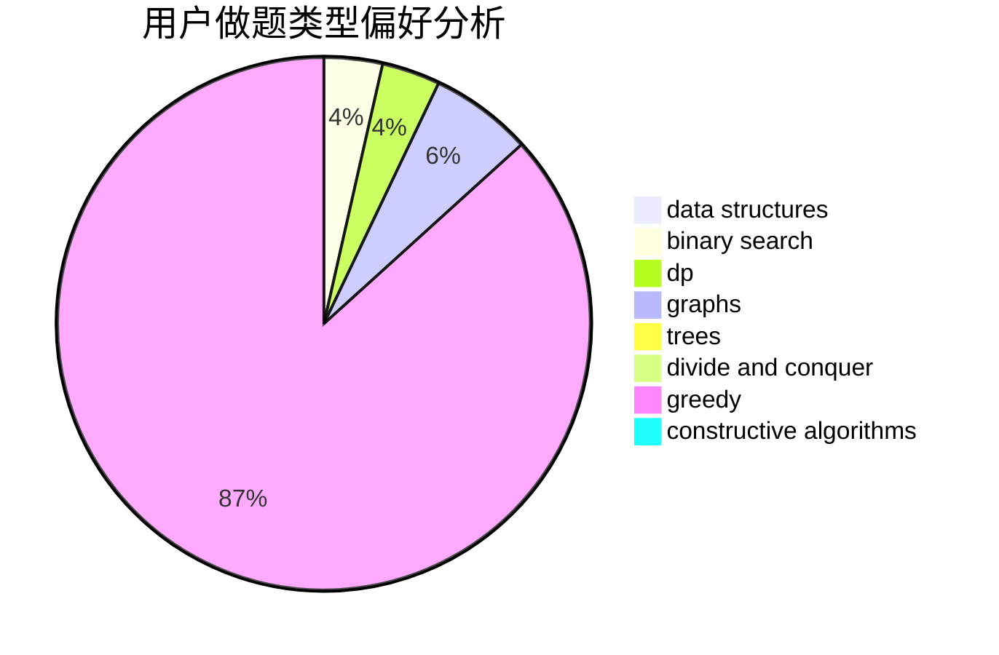
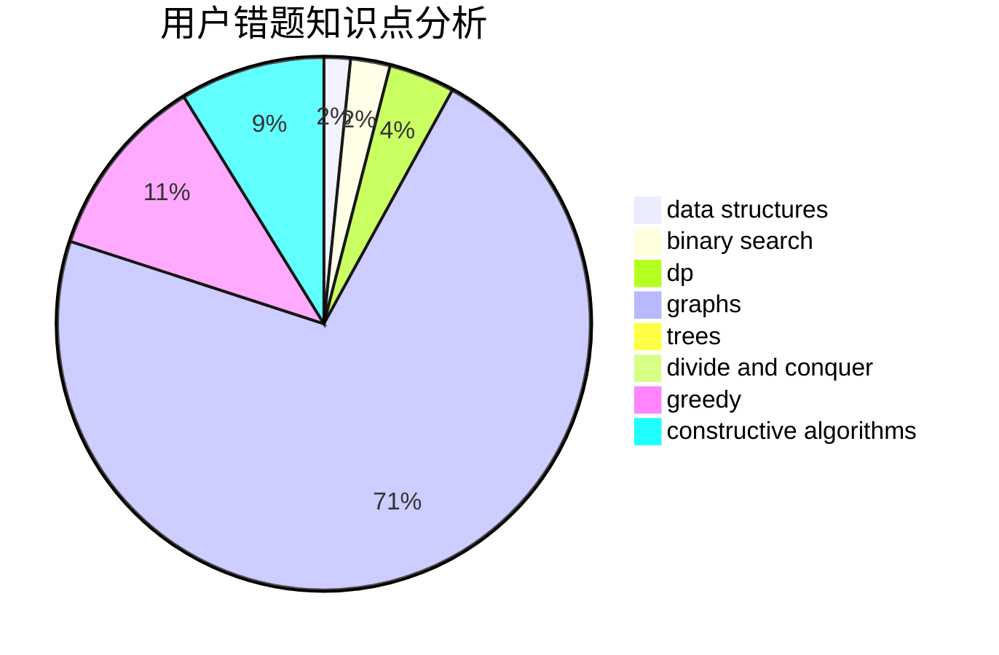

# G_X_J

<!-- tabs:start -->

#### **用户提交结果分析**

#### **用户做题类型偏好分析**

#### **用户错题知识点分析**

<!-- tabs:end -->
# 推荐题目
[445B](https://codeforces.com/contest/445/problem/B)		dfs and similar,
                        dsu,
                        greedy		  
[219C](https://codeforces.com/contest/219/problem/C)		brute force,
                        dp,
                        greedy		  
[596A](https://codeforces.com/contest/596/problem/A)		geometry,
                        implementation		  
[216C](https://codeforces.com/contest/216/problem/C)		greedy		  
[1367C](https://codeforces.com/contest/1367/problem/C)		constructive algorithms,
                        greedy,
                        math		  
[469A](https://codeforces.com/contest/469/problem/A)		greedy,
                        implementation		  
[1194E](https://codeforces.com/contest/1194/problem/E)		bitmasks,
                        brute force,
                        data structures,
                        geometry,
                        sortings		  
[1445D](https://codeforces.com/contest/1445/problem/D)		dsu,graphs,sortings,trees		  
[1142B](https://codeforces.com/contest/1142/problem/B)		data structures,
                        dfs and similar,
                        dp,
                        math,
                        trees		  
[659B](https://codeforces.com/contest/659/problem/B)		constructive algorithms,
                        sortings		  
