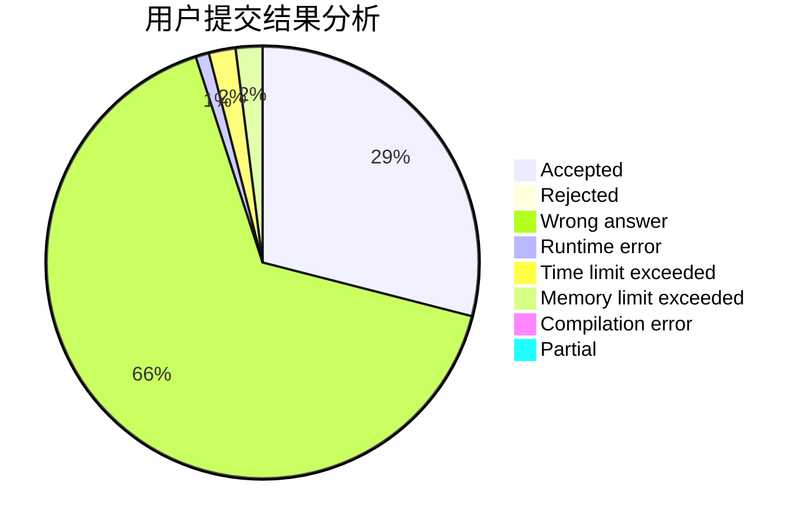
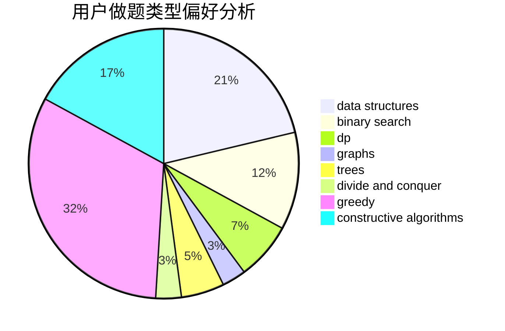
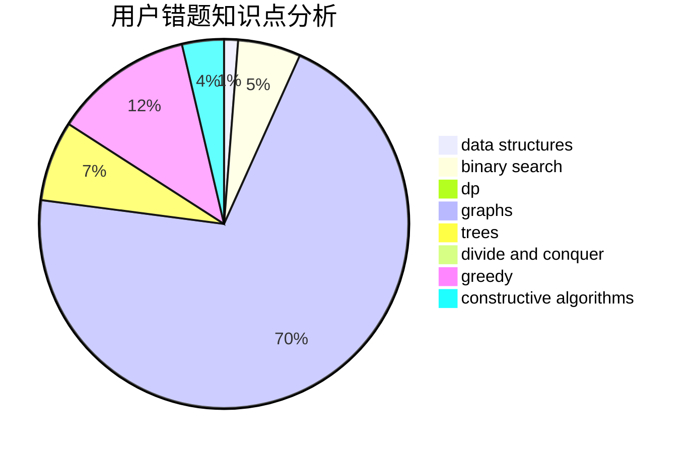

# Gades

<!-- tabs:start -->

#### **用户提交结果分析**

#### **用户做题类型偏好分析**

#### **用户错题知识点分析**

<!-- tabs:end -->
# 推荐题目
[1101F](https://codeforces.com/contest/1101/problem/F)		binary search,
                        dp		  
[215B](https://codeforces.com/contest/215/problem/B)		greedy,
                        math		  
[1063C](https://codeforces.com/contest/1063/problem/C)		binary search,
                        constructive algorithms,
                        geometry,
                        interactive		  
[1190B](https://codeforces.com/contest/1190/problem/B)		games		  
[436B](https://codeforces.com/contest/436/problem/B)		implementation,
                        math		  
[363D](https://codeforces.com/contest/363/problem/D)		binary search,
                        greedy		  
[246E](https://codeforces.com/contest/246/problem/E)		binary search,
                        data structures,
                        dfs and similar,
                        dp,
                        sortings		  
[123E](https://codeforces.com/contest/123/problem/E)		dfs and similar,
                        dp,
                        probabilities,
                        trees		  
[877D](https://codeforces.com/contest/877/problem/D)		data structures,
                        dfs and similar,
                        graphs,
                        shortest paths		  
[1310E](https://codeforces.com/contest/1310/problem/E)		dp		  
