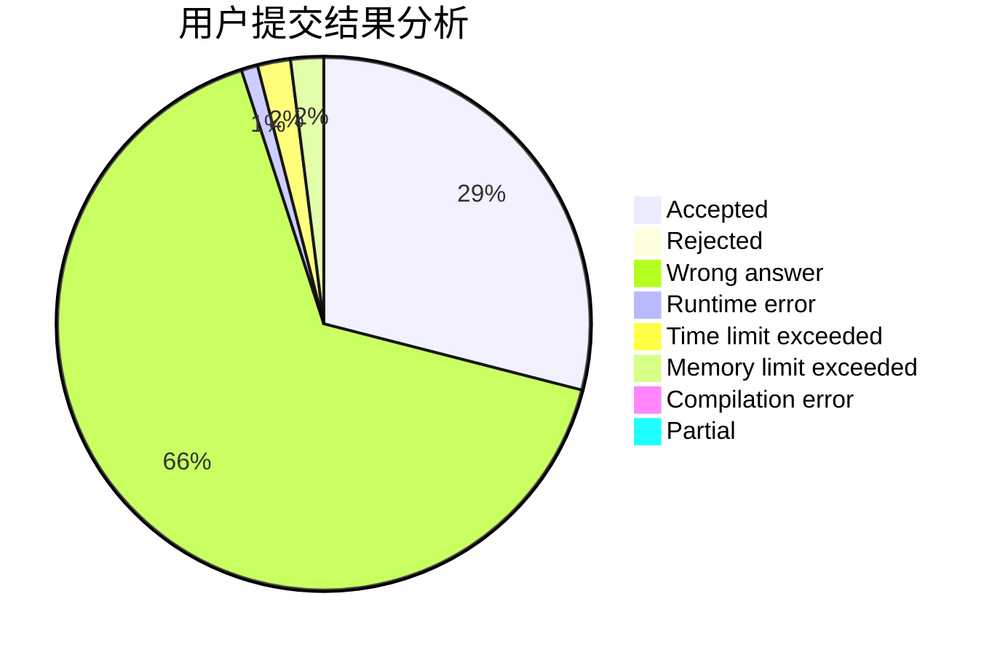
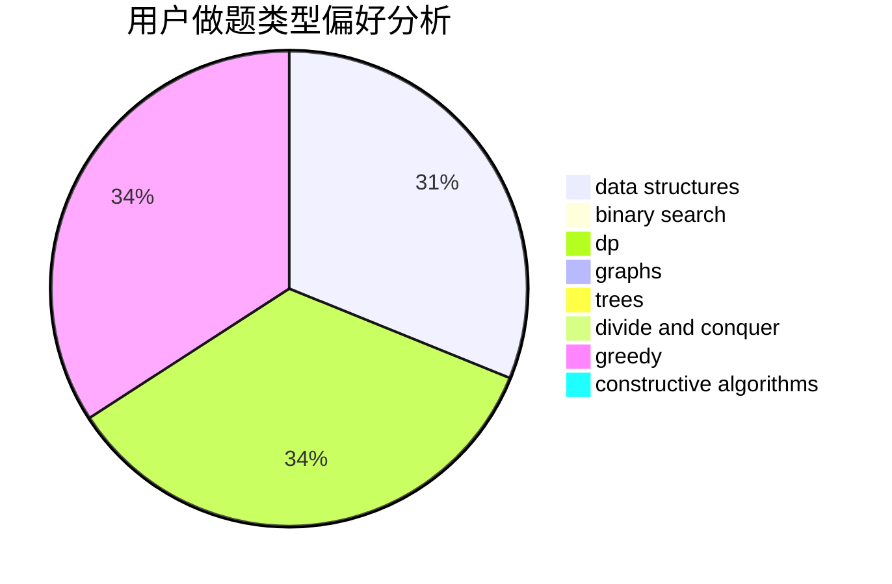
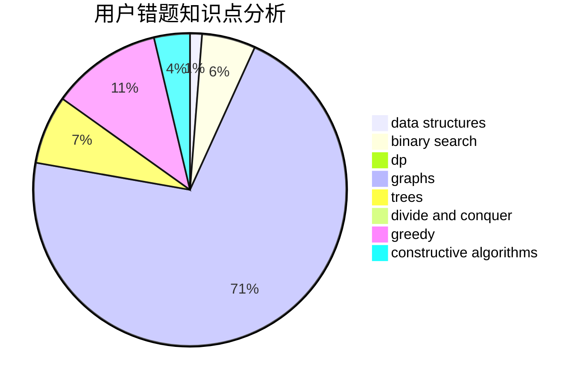

# Gades

<!-- tabs:start -->

#### **用户提交结果分析**

#### **用户做题类型偏好分析**

#### **用户错题知识点分析**

<!-- tabs:end -->
# 推荐题目
[1102B](https://codeforces.com/contest/1102/problem/B)		greedy,
                        sortings		  
[234A](https://codeforces.com/contest/234/problem/A)		implementation		  
[1063F](https://codeforces.com/contest/1063/problem/F)		data structures,
                        dp,
                        string suffix structures		  
[11962](https://codeforces.com/contest/1196/problem/2)		dsu,graphs,sortings,trees		  
[456B](https://codeforces.com/contest/456/problem/B)		math,
                        number theory		  
[38C](https://codeforces.com/contest/38/problem/C)		brute force		  
[268A](https://codeforces.com/contest/268/problem/A)		brute force		  
[1245C](https://codeforces.com/contest/1245/problem/C)		dp		  
[898C](https://codeforces.com/contest/898/problem/C)		implementation,
                        strings		  
[131D](https://codeforces.com/contest/131/problem/D)		dfs and similar,
                        graphs		  
