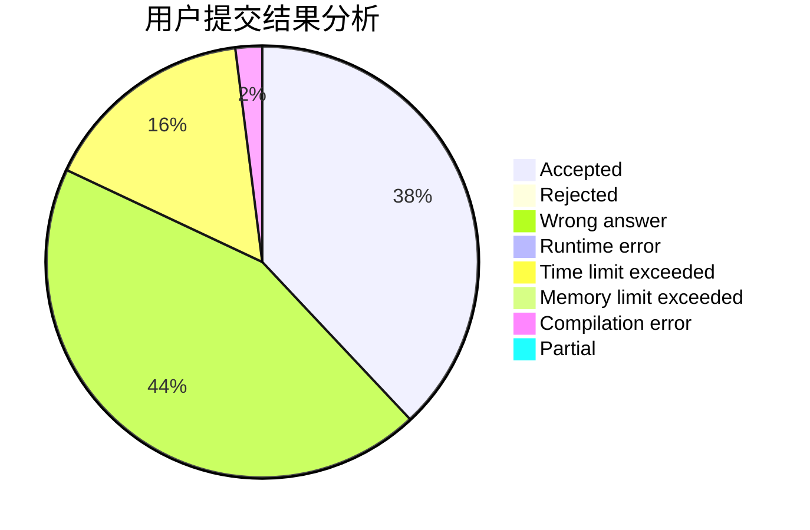
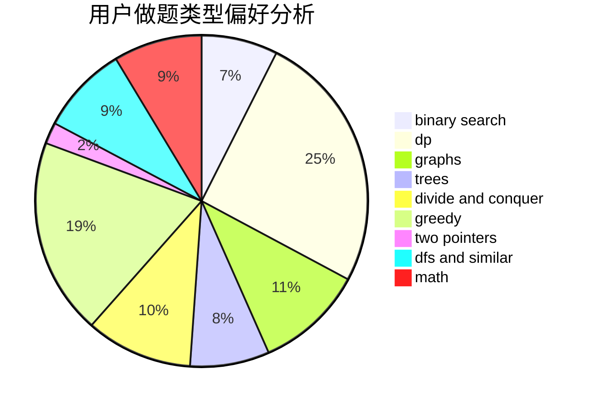

# Gakki_

<!-- tabs:start -->

#### **用户提交结果分析**

#### **用户做题类型偏好分析**

<!-- tabs:end -->
# 推荐题目
[708E](https://codeforces.com/contest/708/problem/E)
[899D](https://codeforces.com/contest/899/problem/D)
[893F](https://codeforces.com/contest/893/problem/F)
[38C](https://codeforces.com/contest/38/problem/C)
[13577](https://codeforces.com/contest/1357/problem/7)
[713A](https://codeforces.com/contest/713/problem/A)
[1132E](https://codeforces.com/contest/1132/problem/E)
[1081F](https://codeforces.com/contest/1081/problem/F)
[1342F](https://codeforces.com/contest/1342/problem/F)
[208D](https://codeforces.com/contest/208/problem/D)
