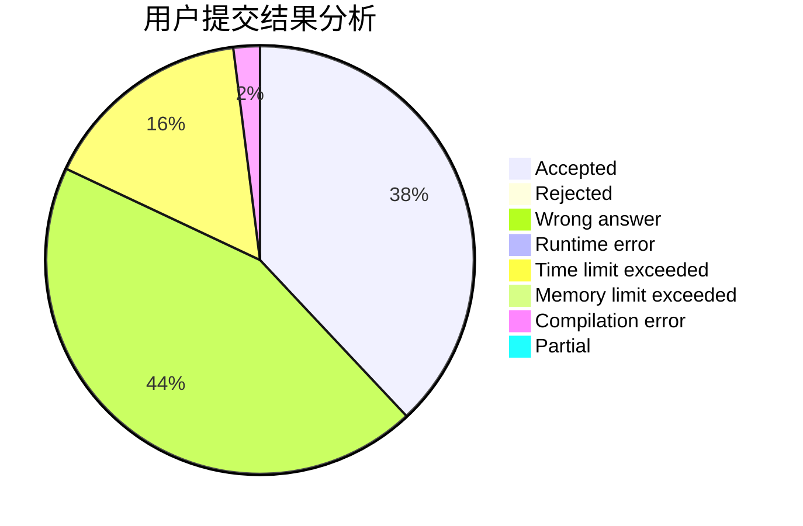
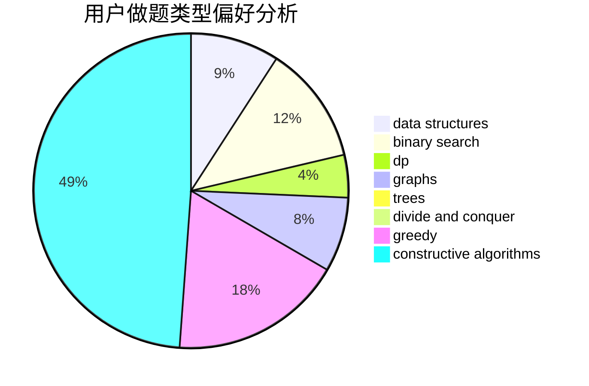

# Gakki_
<!-- tabs:start -->
#### **用户提交结果分析**

#### **用户做题类型偏好分析**

#### **用户错题知识点分析**

<!-- tabs:end -->
# 推荐题目
[Numbers on the blackboard](http://codeforces.com/problemset/problem/878/E)		combinatorics,
                        dp		  
[Teams Formation](http://codeforces.com/problemset/problem/878/B)		data structures,
                        implementation		  
[The Unbearable Lightness of Weights](http://codeforces.com/problemset/problem/1032/E)		dp,
                        math		  
[Grime Zoo](http://codeforces.com/problemset/problem/1411/D)		brute force,
                        greedy,
                        implementation,
                        strings		  
[Card Bag](http://codeforces.com/problemset/problem/1156/F)		dp,
                        math,
                        probabilities		  
[Colorful Bricks](http://codeforces.com/problemset/problem/1081/C)		combinatorics,
                        dp,
                        math		  
[Toy Train](https://codeforces.com/contest/1130/problem/D2)		brute force,
                        greedy		  
[Broken Tree](http://codeforces.com/problemset/problem/758/E)		dfs and similar,
                        dp,
                        graphs,
                        greedy,
                        trees		  
[Renting Bikes](http://codeforces.com/problemset/problem/363/D)		binary search,
                        greedy		  
[Quiz](http://codeforces.com/problemset/problem/337/C)		binary search,
                        greedy,
                        math,
                        matrices,
                        number theory		  
<!-- tabs:start -->
#### **data structures**
[Numbers on the blackboard](http://codeforces.com/problemset/problem/878/B)		data structures,
                        implementation		  
[Teams Formation](http://codeforces.com/problemset/problem/1335/E2)		brute force,
                        data structures,
                        dp,
                        two pointers		  
[The Unbearable Lightness of Weights](http://codeforces.com/problemset/problem/878/C)		data structures,
                        graphs		  
[Grime Zoo](http://codeforces.com/problemset/problem/372/C)		data structures,
                        dp,
                        math		  
[Card Bag](http://codeforces.com/problemset/problem/1481/E)		data structures,
                        dp,
                        greedy		  
[Colorful Bricks](http://codeforces.com/problemset/problem/1492/C)		binary search,
                        data structures,
                        dp,
                        greedy,
                        two pointers		  
[Toy Train](http://codeforces.com/problemset/problem/1490/G)		binary search,
                        data structures,
                        math		  
[Broken Tree](http://codeforces.com/problemset/problem/1479/D)		binary search,
                        bitmasks,
                        brute force,
                        data structures,
                        probabilities,
                        trees		  
[Renting Bikes](http://codeforces.com/problemset/problem/1497/A)		brute force,
                        data structures,
                        greedy,
                        sortings		  
[Quiz](http://codeforces.com/problemset/problem/1491/C)		brute force,
                        data structures,
                        dp,
                        greedy,
                        implementation		  
#### **binary search**
[Numbers on the blackboard](http://codeforces.com/problemset/problem/363/D)		binary search,
                        greedy		  
[Teams Formation](http://codeforces.com/problemset/problem/337/C)		binary search,
                        greedy,
                        math,
                        matrices,
                        number theory		  
[The Unbearable Lightness of Weights](http://codeforces.com/problemset/problem/181/B)		binary search,
                        brute force		  
[Grime Zoo](https://codeforces.com/contest/701/problem/D)		binary search,
                        math		  
[Card Bag](https://codeforces.com/contest/1345/problem/F)		binary search,
                        greedy,
                        math		  
[Colorful Bricks](http://codeforces.com/problemset/problem/1250/J)		binary search,
                        greedy		  
[Toy Train](http://codeforces.com/problemset/problem/1492/C)		binary search,
                        data structures,
                        dp,
                        greedy,
                        two pointers		  
[Broken Tree](http://codeforces.com/problemset/problem/1463/D)		binary search,
                        constructive algorithms,
                        greedy,
                        two pointers		  
[Renting Bikes](http://codeforces.com/problemset/problem/1490/G)		binary search,
                        data structures,
                        math		  
[Quiz](http://codeforces.com/problemset/problem/1479/D)		binary search,
                        bitmasks,
                        brute force,
                        data structures,
                        probabilities,
                        trees		  
#### **dp**
[Numbers on the blackboard](http://codeforces.com/problemset/problem/878/E)		combinatorics,
                        dp		  
[Teams Formation](http://codeforces.com/problemset/problem/1032/E)		dp,
                        math		  
[The Unbearable Lightness of Weights](http://codeforces.com/problemset/problem/1156/F)		dp,
                        math,
                        probabilities		  
[Grime Zoo](http://codeforces.com/problemset/problem/1081/C)		combinatorics,
                        dp,
                        math		  
[Card Bag](http://codeforces.com/problemset/problem/758/E)		dfs and similar,
                        dp,
                        graphs,
                        greedy,
                        trees		  
[Colorful Bricks](http://codeforces.com/problemset/problem/747/F)		brute force,
                        combinatorics,
                        dp,
                        math		  
[Toy Train](http://codeforces.com/problemset/problem/1335/E2)		brute force,
                        data structures,
                        dp,
                        two pointers		  
[Broken Tree](http://codeforces.com/problemset/problem/696/C)		combinatorics,
                        dp,
                        implementation,
                        math,
                        matrices		  
[Renting Bikes](http://codeforces.com/problemset/problem/372/C)		data structures,
                        dp,
                        math		  
[Quiz](http://codeforces.com/problemset/problem/1513/C)		dp,
                        matrices		  
#### **graph**
[Numbers on the blackboard](http://codeforces.com/problemset/problem/758/E)		dfs and similar,
                        dp,
                        graphs,
                        greedy,
                        trees		  
[Teams Formation](http://codeforces.com/problemset/problem/687/A)		dfs and similar,
                        graphs		  
[The Unbearable Lightness of Weights](http://codeforces.com/problemset/problem/1316/D)		constructive algorithms,
                        dfs and similar,
                        graphs,
                        implementation		  
[Grime Zoo](http://codeforces.com/problemset/problem/878/C)		data structures,
                        graphs		  
[Card Bag](http://codeforces.com/problemset/problem/1487/C)		brute force,
                        constructive algorithms,
                        dfs and similar,
                        graphs,
                        greedy,
                        implementation,
                        math		  
[Colorful Bricks](http://codeforces.com/problemset/problem/1437/C)		dp,
                        flows,
                        graph matchings,
                        greedy,
                        math,
                        sortings		  
[Toy Train](http://codeforces.com/problemset/problem/1470/D)		constructive algorithms,
                        dfs and similar,
                        graph matchings,
                        graphs,
                        greedy		  
[Broken Tree](http://codeforces.com/problemset/problem/1476/C)		dp,
                        graphs,
                        greedy		  
[Renting Bikes](http://codeforces.com/problemset/problem/1304/D)		constructive algorithms,
                        graphs,
                        greedy,
                        two pointers		  
[Quiz](http://codeforces.com/problemset/problem/1475/C)		combinatorics,
                        graphs,
                        math		  
#### **trees**
[Numbers on the blackboard](http://codeforces.com/problemset/problem/758/E)		dfs and similar,
                        dp,
                        graphs,
                        greedy,
                        trees		  
[Teams Formation](http://codeforces.com/problemset/problem/1479/D)		binary search,
                        bitmasks,
                        brute force,
                        data structures,
                        probabilities,
                        trees		  
[The Unbearable Lightness of Weights](http://codeforces.com/problemset/problem/1511/C)		brute force,
                        data structures,
                        implementation,
                        trees		  
[Grime Zoo](http://codeforces.com/problemset/problem/1499/F)		combinatorics,
                        dfs and similar,
                        dp,
                        trees		  
[Card Bag](http://codeforces.com/problemset/problem/1491/E)		brute force,
                        dfs and similar,
                        divide and conquer,
                        number theory,
                        trees		  
[Colorful Bricks](http://codeforces.com/problemset/problem/1466/D)		data structures,
                        greedy,
                        sortings,
                        trees		  
[Toy Train](http://codeforces.com/problemset/problem/1495/D)		combinatorics,
                        dfs and similar,
                        graphs,
                        math,
                        shortest paths,
                        trees		  
[Broken Tree](http://codeforces.com/problemset/problem/1303/G)		data structures,
                        divide and conquer,
                        geometry,
                        trees		  
[Renting Bikes](http://codeforces.com/problemset/problem/1454/E)		combinatorics,
                        dfs and similar,
                        graphs,
                        trees		  
[Quiz](http://codeforces.com/problemset/problem/1494/D)		constructive algorithms,
                        data structures,
                        dfs and similar,
                        divide and conquer,
                        dsu,
                        greedy,
                        sortings,
                        trees		  
#### **divide and conquer**
[Numbers on the blackboard](http://codeforces.com/problemset/problem/662/C)		bitmasks,
                        brute force,
                        divide and conquer,
                        dp,
                        fft,
                        math		  
[Teams Formation](http://codeforces.com/problemset/problem/1461/D)		binary search,
                        brute force,
                        data structures,
                        divide and conquer,
                        implementation,
                        sortings		  
[The Unbearable Lightness of Weights](http://codeforces.com/problemset/problem/1466/G)		combinatorics,
                        divide and conquer,
                        hashing,
                        math,
                        string suffix structures,
                        strings		  
[Grime Zoo](http://codeforces.com/problemset/problem/1490/D)		dfs and similar,
                        divide and conquer,
                        implementation		  
[Card Bag](https://codeforces.com/contest/1483/problem/C)		data structures,
                        divide and conquer,
                        dp		  
[Colorful Bricks](http://codeforces.com/problemset/problem/1491/E)		brute force,
                        dfs and similar,
                        divide and conquer,
                        number theory,
                        trees		  
[Toy Train](http://codeforces.com/problemset/problem/1303/G)		data structures,
                        divide and conquer,
                        geometry,
                        trees		  
[Broken Tree](http://codeforces.com/problemset/problem/1494/D)		constructive algorithms,
                        data structures,
                        dfs and similar,
                        divide and conquer,
                        dsu,
                        greedy,
                        sortings,
                        trees		  
[Renting Bikes](http://codeforces.com/problemset/problem/1482/E)		data structures,
                        divide and conquer,
                        dp		  
[Quiz](http://codeforces.com/problemset/problem/566/C)		dfs and similar,
                        divide and conquer,
                        trees		  
#### **greedy**
[Numbers on the blackboard](http://codeforces.com/problemset/problem/1411/D)		brute force,
                        greedy,
                        implementation,
                        strings		  
[Teams Formation](https://codeforces.com/contest/1130/problem/D2)		brute force,
                        greedy		  
[The Unbearable Lightness of Weights](http://codeforces.com/problemset/problem/758/E)		dfs and similar,
                        dp,
                        graphs,
                        greedy,
                        trees		  
[Grime Zoo](http://codeforces.com/problemset/problem/363/D)		binary search,
                        greedy		  
[Card Bag](http://codeforces.com/problemset/problem/337/C)		binary search,
                        greedy,
                        math,
                        matrices,
                        number theory		  
[Colorful Bricks](http://codeforces.com/problemset/problem/1019/A)		brute force,
                        greedy		  
[Toy Train](https://codeforces.com/contest/1350/problem/D)		constructive algorithms,
                        greedy,
                        math		  
[Broken Tree](https://codeforces.com/contest/1345/problem/F)		binary search,
                        greedy,
                        math		  
[Renting Bikes](http://codeforces.com/problemset/problem/1481/E)		data structures,
                        dp,
                        greedy		  
[Quiz](http://codeforces.com/problemset/problem/1250/J)		binary search,
                        greedy		  
#### **constructive algorithms**
[Numbers on the blackboard](https://codeforces.com/contest/1350/problem/D)		constructive algorithms,
                        greedy,
                        math		  
[Teams Formation](http://codeforces.com/problemset/problem/1316/D)		constructive algorithms,
                        dfs and similar,
                        graphs,
                        implementation		  
[The Unbearable Lightness of Weights](http://codeforces.com/problemset/problem/1254/C)		constructive algorithms,
                        geometry,
                        interactive,
                        math		  
[Grime Zoo](http://codeforces.com/problemset/problem/878/A)		bitmasks,
                        constructive algorithms		  
[Card Bag](http://codeforces.com/problemset/problem/1493/A)		constructive algorithms,
                        greedy		  
[Colorful Bricks](http://codeforces.com/problemset/problem/1463/D)		binary search,
                        constructive algorithms,
                        greedy,
                        two pointers		  
[Toy Train](https://codeforces.com/contest/1456/problem/B)		bitmasks,
                        brute force,
                        constructive algorithms		  
[Broken Tree](http://codeforces.com/problemset/problem/1492/D)		bitmasks,
                        constructive algorithms,
                        greedy,
                        math		  
[Renting Bikes](https://codeforces.com/contest/1504/problem/D)		constructive algorithms,
                        games,
                        interactive		  
[Quiz](https://codeforces.com/contest/1483/problem/A)		brute force,
                        constructive algorithms,
                        greedy,
                        implementation		  
#### **sortings**
[Numbers on the blackboard](http://codeforces.com/problemset/problem/1394/A)		dp,
                        greedy,
                        sortings,
                        two pointers		  
[Teams Formation](https://codeforces.com/contest/1496/problem/C)		geometry,
                        greedy,
                        math,
                        sortings		  
[The Unbearable Lightness of Weights](http://codeforces.com/problemset/problem/1495/A)		geometry,
                        greedy,
                        math,
                        sortings		  
[Grime Zoo](http://codeforces.com/problemset/problem/1497/A)		brute force,
                        data structures,
                        greedy,
                        sortings		  
[Card Bag](http://codeforces.com/problemset/problem/1427/A)		math,
                        sortings		  
[Colorful Bricks](http://codeforces.com/problemset/problem/1461/D)		binary search,
                        brute force,
                        data structures,
                        divide and conquer,
                        implementation,
                        sortings		  
[Toy Train](http://codeforces.com/problemset/problem/1437/C)		dp,
                        flows,
                        graph matchings,
                        greedy,
                        math,
                        sortings		  
[Broken Tree](http://codeforces.com/problemset/problem/1473/A)		greedy,
                        implementation,
                        math,
                        sortings		  
[Renting Bikes](http://codeforces.com/problemset/problem/1486/B)		binary search,
                        geometry,
                        shortest paths,
                        sortings		  
[Quiz](http://codeforces.com/problemset/problem/1480/B)		greedy,
                        implementation,
                        sortings		  
<!-- tabs:end -->
