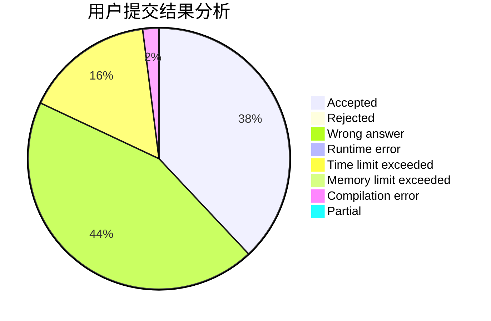
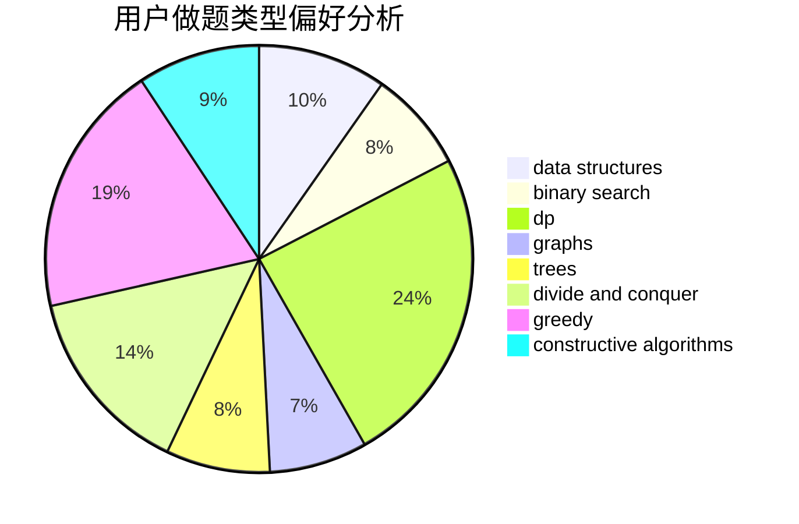

# Gakki_

<!-- tabs:start -->

#### **用户提交结果分析**

#### **用户做题类型偏好分析**

#### **用户错题知识点分析**

<!-- tabs:end -->
# 推荐题目
[708E](https://codeforces.com/contest/708/problem/E)		dp,
                        math		  
[899D](https://codeforces.com/contest/899/problem/D)		constructive algorithms,
                        math		  
[893F](https://codeforces.com/contest/893/problem/F)		data structures,
                        trees		  
[38C](https://codeforces.com/contest/38/problem/C)		brute force		  
[13577](https://codeforces.com/contest/1357/problem/7)		dsu,graphs,sortings,trees		  
[713A](https://codeforces.com/contest/713/problem/A)		data structures,
                        implementation		  
[1132E](https://codeforces.com/contest/1132/problem/E)		dfs and similar,
                        dp,
                        greedy		  
[1081F](https://codeforces.com/contest/1081/problem/F)		constructive algorithms,
                        implementation,
                        interactive		  
[1342F](https://codeforces.com/contest/1342/problem/F)		bitmasks,
                        brute force,
                        dp		  
[208D](https://codeforces.com/contest/208/problem/D)		implementation		  
