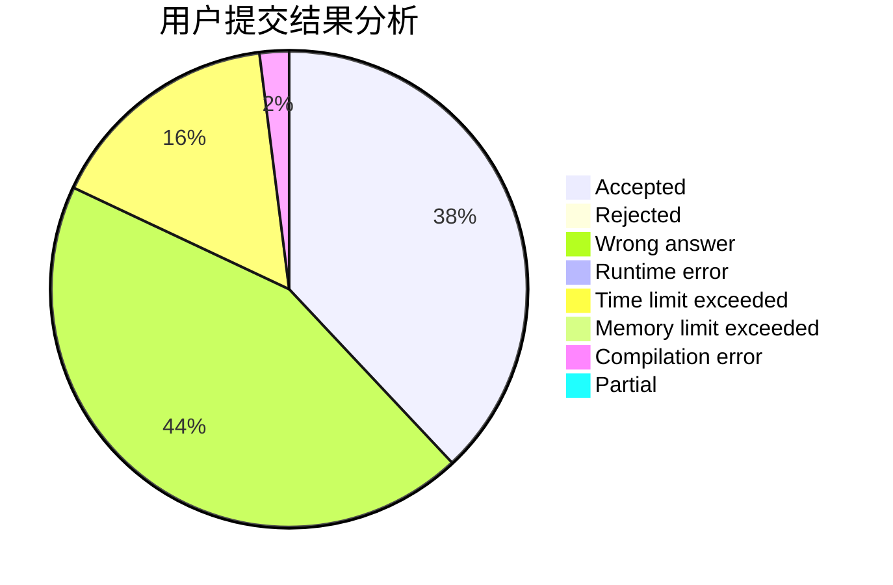
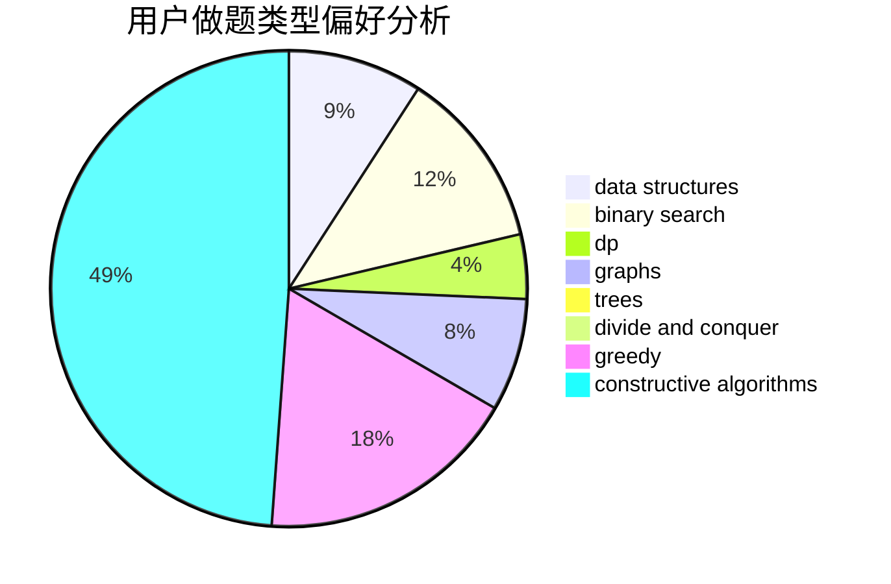

# Gakki_

<!-- tabs:start -->

#### **用户提交结果分析**

#### **用户做题类型偏好分析**

#### **用户错题知识点分析**

<!-- tabs:end -->
# 推荐题目
[687A](https://codeforces.com/contest/687/problem/A)		dfs and similar,
                        graphs		  
[878E](https://codeforces.com/contest/878/problem/E)		combinatorics,
                        dp		  
[873A](https://codeforces.com/contest/873/problem/A)		implementation		  
[363D](https://codeforces.com/contest/363/problem/D)		binary search,
                        greedy		  
[1350D](https://codeforces.com/contest/1350/problem/D)		dsu,graphs,sortings,trees		  
[696C](https://codeforces.com/contest/696/problem/C)		combinatorics,
                        dp,
                        implementation,
                        math,
                        matrices		  
[1130D2](https://codeforces.com/contest/1130D/problem/2)		dsu,graphs,sortings,trees		  
[1081C](https://codeforces.com/contest/1081/problem/C)		combinatorics,
                        dp,
                        math		  
[1335E2](https://codeforces.com/contest/1335E/problem/2)		brute force,
                        data structures,
                        dp,
                        two pointers		  
[181B](https://codeforces.com/contest/181/problem/B)		binary search,
                        brute force		  
