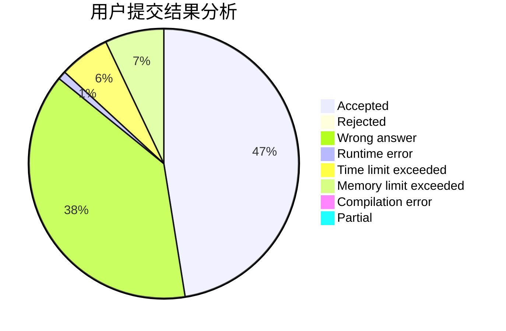
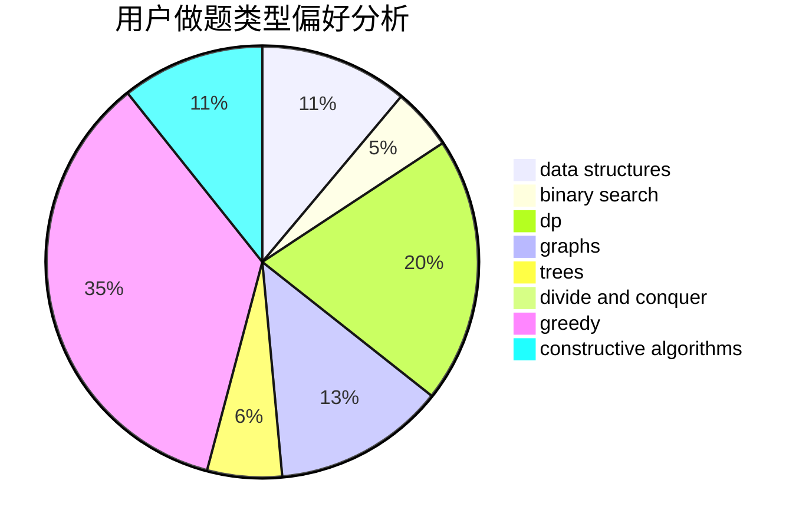
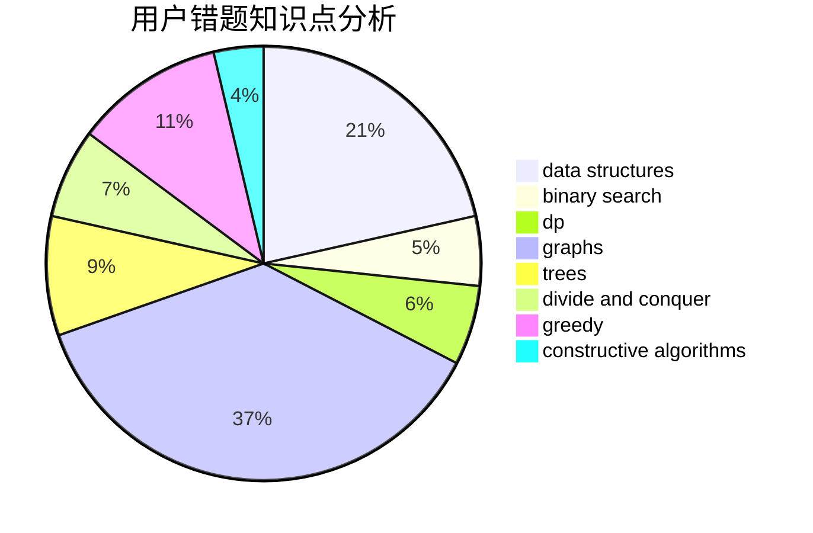

# GamerDiaosi
<!-- tabs:start -->
#### **用户提交结果分析**

#### **用户做题类型偏好分析**

#### **用户错题知识点分析**

<!-- tabs:end -->
# 推荐题目
[The Thorny Path](https://codeforces.com/contest/1464/problem/D)		greedy,
                        math		  
[Sergey's problem](https://codeforces.com/contest/1020/problem/E)		constructive algorithms,
                        graphs		  
[Dreamoon and Notepad](http://codeforces.com/problemset/problem/477/E)		data structures		  
[Borya's Diagnosis](http://codeforces.com/problemset/problem/879/A)		implementation		  
[Even Odds](http://codeforces.com/problemset/problem/318/A)		math		  
[The Monster and the Squirrel](http://codeforces.com/problemset/problem/592/B)		math		  
[Winding polygonal line](https://codeforces.com/contest/1159/problem/F)		constructive algorithms,
                        geometry,
                        greedy,
                        math		  
[Interactive LowerBound](http://codeforces.com/problemset/problem/843/B)		brute force,
                        interactive,
                        probabilities		  
[Table Tennis](http://codeforces.com/problemset/problem/879/B)		data structures,
                        implementation		  
[Флеш-карты](http://codeforces.com/problemset/problem/609/A)		greedy,
                        implementation,
                        sortings		  
<!-- tabs:start -->
#### **data structures**
[The Thorny Path](http://codeforces.com/problemset/problem/477/E)		data structures		  
[Sergey's problem](http://codeforces.com/problemset/problem/879/B)		data structures,
                        implementation		  
[Dreamoon and Notepad](http://codeforces.com/problemset/problem/311/D)		data structures,
                        math		  
[Borya's Diagnosis](https://codeforces.com/contest/740/problem/D)		binary search,
                        data structures,
                        dfs and similar,
                        graphs,
                        trees		  
[Even Odds](http://codeforces.com/problemset/problem/524/F)		data structures,
                        greedy,
                        hashing,
                        string suffix structures,
                        strings		  
[The Monster and the Squirrel](http://codeforces.com/problemset/problem/486/E)		data structures,
                        dp,
                        greedy,
                        hashing,
                        math		  
[Winding polygonal line](http://codeforces.com/problemset/problem/1495/E)		brute force,
                        data structures,
                        greedy,
                        implementation		  
[Interactive LowerBound](http://codeforces.com/problemset/problem/1348/F)		data structures,
                        dfs and similar,
                        graphs,
                        greedy		  
[Table Tennis](http://codeforces.com/problemset/problem/1340/A)		brute force,
                        data structures,
                        greedy,
                        implementation		  
[Флеш-карты](http://codeforces.com/problemset/problem/1446/D1)		data structures,
                        greedy		  
#### **binary search**
[The Thorny Path](https://codeforces.com/contest/740/problem/D)		binary search,
                        data structures,
                        dfs and similar,
                        graphs,
                        trees		  
[Sergey's problem](https://codeforces.com/contest/1246/problem/C)		binary search,
                        dp		  
[Dreamoon and Notepad](http://codeforces.com/problemset/problem/1111/C)		binary search,
                        brute force,
                        divide and conquer,
                        math		  
[Borya's Diagnosis](http://codeforces.com/problemset/problem/147/B)		binary search,
                        graphs,
                        matrices		  
[Even Odds](http://codeforces.com/problemset/problem/1492/C)		binary search,
                        data structures,
                        dp,
                        greedy,
                        two pointers		  
[The Monster and the Squirrel](http://codeforces.com/problemset/problem/1463/D)		binary search,
                        constructive algorithms,
                        greedy,
                        two pointers		  
[Winding polygonal line](http://codeforces.com/problemset/problem/1490/G)		binary search,
                        data structures,
                        math		  
[Interactive LowerBound](http://codeforces.com/problemset/problem/1479/D)		binary search,
                        bitmasks,
                        brute force,
                        data structures,
                        probabilities,
                        trees		  
[Table Tennis](http://codeforces.com/problemset/problem/1436/E)		binary search,
                        data structures,
                        two pointers		  
[Флеш-карты](http://codeforces.com/problemset/problem/1461/D)		binary search,
                        brute force,
                        data structures,
                        divide and conquer,
                        implementation,
                        sortings		  
#### **dp**
[The Thorny Path](http://codeforces.com/problemset/problem/559/E)		dp,
                        sortings		  
[Sergey's problem](https://codeforces.com/contest/1246/problem/C)		binary search,
                        dp		  
[Dreamoon and Notepad](http://codeforces.com/problemset/problem/486/E)		data structures,
                        dp,
                        greedy,
                        hashing,
                        math		  
[Borya's Diagnosis](http://codeforces.com/problemset/problem/1089/A)		dp		  
[Even Odds](http://codeforces.com/problemset/problem/300/D)		dp,
                        fft		  
[The Monster and the Squirrel](http://codeforces.com/problemset/problem/316/D2)		dp		  
[Winding polygonal line](http://codeforces.com/problemset/problem/383/D)		dp		  
[Interactive LowerBound](http://codeforces.com/problemset/problem/346/D)		dp,
                        graphs,
                        shortest paths		  
[Table Tennis](http://codeforces.com/problemset/problem/1381/D)		dfs and similar,
                        dp,
                        greedy,
                        trees,
                        two pointers		  
[Флеш-карты](http://codeforces.com/problemset/problem/1451/B)		dp,
                        greedy,
                        implementation,
                        strings		  
#### **graph**
[The Thorny Path](https://codeforces.com/contest/1020/problem/E)		constructive algorithms,
                        graphs		  
[Sergey's problem](https://codeforces.com/contest/740/problem/D)		binary search,
                        data structures,
                        dfs and similar,
                        graphs,
                        trees		  
[Dreamoon and Notepad](http://codeforces.com/problemset/problem/1205/B)		bitmasks,
                        brute force,
                        graphs,
                        shortest paths		  
[Borya's Diagnosis](http://codeforces.com/problemset/problem/147/B)		binary search,
                        graphs,
                        matrices		  
[Even Odds](http://codeforces.com/problemset/problem/346/D)		dp,
                        graphs,
                        shortest paths		  
[The Monster and the Squirrel](http://codeforces.com/problemset/problem/1348/F)		data structures,
                        dfs and similar,
                        graphs,
                        greedy		  
[Winding polygonal line](https://codeforces.com/contest/1287/problem/D)		constructive algorithms,
                        data structures,
                        dfs and similar,
                        graphs,
                        greedy,
                        trees		  
[Interactive LowerBound](http://codeforces.com/problemset/problem/1487/C)		brute force,
                        constructive algorithms,
                        dfs and similar,
                        graphs,
                        greedy,
                        implementation,
                        math		  
[Table Tennis](http://codeforces.com/problemset/problem/1437/C)		dp,
                        flows,
                        graph matchings,
                        greedy,
                        math,
                        sortings		  
[Флеш-карты](http://codeforces.com/problemset/problem/1470/D)		constructive algorithms,
                        dfs and similar,
                        graph matchings,
                        graphs,
                        greedy		  
#### **trees**
[The Thorny Path](https://codeforces.com/contest/828/problem/D)		constructive algorithms,
                        greedy,
                        implementation,
                        trees		  
[Sergey's problem](https://codeforces.com/contest/740/problem/D)		binary search,
                        data structures,
                        dfs and similar,
                        graphs,
                        trees		  
[Dreamoon and Notepad](http://codeforces.com/problemset/problem/1188/A1)		trees		  
[Borya's Diagnosis](http://codeforces.com/problemset/problem/1381/D)		dfs and similar,
                        dp,
                        greedy,
                        trees,
                        two pointers		  
[Even Odds](http://codeforces.com/problemset/problem/1338/B)		bitmasks,
                        constructive algorithms,
                        dfs and similar,
                        greedy,
                        math,
                        trees		  
[The Monster and the Squirrel](https://codeforces.com/contest/1287/problem/D)		constructive algorithms,
                        data structures,
                        dfs and similar,
                        graphs,
                        greedy,
                        trees		  
[Winding polygonal line](http://codeforces.com/problemset/problem/1479/D)		binary search,
                        bitmasks,
                        brute force,
                        data structures,
                        probabilities,
                        trees		  
[Interactive LowerBound](http://codeforces.com/problemset/problem/1511/C)		brute force,
                        data structures,
                        implementation,
                        trees		  
[Table Tennis](http://codeforces.com/problemset/problem/1499/F)		combinatorics,
                        dfs and similar,
                        dp,
                        trees		  
[Флеш-карты](http://codeforces.com/problemset/problem/1491/E)		brute force,
                        dfs and similar,
                        divide and conquer,
                        number theory,
                        trees		  
#### **divide and conquer**
[The Thorny Path](http://codeforces.com/problemset/problem/1111/C)		binary search,
                        brute force,
                        divide and conquer,
                        math		  
[Sergey's problem](http://codeforces.com/problemset/problem/1461/D)		binary search,
                        brute force,
                        data structures,
                        divide and conquer,
                        implementation,
                        sortings		  
[Dreamoon and Notepad](http://codeforces.com/problemset/problem/1466/G)		combinatorics,
                        divide and conquer,
                        hashing,
                        math,
                        string suffix structures,
                        strings		  
[Borya's Diagnosis](http://codeforces.com/problemset/problem/1490/D)		dfs and similar,
                        divide and conquer,
                        implementation		  
[Even Odds](https://codeforces.com/contest/1483/problem/C)		data structures,
                        divide and conquer,
                        dp		  
[The Monster and the Squirrel](http://codeforces.com/problemset/problem/1491/E)		brute force,
                        dfs and similar,
                        divide and conquer,
                        number theory,
                        trees		  
[Winding polygonal line](http://codeforces.com/problemset/problem/1303/G)		data structures,
                        divide and conquer,
                        geometry,
                        trees		  
[Interactive LowerBound](http://codeforces.com/problemset/problem/1494/D)		constructive algorithms,
                        data structures,
                        dfs and similar,
                        divide and conquer,
                        dsu,
                        greedy,
                        sortings,
                        trees		  
[Table Tennis](http://codeforces.com/problemset/problem/1482/E)		data structures,
                        divide and conquer,
                        dp		  
[Флеш-карты](http://codeforces.com/problemset/problem/566/C)		dfs and similar,
                        divide and conquer,
                        trees		  
#### **greedy**
[The Thorny Path](https://codeforces.com/contest/1464/problem/D)		greedy,
                        math		  
[Sergey's problem](https://codeforces.com/contest/1159/problem/F)		constructive algorithms,
                        geometry,
                        greedy,
                        math		  
[Dreamoon and Notepad](http://codeforces.com/problemset/problem/609/A)		greedy,
                        implementation,
                        sortings		  
[Borya's Diagnosis](https://codeforces.com/contest/828/problem/D)		constructive algorithms,
                        greedy,
                        implementation,
                        trees		  
[Even Odds](http://codeforces.com/problemset/problem/524/F)		data structures,
                        greedy,
                        hashing,
                        string suffix structures,
                        strings		  
[The Monster and the Squirrel](http://codeforces.com/problemset/problem/486/E)		data structures,
                        dp,
                        greedy,
                        hashing,
                        math		  
[Winding polygonal line](http://codeforces.com/problemset/problem/1495/E)		brute force,
                        data structures,
                        greedy,
                        implementation		  
[Interactive LowerBound](http://codeforces.com/problemset/problem/1381/D)		dfs and similar,
                        dp,
                        greedy,
                        trees,
                        two pointers		  
[Table Tennis](http://codeforces.com/problemset/problem/1348/F)		data structures,
                        dfs and similar,
                        graphs,
                        greedy		  
[Флеш-карты](http://codeforces.com/problemset/problem/1181/B)		greedy,
                        implementation,
                        strings		  
#### **constructive algorithms**
[The Thorny Path](https://codeforces.com/contest/1020/problem/E)		constructive algorithms,
                        graphs		  
[Sergey's problem](https://codeforces.com/contest/1159/problem/F)		constructive algorithms,
                        geometry,
                        greedy,
                        math		  
[Dreamoon and Notepad](https://codeforces.com/contest/828/problem/D)		constructive algorithms,
                        greedy,
                        implementation,
                        trees		  
[Borya's Diagnosis](http://codeforces.com/problemset/problem/1038/B)		constructive algorithms,
                        math		  
[Even Odds](http://codeforces.com/problemset/problem/1473/C)		constructive algorithms,
                        math		  
[The Monster and the Squirrel](http://codeforces.com/problemset/problem/1305/E)		constructive algorithms,
                        greedy,
                        implementation,
                        math		  
[Winding polygonal line](http://codeforces.com/problemset/problem/1430/C)		constructive algorithms,
                        data structures,
                        greedy,
                        implementation,
                        math		  
[Interactive LowerBound](http://codeforces.com/problemset/problem/1338/B)		bitmasks,
                        constructive algorithms,
                        dfs and similar,
                        greedy,
                        math,
                        trees		  
[Table Tennis](http://codeforces.com/problemset/problem/1148/C)		constructive algorithms,
                        sortings		  
[Флеш-карты](https://codeforces.com/contest/1287/problem/D)		constructive algorithms,
                        data structures,
                        dfs and similar,
                        graphs,
                        greedy,
                        trees		  
#### **sortings**
[The Thorny Path](http://codeforces.com/problemset/problem/609/A)		greedy,
                        implementation,
                        sortings		  
[Sergey's problem](http://codeforces.com/problemset/problem/559/E)		dp,
                        sortings		  
[Dreamoon and Notepad](http://codeforces.com/problemset/problem/1148/C)		constructive algorithms,
                        sortings		  
[Borya's Diagnosis](http://codeforces.com/problemset/problem/1272/A)		brute force,
                        greedy,
                        math,
                        sortings		  
[Even Odds](https://codeforces.com/contest/1496/problem/C)		geometry,
                        greedy,
                        math,
                        sortings		  
[The Monster and the Squirrel](http://codeforces.com/problemset/problem/1495/A)		geometry,
                        greedy,
                        math,
                        sortings		  
[Winding polygonal line](http://codeforces.com/problemset/problem/1497/A)		brute force,
                        data structures,
                        greedy,
                        sortings		  
[Interactive LowerBound](http://codeforces.com/problemset/problem/1427/A)		math,
                        sortings		  
[Table Tennis](http://codeforces.com/problemset/problem/1461/D)		binary search,
                        brute force,
                        data structures,
                        divide and conquer,
                        implementation,
                        sortings		  
[Флеш-карты](http://codeforces.com/problemset/problem/1437/C)		dp,
                        flows,
                        graph matchings,
                        greedy,
                        math,
                        sortings		  
<!-- tabs:end -->
