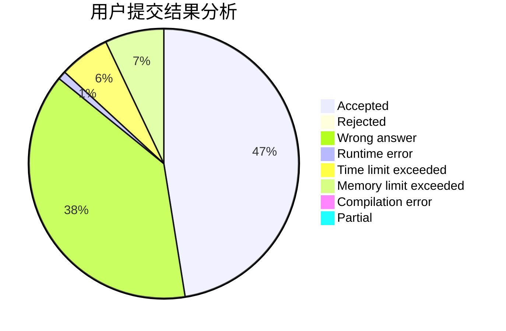
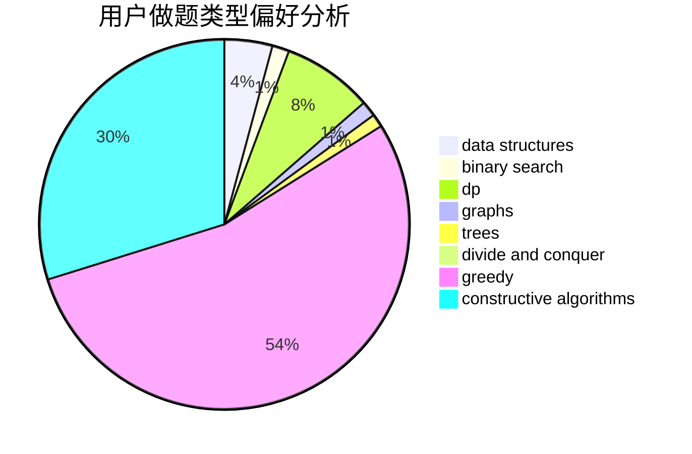
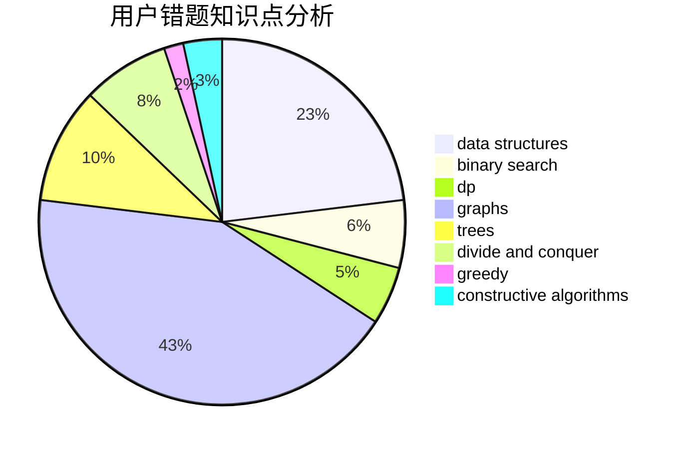

# GamerDiaosi

<!-- tabs:start -->

#### **用户提交结果分析**

#### **用户做题类型偏好分析**

#### **用户错题知识点分析**

<!-- tabs:end -->
# 推荐题目
[348B](https://codeforces.com/contest/348/problem/B)		dfs and similar,
                        number theory,
                        trees		  
[1023C](https://codeforces.com/contest/1023/problem/C)		greedy		  
[549C](https://codeforces.com/contest/549/problem/C)		games		  
[798B](https://codeforces.com/contest/798/problem/B)		brute force,
                        dp,
                        strings		  
[862D](https://codeforces.com/contest/862/problem/D)		binary search,
                        divide and conquer,
                        interactive		  
[627F](https://codeforces.com/contest/627/problem/F)		dfs and similar,
                        dsu,
                        graphs,
                        trees		  
[582C](https://codeforces.com/contest/582/problem/C)		number theory		  
[899F](https://codeforces.com/contest/899/problem/F)		data structures,
                        strings		  
[114C](https://codeforces.com/contest/114/problem/C)		dsu,graphs,sortings,trees		  
[319B](https://codeforces.com/contest/319/problem/B)		data structures,
                        implementation		  
