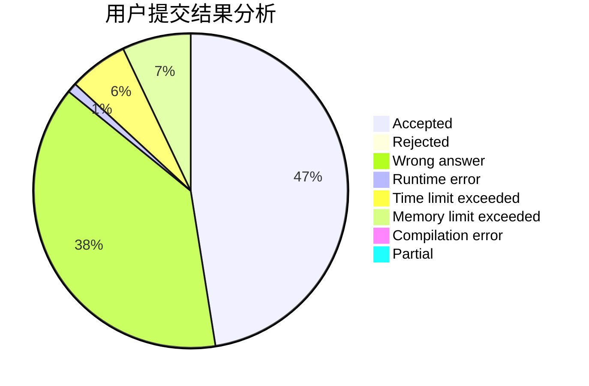
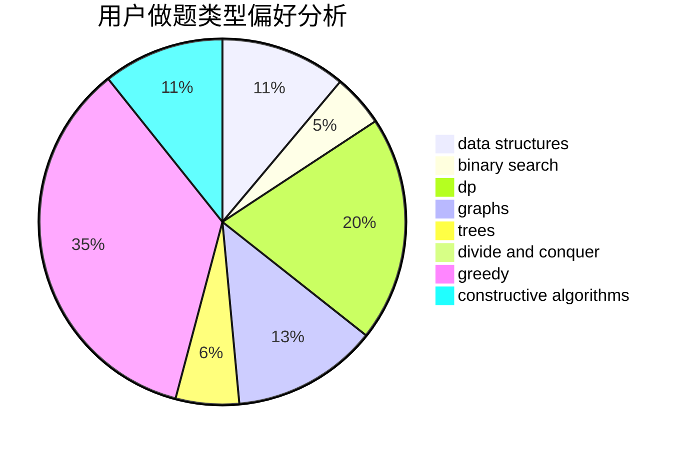
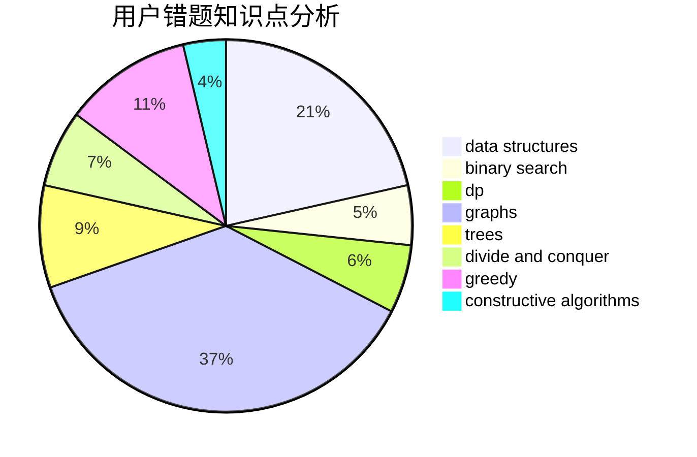

# GamerDiaosi

<!-- tabs:start -->

#### **用户提交结果分析**

#### **用户做题类型偏好分析**

#### **用户错题知识点分析**

<!-- tabs:end -->
# 推荐题目
[318A](https://codeforces.com/contest/318/problem/A)		math		  
[1020E](https://codeforces.com/contest/1020/problem/E)		dsu,graphs,sortings,trees		  
[524F](https://codeforces.com/contest/524/problem/F)		data structures,
                        greedy,
                        hashing,
                        string suffix structures,
                        strings		  
[77B](https://codeforces.com/contest/77/problem/B)		math,
                        probabilities		  
[843B](https://codeforces.com/contest/843/problem/B)		brute force,
                        interactive,
                        probabilities		  
[609A](https://codeforces.com/contest/609/problem/A)		greedy,
                        implementation,
                        sortings		  
[559E](https://codeforces.com/contest/559/problem/E)		dp,
                        sortings		  
[879B](https://codeforces.com/contest/879/problem/B)		data structures,
                        implementation		  
[1148C](https://codeforces.com/contest/1148/problem/C)		constructive algorithms,
                        sortings		  
[300D](https://codeforces.com/contest/300/problem/D)		dp,
                        fft		  
