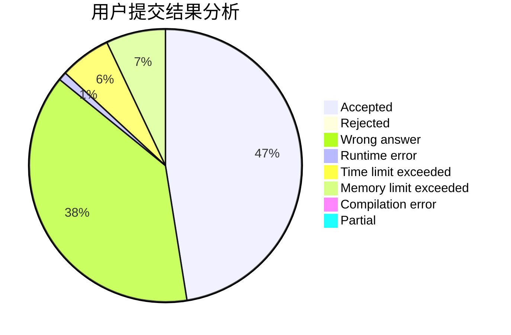
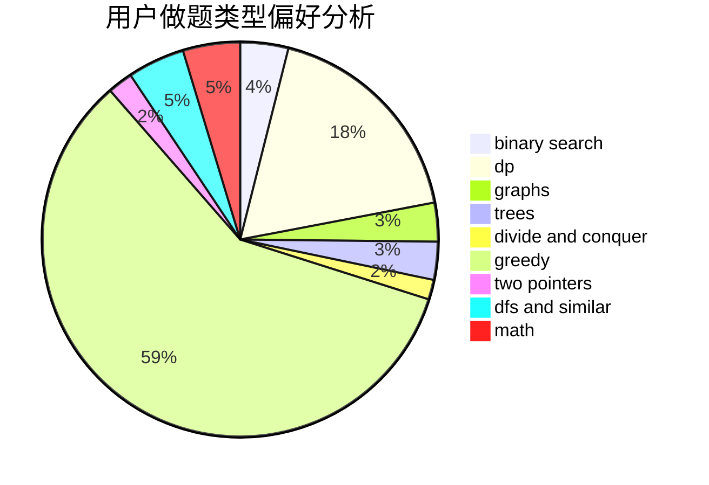

# GamerDiaosi

<!-- tabs:start -->

#### **用户提交结果分析**

#### **用户做题类型偏好分析**

<!-- tabs:end -->
# 推荐题目
[348B](https://codeforces.com/contest/348/problem/B)
[1023C](https://codeforces.com/contest/1023/problem/C)
[549C](https://codeforces.com/contest/549/problem/C)
[798B](https://codeforces.com/contest/798/problem/B)
[862D](https://codeforces.com/contest/862/problem/D)
[627F](https://codeforces.com/contest/627/problem/F)
[582C](https://codeforces.com/contest/582/problem/C)
[899F](https://codeforces.com/contest/899/problem/F)
[114C](https://codeforces.com/contest/114/problem/C)
[319B](https://codeforces.com/contest/319/problem/B)
