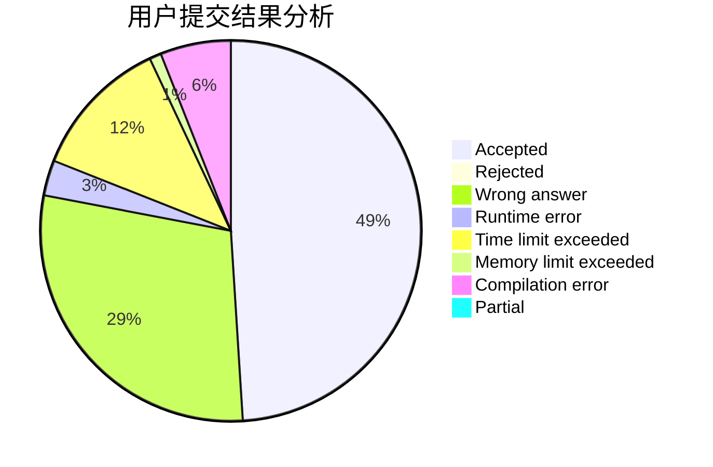
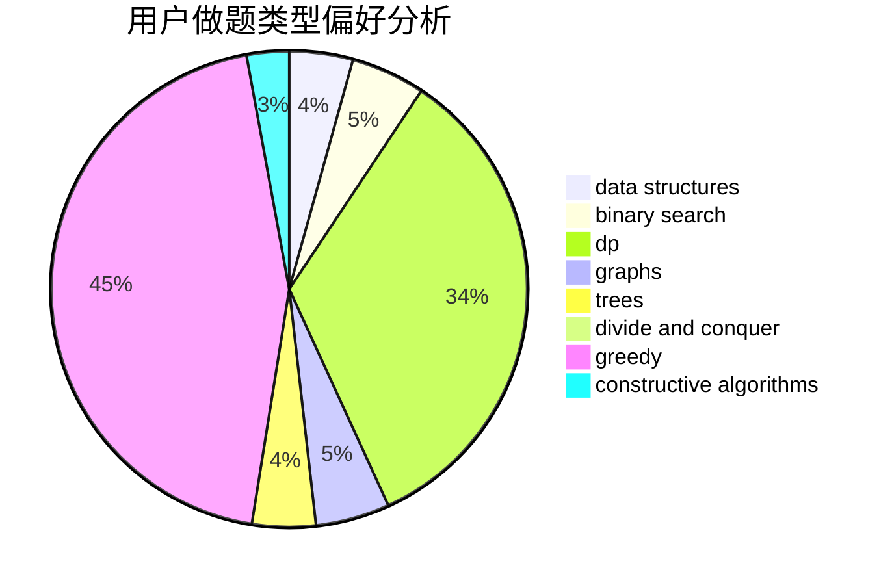
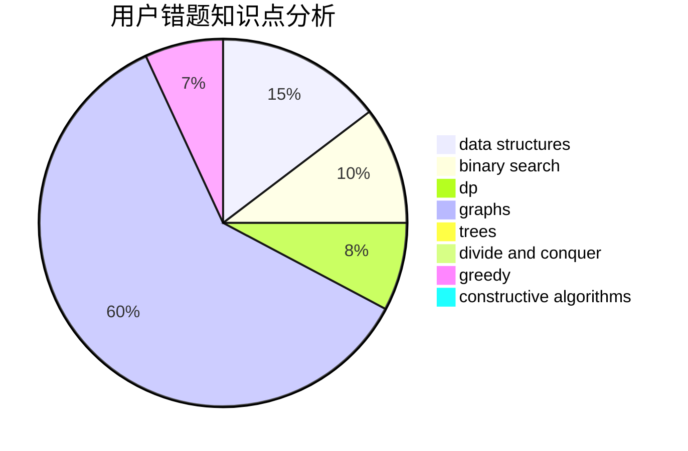

# GaoYusong

<!-- tabs:start -->

#### **用户提交结果分析**

#### **用户做题类型偏好分析**

#### **用户错题知识点分析**

<!-- tabs:end -->
# 推荐题目
[1300C](https://codeforces.com/contest/1300/problem/C)		dsu,graphs,sortings,trees		  
[1080B](https://codeforces.com/contest/1080/problem/B)		math		  
[339A](https://codeforces.com/contest/339/problem/A)		greedy,
                        implementation,
                        sortings,
                        strings		  
[8D](https://codeforces.com/contest/8/problem/D)		binary search,
                        geometry		  
[13932](https://codeforces.com/contest/1393/problem/2)		dsu,graphs,sortings,trees		  
[696C](https://codeforces.com/contest/696/problem/C)		combinatorics,
                        dp,
                        implementation,
                        math,
                        matrices		  
[585D](https://codeforces.com/contest/585/problem/D)		meet-in-the-middle		  
[1346C](https://codeforces.com/contest/1346/problem/C)		*special problem,
                        greedy,
                        sortings		  
[8B](https://codeforces.com/contest/8/problem/B)		constructive algorithms,
                        graphs,
                        implementation		  
[837F](https://codeforces.com/contest/837/problem/F)		binary search,
                        brute force,
                        combinatorics,
                        math,
                        matrices		  
