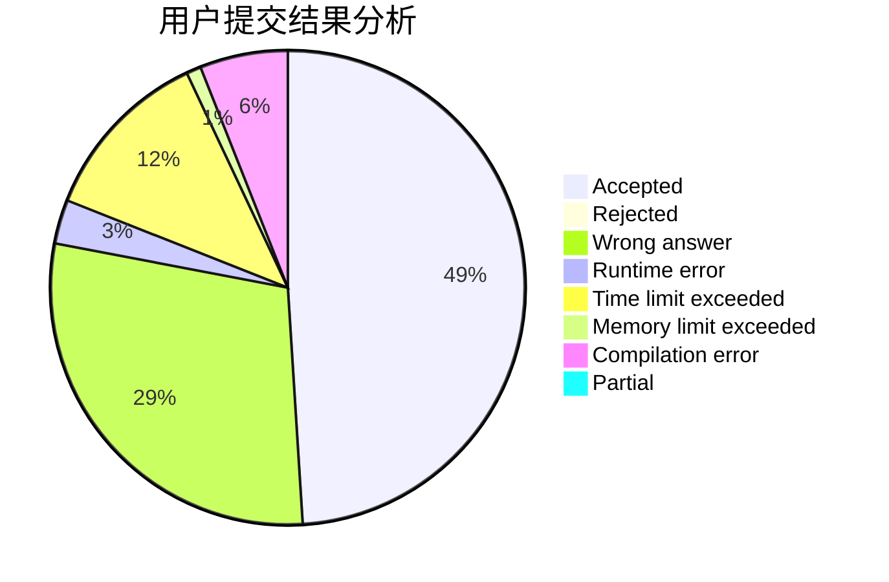
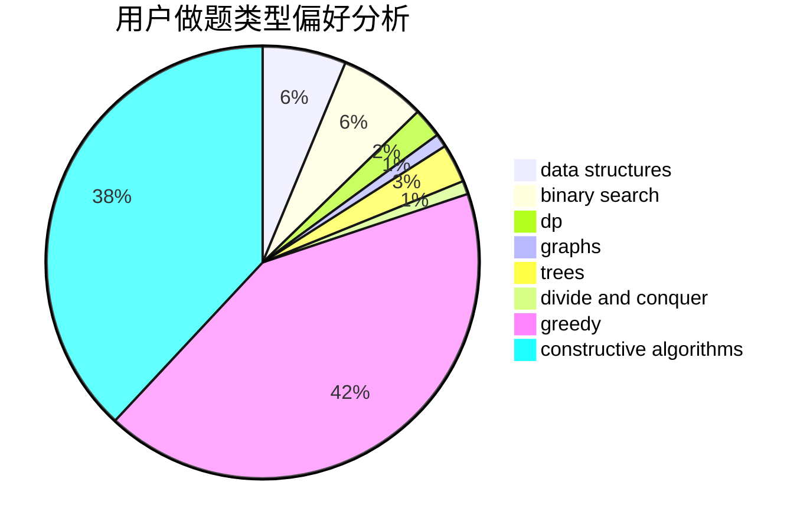
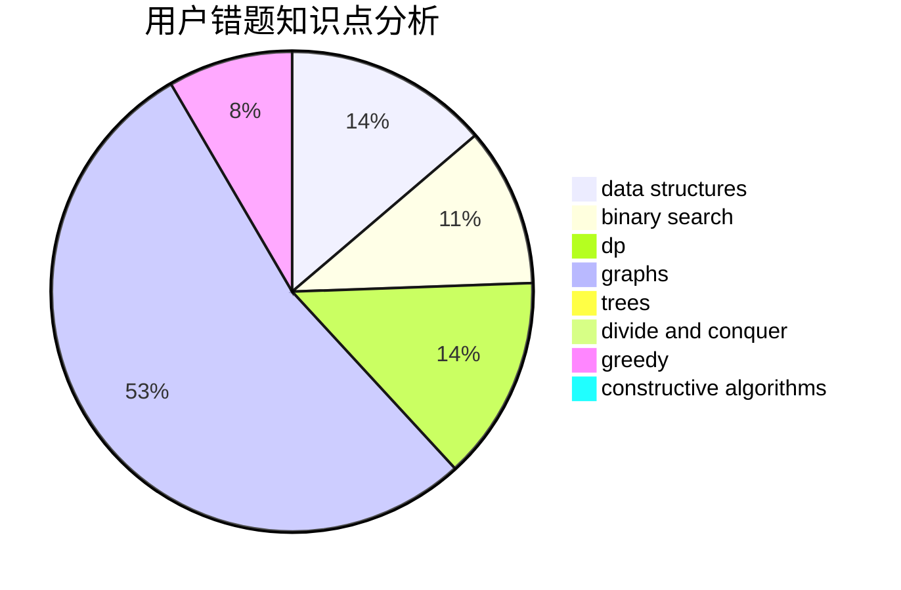

# GaoYusong

<!-- tabs:start -->

#### **用户提交结果分析**

#### **用户做题类型偏好分析**

#### **用户错题知识点分析**

<!-- tabs:end -->
# 推荐题目
[1294A](https://codeforces.com/contest/1294/problem/A)		math		  
[107C](https://codeforces.com/contest/107/problem/C)		bitmasks,
                        dp		  
[314B](https://codeforces.com/contest/314/problem/B)		binary search,
                        dfs and similar,
                        strings		  
[87C](https://codeforces.com/contest/87/problem/C)		dp,
                        games,
                        math		  
[1383C](https://codeforces.com/contest/1383/problem/C)		bitmasks,
                        dp,
                        graphs,
                        trees		  
[670D2](https://codeforces.com/contest/670D/problem/2)		binary search,
                        implementation		  
[566E](https://codeforces.com/contest/566/problem/E)		bitmasks,
                        constructive algorithms,
                        trees		  
[1339C](https://codeforces.com/contest/1339/problem/C)		dsu,graphs,sortings,trees		  
[879C](https://codeforces.com/contest/879/problem/C)		dsu,graphs,sortings,trees		  
[817F](https://codeforces.com/contest/817/problem/F)		binary search,
                        data structures,
                        trees		  
