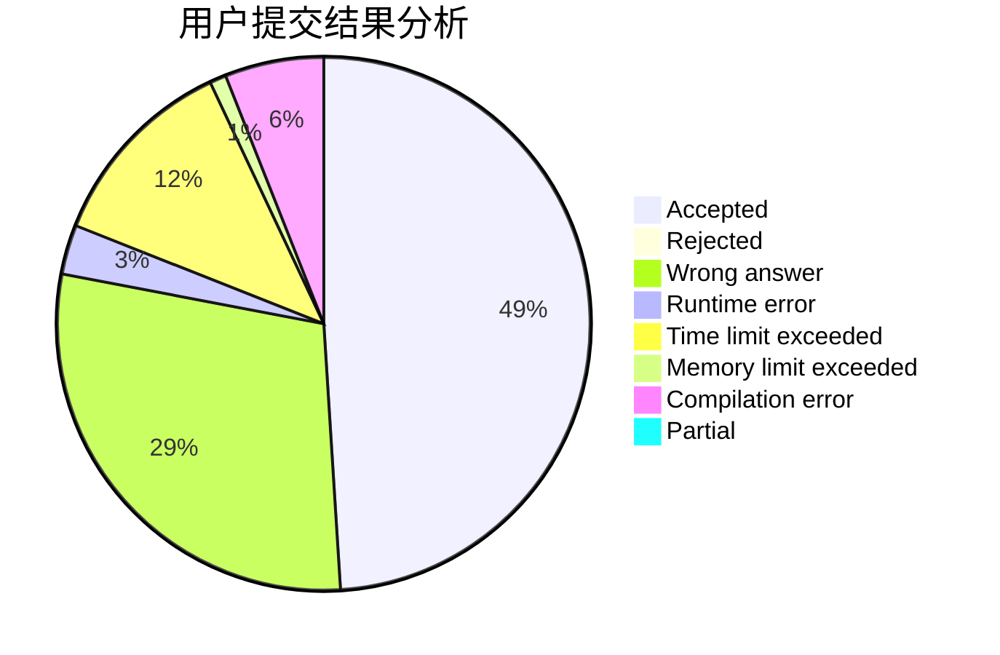
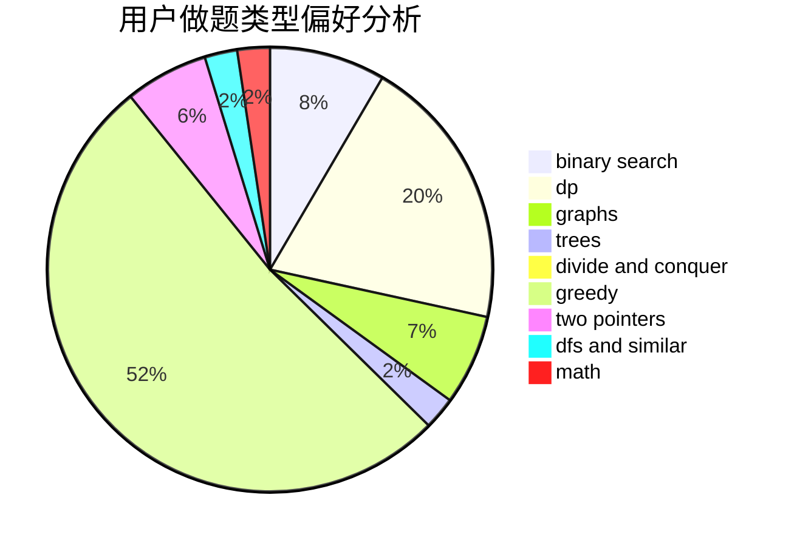

# GaoYusong

<!-- tabs:start -->

#### **用户提交结果分析**

#### **用户做题类型偏好分析**

<!-- tabs:end -->
# 推荐题目
[1300C](https://codeforces.com/contest/1300/problem/C)
[1080B](https://codeforces.com/contest/1080/problem/B)
[339A](https://codeforces.com/contest/339/problem/A)
[8D](https://codeforces.com/contest/8/problem/D)
[13932](https://codeforces.com/contest/1393/problem/2)
[696C](https://codeforces.com/contest/696/problem/C)
[585D](https://codeforces.com/contest/585/problem/D)
[1346C](https://codeforces.com/contest/1346/problem/C)
[8B](https://codeforces.com/contest/8/problem/B)
[837F](https://codeforces.com/contest/837/problem/F)
