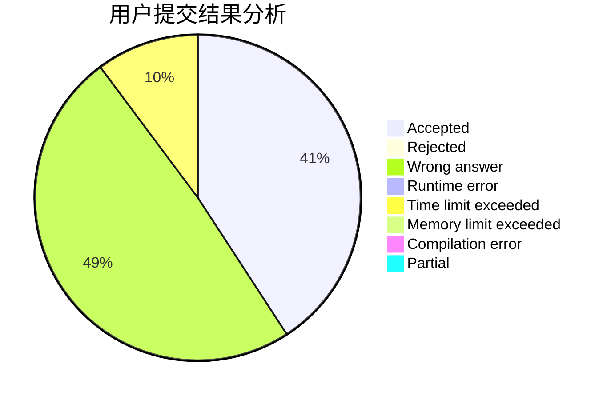
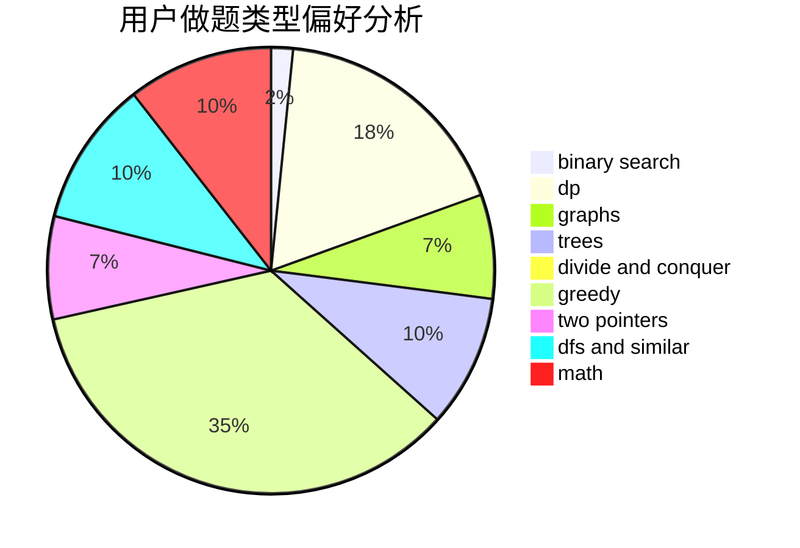

# Gaomez

<!-- tabs:start -->

#### **用户提交结果分析**

#### **用户做题类型偏好分析**

<!-- tabs:end -->
# 推荐题目
[603A](https://codeforces.com/contest/603/problem/A)
[1104C](https://codeforces.com/contest/1104/problem/C)
[1292E](https://codeforces.com/contest/1292/problem/E)
[300B](https://codeforces.com/contest/300/problem/B)
[567C](https://codeforces.com/contest/567/problem/C)
[1286A](https://codeforces.com/contest/1286/problem/A)
[635E](https://codeforces.com/contest/635/problem/E)
[900B](https://codeforces.com/contest/900/problem/B)
[901A](https://codeforces.com/contest/901/problem/A)
[1489C](https://codeforces.com/contest/1489/problem/C)
