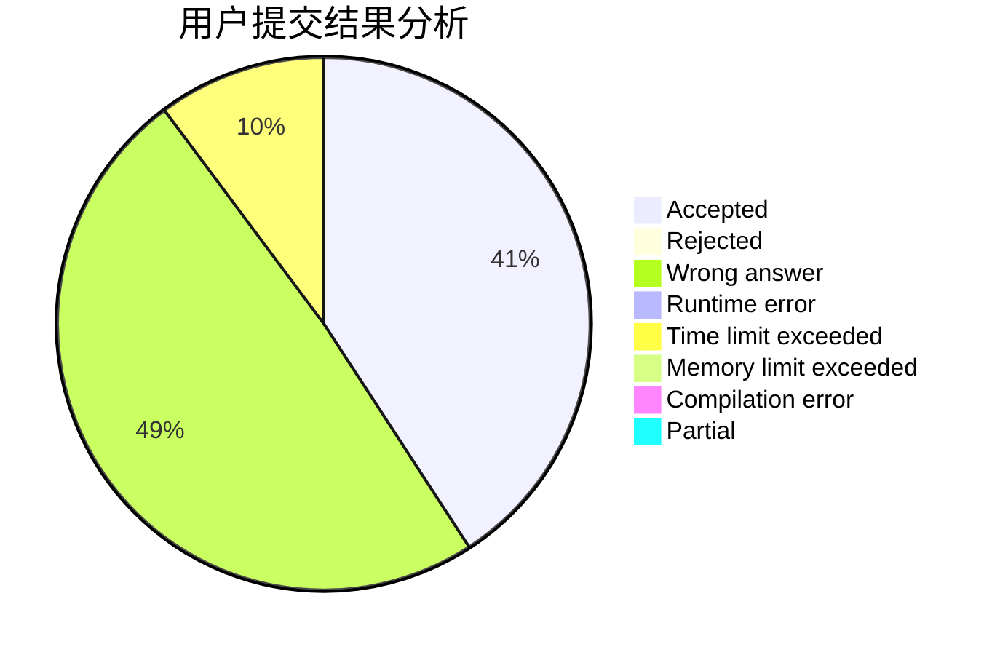
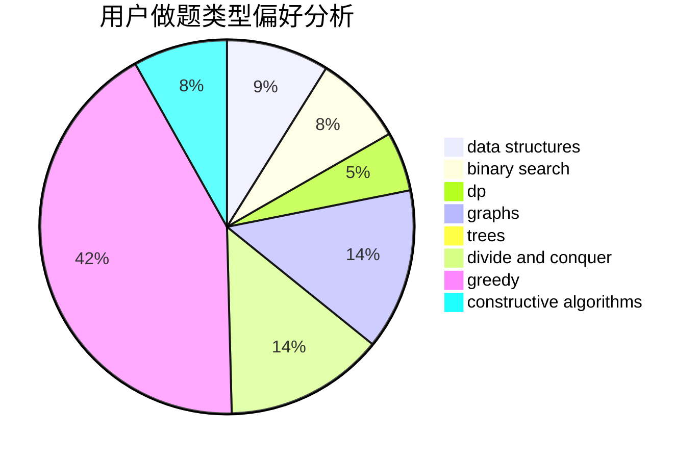
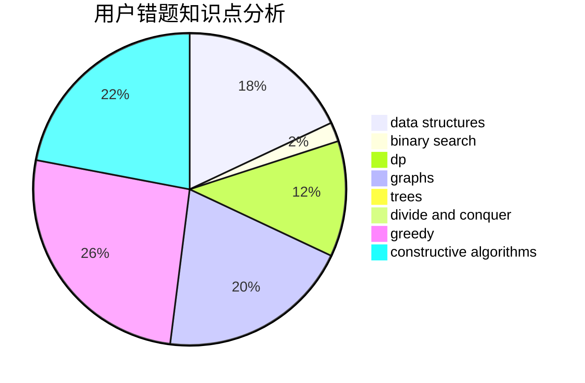

# Gaomez

<!-- tabs:start -->

#### **用户提交结果分析**

#### **用户做题类型偏好分析**

#### **用户错题知识点分析**

<!-- tabs:end -->
# 推荐题目
[582A](https://codeforces.com/contest/582/problem/A)		constructive algorithms,
                        greedy,
                        number theory		  
[1103E](https://codeforces.com/contest/1103/problem/E)		fft,
                        math,
                        number theory		  
[1285D](https://codeforces.com/contest/1285/problem/D)		bitmasks,
                        brute force,
                        dfs and similar,
                        divide and conquer,
                        dp,
                        greedy,
                        strings,
                        trees		  
[286A](https://codeforces.com/contest/286/problem/A)		constructive algorithms,
                        math		  
[543A](https://codeforces.com/contest/543/problem/A)		dp		  
[1280A](https://codeforces.com/contest/1280/problem/A)		implementation,
                        math		  
[617E](https://codeforces.com/contest/617/problem/E)		data structures		  
[883C](https://codeforces.com/contest/883/problem/C)		binary search,
                        implementation		  
[883G](https://codeforces.com/contest/883/problem/G)		dfs and similar,
                        graphs		  
[1481A](https://codeforces.com/contest/1481/problem/A)		greedy,
                        strings		  
