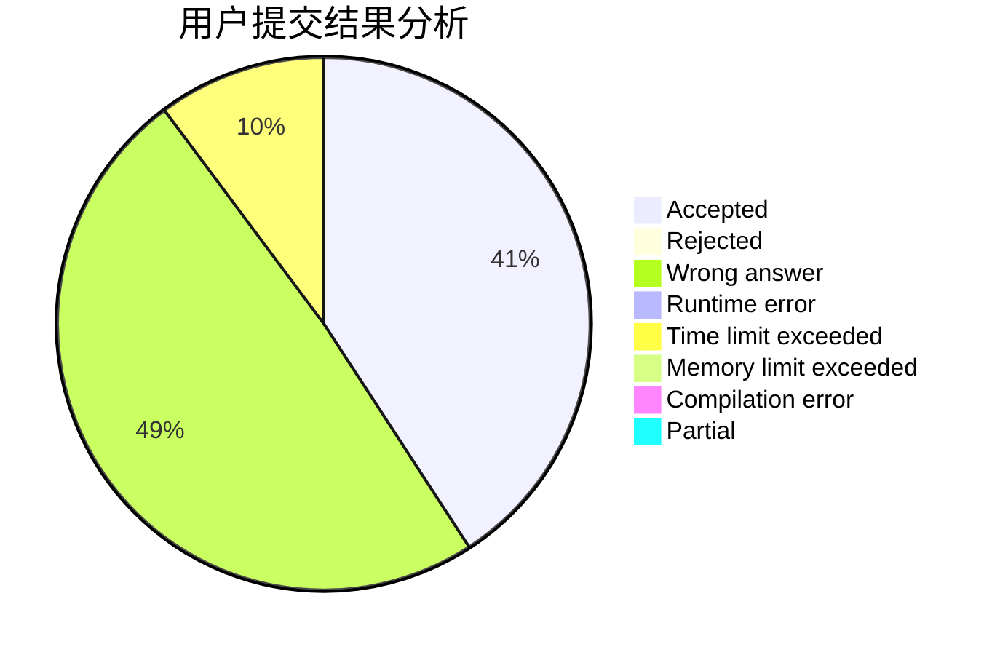
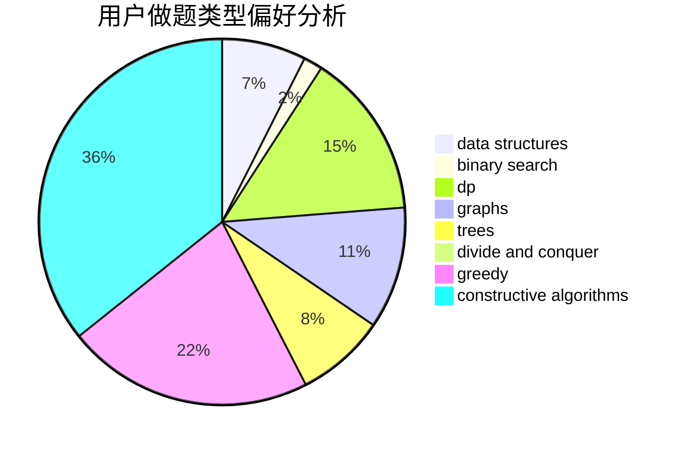
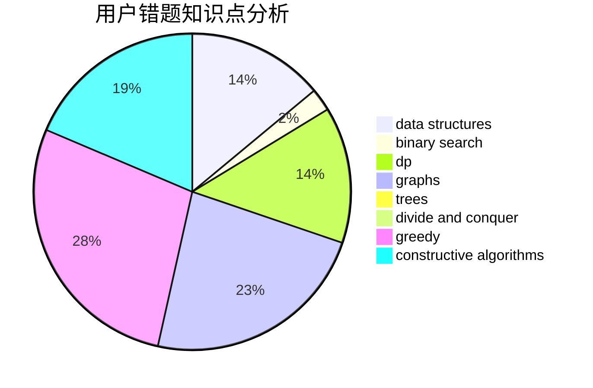

# Gaomez

<!-- tabs:start -->

#### **用户提交结果分析**

#### **用户做题类型偏好分析**

#### **用户错题知识点分析**

<!-- tabs:end -->
# 推荐题目
[603A](https://codeforces.com/contest/603/problem/A)		dp,
                        greedy,
                        math		  
[1104C](https://codeforces.com/contest/1104/problem/C)		dsu,graphs,sortings,trees		  
[1292E](https://codeforces.com/contest/1292/problem/E)		constructive algorithms,
                        greedy,
                        interactive,
                        math		  
[300B](https://codeforces.com/contest/300/problem/B)		brute force,
                        dfs and similar,
                        graphs		  
[567C](https://codeforces.com/contest/567/problem/C)		binary search,
                        data structures,
                        dp		  
[1286A](https://codeforces.com/contest/1286/problem/A)		dp,
                        greedy,
                        sortings		  
[635E](https://codeforces.com/contest/635/problem/E)		dsu,graphs,sortings,trees		  
[900B](https://codeforces.com/contest/900/problem/B)		math,
                        number theory		  
[901A](https://codeforces.com/contest/901/problem/A)		constructive algorithms,
                        trees		  
[1489C](https://codeforces.com/contest/1489/problem/C)		dsu,graphs,sortings,trees		  
