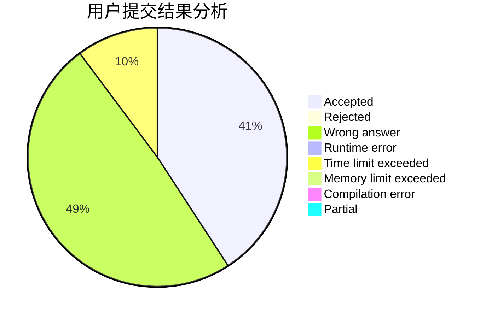
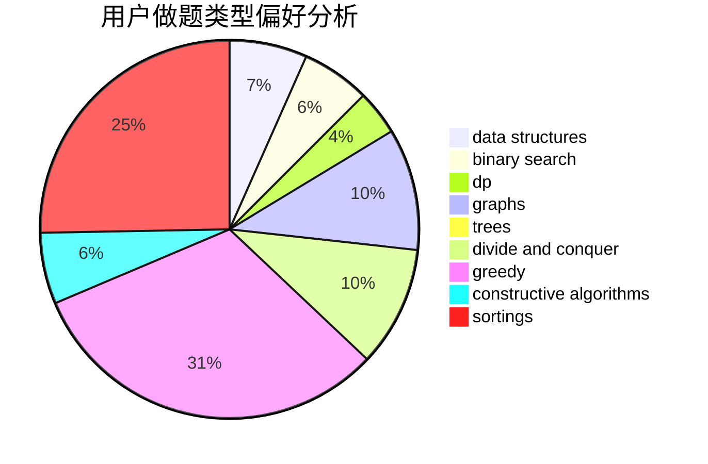
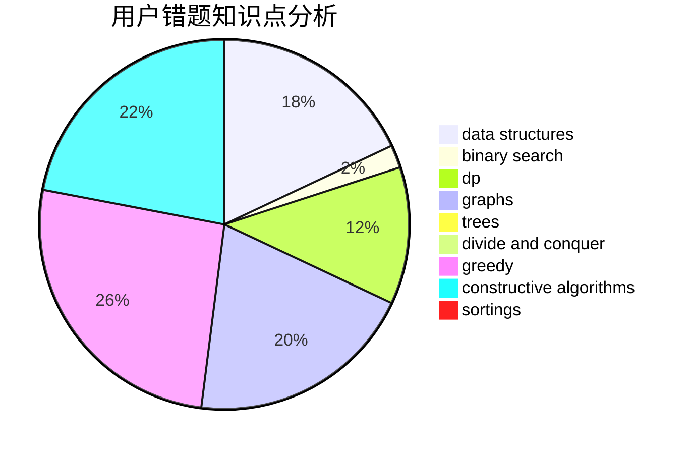

# Gaomez
<!-- tabs:start -->
#### **用户提交结果分析**

#### **用户做题类型偏好分析**

#### **用户错题知识点分析**

<!-- tabs:end -->
# 推荐题目
[582A](http://codeforces.com/problemset/problem/582/A)		constructive algorithms,
                        greedy,
                        number theory		  
[1103E](http://codeforces.com/problemset/problem/1103/E)		fft,
                        math,
                        number theory		  
[618C](http://codeforces.com/problemset/problem/618/C)		geometry,
                        implementation		  
[1280A](http://codeforces.com/problemset/problem/1280/A)		implementation,
                        math		  
[883C](http://codeforces.com/problemset/problem/883/C)		binary search,
                        implementation		  
[754C](http://codeforces.com/problemset/problem/754/C)		brute force,
                        constructive algorithms,
                        dp,
                        implementation,
                        strings		  
[883G](http://codeforces.com/problemset/problem/883/G)		dfs and similar,
                        graphs		  
[1411B](http://codeforces.com/problemset/problem/1411/B)		brute force,
                        number theory		  
[613A](http://codeforces.com/problemset/problem/613/A)		binary search,
                        geometry,
                        ternary search		  
[286A](http://codeforces.com/problemset/problem/286/A)		constructive algorithms,
                        math		  
<!-- tabs:start -->
#### **data structures**
[1117G](http://codeforces.com/problemset/problem/1117/G)		data structures		  
[813F](http://codeforces.com/problemset/problem/813/F)		data structures,
                        dsu,
                        graphs		  
[1500D](http://codeforces.com/problemset/problem/1500/D)		data structures,
                        sortings,
                        two pointers		  
[241B](http://codeforces.com/problemset/problem/241/B)		binary search,
                        bitmasks,
                        data structures,
                        math		  
[617E](http://codeforces.com/problemset/problem/617/E)		data structures		  
[1428F](http://codeforces.com/problemset/problem/1428/F)		binary search,
                        data structures,
                        divide and conquer,
                        dp,
                        two pointers		  
[1379C](http://codeforces.com/problemset/problem/1379/C)		binary search,
                        brute force,
                        data structures,
                        dfs and similar,
                        dp,
                        greedy,
                        sortings,
                        two pointers		  
[1492C](http://codeforces.com/problemset/problem/1492/C)		binary search,
                        data structures,
                        dp,
                        greedy,
                        two pointers		  
[1490G](http://codeforces.com/problemset/problem/1490/G)		binary search,
                        data structures,
                        math		  
[1479D](http://codeforces.com/problemset/problem/1479/D)		binary search,
                        bitmasks,
                        brute force,
                        data structures,
                        probabilities,
                        trees		  
#### **binary search**
[883C](http://codeforces.com/problemset/problem/883/C)		binary search,
                        implementation		  
[613A](http://codeforces.com/problemset/problem/613/A)		binary search,
                        geometry,
                        ternary search		  
[883D](http://codeforces.com/problemset/problem/883/D)		binary search,
                        dp,
                        math		  
[241B](http://codeforces.com/problemset/problem/241/B)		binary search,
                        bitmasks,
                        data structures,
                        math		  
[1428F](http://codeforces.com/problemset/problem/1428/F)		binary search,
                        data structures,
                        divide and conquer,
                        dp,
                        two pointers		  
[1379C](http://codeforces.com/problemset/problem/1379/C)		binary search,
                        brute force,
                        data structures,
                        dfs and similar,
                        dp,
                        greedy,
                        sortings,
                        two pointers		  
[1492C](http://codeforces.com/problemset/problem/1492/C)		binary search,
                        data structures,
                        dp,
                        greedy,
                        two pointers		  
[1463D](http://codeforces.com/problemset/problem/1463/D)		binary search,
                        constructive algorithms,
                        greedy,
                        two pointers		  
[1490G](http://codeforces.com/problemset/problem/1490/G)		binary search,
                        data structures,
                        math		  
[1479D](http://codeforces.com/problemset/problem/1479/D)		binary search,
                        bitmasks,
                        brute force,
                        data structures,
                        probabilities,
                        trees		  
#### **dp**
[754C](http://codeforces.com/problemset/problem/754/C)		brute force,
                        constructive algorithms,
                        dp,
                        implementation,
                        strings		  
[1285D](http://codeforces.com/problemset/problem/1285/D)		bitmasks,
                        brute force,
                        dfs and similar,
                        divide and conquer,
                        dp,
                        greedy,
                        strings,
                        trees		  
[1185G2](http://codeforces.com/problemset/problem/1185/G2)		combinatorics,
                        dp		  
[1042B](http://codeforces.com/problemset/problem/1042/B)		bitmasks,
                        brute force,
                        dp,
                        implementation		  
[1266H](http://codeforces.com/problemset/problem/1266/H)		dp,
                        graphs,
                        math,
                        matrices,
                        meet-in-the-middle		  
[1469B](http://codeforces.com/problemset/problem/1469/B)		dp,
                        greedy		  
[1293E](https://codeforces.com/contest/1293/problem/E)		combinatorics,
                        dfs and similar,
                        dp,
                        greedy,
                        trees		  
[883D](http://codeforces.com/problemset/problem/883/D)		binary search,
                        dp,
                        math		  
[543A](http://codeforces.com/problemset/problem/543/A)		dp		  
[512D](http://codeforces.com/problemset/problem/512/D)		dp,
                        trees		  
#### **graph**
[883G](http://codeforces.com/problemset/problem/883/G)		dfs and similar,
                        graphs		  
[883B](http://codeforces.com/problemset/problem/883/B)		constructive algorithms,
                        graphs,
                        greedy		  
[1266H](http://codeforces.com/problemset/problem/1266/H)		dp,
                        graphs,
                        math,
                        matrices,
                        meet-in-the-middle		  
[132E](http://codeforces.com/problemset/problem/132/E)		flows,
                        graphs		  
[813F](http://codeforces.com/problemset/problem/813/F)		data structures,
                        dsu,
                        graphs		  
[1320B](http://codeforces.com/problemset/problem/1320/B)		dfs and similar,
                        graphs,
                        shortest paths		  
[1487C](http://codeforces.com/problemset/problem/1487/C)		brute force,
                        constructive algorithms,
                        dfs and similar,
                        graphs,
                        greedy,
                        implementation,
                        math		  
[1437C](http://codeforces.com/problemset/problem/1437/C)		dp,
                        flows,
                        graph matchings,
                        greedy,
                        math,
                        sortings		  
[1470D](http://codeforces.com/problemset/problem/1470/D)		constructive algorithms,
                        dfs and similar,
                        graph matchings,
                        graphs,
                        greedy		  
[1476C](http://codeforces.com/problemset/problem/1476/C)		dp,
                        graphs,
                        greedy		  
#### **trees**
[1285D](http://codeforces.com/problemset/problem/1285/D)		bitmasks,
                        brute force,
                        dfs and similar,
                        divide and conquer,
                        dp,
                        greedy,
                        strings,
                        trees		  
[1293E](https://codeforces.com/contest/1293/problem/E)		combinatorics,
                        dfs and similar,
                        dp,
                        greedy,
                        trees		  
[512D](http://codeforces.com/problemset/problem/512/D)		dp,
                        trees		  
[1097G](http://codeforces.com/problemset/problem/1097/G)		combinatorics,
                        dp,
                        trees		  
[1479D](http://codeforces.com/problemset/problem/1479/D)		binary search,
                        bitmasks,
                        brute force,
                        data structures,
                        probabilities,
                        trees		  
[1511C](http://codeforces.com/problemset/problem/1511/C)		brute force,
                        data structures,
                        implementation,
                        trees		  
[1499F](http://codeforces.com/problemset/problem/1499/F)		combinatorics,
                        dfs and similar,
                        dp,
                        trees		  
[1491E](http://codeforces.com/problemset/problem/1491/E)		brute force,
                        dfs and similar,
                        divide and conquer,
                        number theory,
                        trees		  
[1466D](http://codeforces.com/problemset/problem/1466/D)		data structures,
                        greedy,
                        sortings,
                        trees		  
[1495D](http://codeforces.com/problemset/problem/1495/D)		combinatorics,
                        dfs and similar,
                        graphs,
                        math,
                        shortest paths,
                        trees		  
#### **divide and conquer**
[1285D](http://codeforces.com/problemset/problem/1285/D)		bitmasks,
                        brute force,
                        dfs and similar,
                        divide and conquer,
                        dp,
                        greedy,
                        strings,
                        trees		  
[1428F](http://codeforces.com/problemset/problem/1428/F)		binary search,
                        data structures,
                        divide and conquer,
                        dp,
                        two pointers		  
[1461D](http://codeforces.com/problemset/problem/1461/D)		binary search,
                        brute force,
                        data structures,
                        divide and conquer,
                        implementation,
                        sortings		  
[1466G](http://codeforces.com/problemset/problem/1466/G)		combinatorics,
                        divide and conquer,
                        hashing,
                        math,
                        string suffix structures,
                        strings		  
[1490D](http://codeforces.com/problemset/problem/1490/D)		dfs and similar,
                        divide and conquer,
                        implementation		  
[1483C](https://codeforces.com/contest/1483/problem/C)		data structures,
                        divide and conquer,
                        dp		  
[1491E](http://codeforces.com/problemset/problem/1491/E)		brute force,
                        dfs and similar,
                        divide and conquer,
                        number theory,
                        trees		  
[1303G](http://codeforces.com/problemset/problem/1303/G)		data structures,
                        divide and conquer,
                        geometry,
                        trees		  
[1494D](http://codeforces.com/problemset/problem/1494/D)		constructive algorithms,
                        data structures,
                        dfs and similar,
                        divide and conquer,
                        dsu,
                        greedy,
                        sortings,
                        trees		  
[1482E](http://codeforces.com/problemset/problem/1482/E)		data structures,
                        divide and conquer,
                        dp		  
#### **greedy**
[582A](http://codeforces.com/problemset/problem/582/A)		constructive algorithms,
                        greedy,
                        number theory		  
[1285D](http://codeforces.com/problemset/problem/1285/D)		bitmasks,
                        brute force,
                        dfs and similar,
                        divide and conquer,
                        dp,
                        greedy,
                        strings,
                        trees		  
[883B](http://codeforces.com/problemset/problem/883/B)		constructive algorithms,
                        graphs,
                        greedy		  
[1173B](http://codeforces.com/problemset/problem/1173/B)		constructive algorithms,
                        greedy		  
[1264A](http://codeforces.com/problemset/problem/1264/A)		greedy,
                        implementation		  
[1469B](http://codeforces.com/problemset/problem/1469/B)		dp,
                        greedy		  
[1293E](https://codeforces.com/contest/1293/problem/E)		combinatorics,
                        dfs and similar,
                        dp,
                        greedy,
                        trees		  
[1305A](http://codeforces.com/problemset/problem/1305/A)		brute force,
                        constructive algorithms,
                        greedy,
                        sortings		  
[1481A](http://codeforces.com/problemset/problem/1481/A)		greedy,
                        strings		  
[483C](https://codeforces.com/contest/483/problem/C)		constructive algorithms,
                        greedy		  
#### **constructive algorithms**
[582A](http://codeforces.com/problemset/problem/582/A)		constructive algorithms,
                        greedy,
                        number theory		  
[754C](http://codeforces.com/problemset/problem/754/C)		brute force,
                        constructive algorithms,
                        dp,
                        implementation,
                        strings		  
[286A](http://codeforces.com/problemset/problem/286/A)		constructive algorithms,
                        math		  
[460D](http://codeforces.com/problemset/problem/460/D)		brute force,
                        constructive algorithms,
                        math		  
[1088A](http://codeforces.com/problemset/problem/1088/A)		brute force,
                        constructive algorithms		  
[317E](http://codeforces.com/problemset/problem/317/E)		constructive algorithms,
                        shortest paths		  
[883B](http://codeforces.com/problemset/problem/883/B)		constructive algorithms,
                        graphs,
                        greedy		  
[1131F](http://codeforces.com/problemset/problem/1131/F)		constructive algorithms,
                        dsu		  
[1173B](http://codeforces.com/problemset/problem/1173/B)		constructive algorithms,
                        greedy		  
[1261A](https://codeforces.com/contest/1261/problem/A)		constructive algorithms		  
#### **sortings**
[160C](http://codeforces.com/problemset/problem/160/C)		implementation,
                        math,
                        sortings		  
[1500D](http://codeforces.com/problemset/problem/1500/D)		data structures,
                        sortings,
                        two pointers		  
[1305A](http://codeforces.com/problemset/problem/1305/A)		brute force,
                        constructive algorithms,
                        greedy,
                        sortings		  
[1475E](http://codeforces.com/problemset/problem/1475/E)		combinatorics,
                        math,
                        sortings		  
[1379C](http://codeforces.com/problemset/problem/1379/C)		binary search,
                        brute force,
                        data structures,
                        dfs and similar,
                        dp,
                        greedy,
                        sortings,
                        two pointers		  
[1496C](https://codeforces.com/contest/1496/problem/C)		geometry,
                        greedy,
                        math,
                        sortings		  
[1495A](http://codeforces.com/problemset/problem/1495/A)		geometry,
                        greedy,
                        math,
                        sortings		  
[1497A](http://codeforces.com/problemset/problem/1497/A)		brute force,
                        data structures,
                        greedy,
                        sortings		  
[1427A](http://codeforces.com/problemset/problem/1427/A)		math,
                        sortings		  
[1461D](http://codeforces.com/problemset/problem/1461/D)		binary search,
                        brute force,
                        data structures,
                        divide and conquer,
                        implementation,
                        sortings		  
<!-- tabs:end -->
