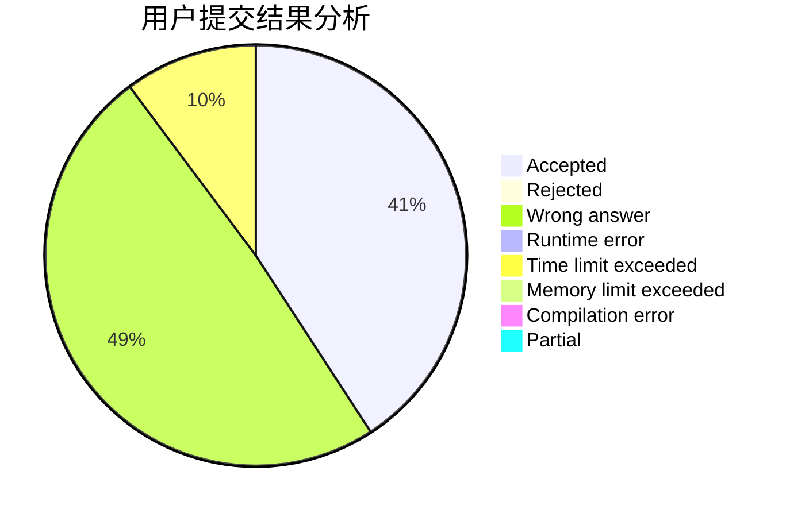
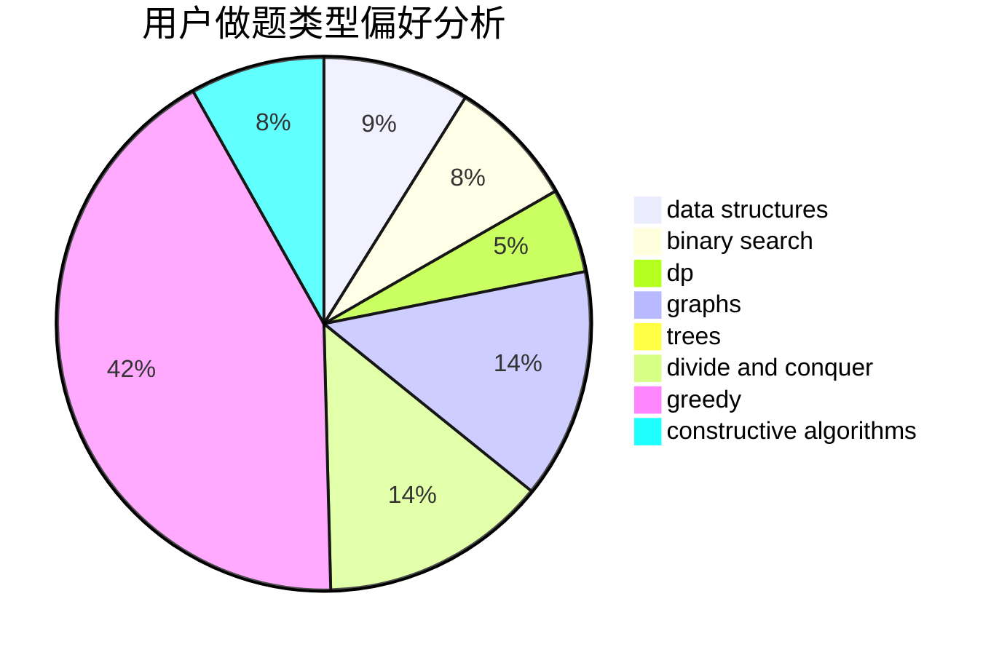
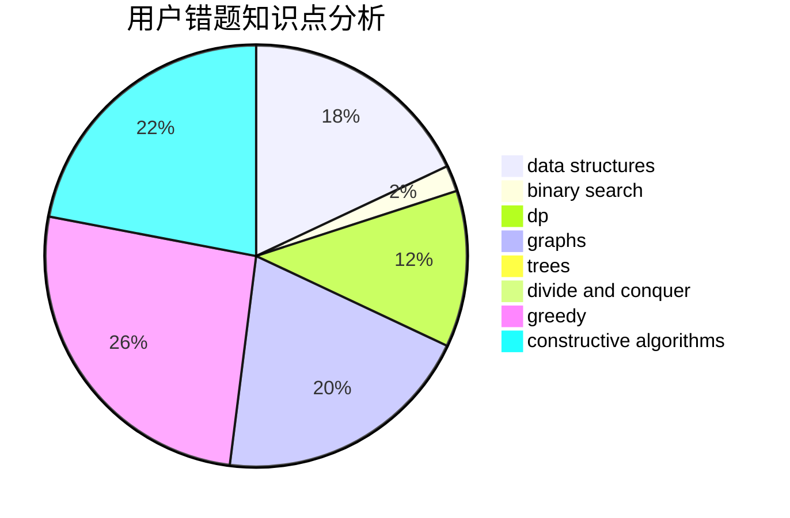

# Gaomez
<!-- tabs:start -->
#### **用户提交结果分析**

#### **用户做题类型偏好分析**

#### **用户错题知识点分析**

<!-- tabs:end -->
# 推荐题目
[GCD Table](http://codeforces.com/problemset/problem/582/A)		constructive algorithms,
                        greedy,
                        number theory		  
[Radix sum](http://codeforces.com/problemset/problem/1103/E)		fft,
                        math,
                        number theory		  
[Constellation](http://codeforces.com/problemset/problem/618/C)		geometry,
                        implementation		  
[Cut and Paste](http://codeforces.com/problemset/problem/1280/A)		implementation,
                        math		  
[Downloading B++](http://codeforces.com/problemset/problem/883/C)		binary search,
                        implementation		  
[Vladik and chat](http://codeforces.com/problemset/problem/754/C)		brute force,
                        constructive algorithms,
                        dp,
                        implementation,
                        strings		  
[Orientation of Edges](http://codeforces.com/problemset/problem/883/G)		dfs and similar,
                        graphs		  
[Fair Numbers](http://codeforces.com/problemset/problem/1411/B)		brute force,
                        number theory		  
[Peter and Snow Blower](http://codeforces.com/problemset/problem/613/A)		binary search,
                        geometry,
                        ternary search		  
[Lucky Permutation](http://codeforces.com/problemset/problem/286/A)		constructive algorithms,
                        math		  
<!-- tabs:start -->
#### **data structures**
[Recursive Queries](http://codeforces.com/problemset/problem/1117/G)		data structures		  
[Bipartite Checking](http://codeforces.com/problemset/problem/813/F)		data structures,
                        dsu,
                        graphs		  
[Tiles for Bathroom](http://codeforces.com/problemset/problem/1500/D)		data structures,
                        sortings,
                        two pointers		  
[Friends](http://codeforces.com/problemset/problem/241/B)		binary search,
                        bitmasks,
                        data structures,
                        math		  
[XOR and Favorite Number](http://codeforces.com/problemset/problem/617/E)		data structures		  
[Fruit Sequences](http://codeforces.com/problemset/problem/1428/F)		binary search,
                        data structures,
                        divide and conquer,
                        dp,
                        two pointers		  
[Choosing flowers](http://codeforces.com/problemset/problem/1379/C)		binary search,
                        brute force,
                        data structures,
                        dfs and similar,
                        dp,
                        greedy,
                        sortings,
                        two pointers		  
[Maximum width](http://codeforces.com/problemset/problem/1492/C)		binary search,
                        data structures,
                        dp,
                        greedy,
                        two pointers		  
[Old Floppy Drive](http://codeforces.com/problemset/problem/1490/G)		binary search,
                        data structures,
                        math		  
[Odd Mineral Resource](http://codeforces.com/problemset/problem/1479/D)		binary search,
                        bitmasks,
                        brute force,
                        data structures,
                        probabilities,
                        trees		  
#### **binary search**
[Downloading B++](http://codeforces.com/problemset/problem/883/C)		binary search,
                        implementation		  
[Peter and Snow Blower](http://codeforces.com/problemset/problem/613/A)		binary search,
                        geometry,
                        ternary search		  
[Packmen Strike Back](http://codeforces.com/problemset/problem/883/D)		binary search,
                        dp,
                        math		  
[Friends](http://codeforces.com/problemset/problem/241/B)		binary search,
                        bitmasks,
                        data structures,
                        math		  
[Fruit Sequences](http://codeforces.com/problemset/problem/1428/F)		binary search,
                        data structures,
                        divide and conquer,
                        dp,
                        two pointers		  
[Choosing flowers](http://codeforces.com/problemset/problem/1379/C)		binary search,
                        brute force,
                        data structures,
                        dfs and similar,
                        dp,
                        greedy,
                        sortings,
                        two pointers		  
[Maximum width](http://codeforces.com/problemset/problem/1492/C)		binary search,
                        data structures,
                        dp,
                        greedy,
                        two pointers		  
[Pairs](http://codeforces.com/problemset/problem/1463/D)		binary search,
                        constructive algorithms,
                        greedy,
                        two pointers		  
[Old Floppy Drive](http://codeforces.com/problemset/problem/1490/G)		binary search,
                        data structures,
                        math		  
[Odd Mineral Resource](http://codeforces.com/problemset/problem/1479/D)		binary search,
                        bitmasks,
                        brute force,
                        data structures,
                        probabilities,
                        trees		  
#### **dp**
[Vladik and chat](http://codeforces.com/problemset/problem/754/C)		brute force,
                        constructive algorithms,
                        dp,
                        implementation,
                        strings		  
[Dr. Evil Underscores](http://codeforces.com/problemset/problem/1285/D)		bitmasks,
                        brute force,
                        dfs and similar,
                        divide and conquer,
                        dp,
                        greedy,
                        strings,
                        trees		  
[Playlist for Polycarp (hard version)](http://codeforces.com/problemset/problem/1185/G2)		combinatorics,
                        dp		  
[Vitamins](http://codeforces.com/problemset/problem/1042/B)		bitmasks,
                        brute force,
                        dp,
                        implementation		  
[Red-Blue Graph](http://codeforces.com/problemset/problem/1266/H)		dp,
                        graphs,
                        math,
                        matrices,
                        meet-in-the-middle		  
[Red and Blue](http://codeforces.com/problemset/problem/1469/B)		dp,
                        greedy		  
[Xenon's Attack on the Gangs](https://codeforces.com/contest/1293/problem/E)		combinatorics,
                        dfs and similar,
                        dp,
                        greedy,
                        trees		  
[Packmen Strike Back](http://codeforces.com/problemset/problem/883/D)		binary search,
                        dp,
                        math		  
[Writing Code](http://codeforces.com/problemset/problem/543/A)		dp		  
[Fox And Travelling](http://codeforces.com/problemset/problem/512/D)		dp,
                        trees		  
#### **graph**
[Orientation of Edges](http://codeforces.com/problemset/problem/883/G)		dfs and similar,
                        graphs		  
[Berland Army](http://codeforces.com/problemset/problem/883/B)		constructive algorithms,
                        graphs,
                        greedy		  
[Red-Blue Graph](http://codeforces.com/problemset/problem/1266/H)		dp,
                        graphs,
                        math,
                        matrices,
                        meet-in-the-middle		  
[Bits of merry old England](http://codeforces.com/problemset/problem/132/E)		flows,
                        graphs		  
[Bipartite Checking](http://codeforces.com/problemset/problem/813/F)		data structures,
                        dsu,
                        graphs		  
[Navigation System](http://codeforces.com/problemset/problem/1320/B)		dfs and similar,
                        graphs,
                        shortest paths		  
[Minimum Ties](http://codeforces.com/problemset/problem/1487/C)		brute force,
                        constructive algorithms,
                        dfs and similar,
                        graphs,
                        greedy,
                        implementation,
                        math		  
[Chef Monocarp](http://codeforces.com/problemset/problem/1437/C)		dp,
                        flows,
                        graph matchings,
                        greedy,
                        math,
                        sortings		  
[Strange Housing](http://codeforces.com/problemset/problem/1470/D)		constructive algorithms,
                        dfs and similar,
                        graph matchings,
                        graphs,
                        greedy		  
[Longest Simple Cycle](http://codeforces.com/problemset/problem/1476/C)		dp,
                        graphs,
                        greedy		  
#### **trees**
[Dr. Evil Underscores](http://codeforces.com/problemset/problem/1285/D)		bitmasks,
                        brute force,
                        dfs and similar,
                        divide and conquer,
                        dp,
                        greedy,
                        strings,
                        trees		  
[Xenon's Attack on the Gangs](https://codeforces.com/contest/1293/problem/E)		combinatorics,
                        dfs and similar,
                        dp,
                        greedy,
                        trees		  
[Fox And Travelling](http://codeforces.com/problemset/problem/512/D)		dp,
                        trees		  
[Vladislav and a Great Legend](http://codeforces.com/problemset/problem/1097/G)		combinatorics,
                        dp,
                        trees		  
[Odd Mineral Resource](http://codeforces.com/problemset/problem/1479/D)		binary search,
                        bitmasks,
                        brute force,
                        data structures,
                        probabilities,
                        trees		  
[Yet Another Card Deck](http://codeforces.com/problemset/problem/1511/C)		brute force,
                        data structures,
                        implementation,
                        trees		  
[Diameter Cuts](http://codeforces.com/problemset/problem/1499/F)		combinatorics,
                        dfs and similar,
                        dp,
                        trees		  
[Fib-tree](http://codeforces.com/problemset/problem/1491/E)		brute force,
                        dfs and similar,
                        divide and conquer,
                        number theory,
                        trees		  
[13th Labour of Heracles](http://codeforces.com/problemset/problem/1466/D)		data structures,
                        greedy,
                        sortings,
                        trees		  
[BFS Trees](http://codeforces.com/problemset/problem/1495/D)		combinatorics,
                        dfs and similar,
                        graphs,
                        math,
                        shortest paths,
                        trees		  
#### **divide and conquer**
[Dr. Evil Underscores](http://codeforces.com/problemset/problem/1285/D)		bitmasks,
                        brute force,
                        dfs and similar,
                        divide and conquer,
                        dp,
                        greedy,
                        strings,
                        trees		  
[Fruit Sequences](http://codeforces.com/problemset/problem/1428/F)		binary search,
                        data structures,
                        divide and conquer,
                        dp,
                        two pointers		  
[Divide and Summarize](http://codeforces.com/problemset/problem/1461/D)		binary search,
                        brute force,
                        data structures,
                        divide and conquer,
                        implementation,
                        sortings		  
[Song of the Sirens](http://codeforces.com/problemset/problem/1466/G)		combinatorics,
                        divide and conquer,
                        hashing,
                        math,
                        string suffix structures,
                        strings		  
[Permutation Transformation](http://codeforces.com/problemset/problem/1490/D)		dfs and similar,
                        divide and conquer,
                        implementation		  
[Skyline Photo](https://codeforces.com/contest/1483/problem/C)		data structures,
                        divide and conquer,
                        dp		  
[Fib-tree](http://codeforces.com/problemset/problem/1491/E)		brute force,
                        dfs and similar,
                        divide and conquer,
                        number theory,
                        trees		  
[Sum of Prefix Sums](http://codeforces.com/problemset/problem/1303/G)		data structures,
                        divide and conquer,
                        geometry,
                        trees		  
[Dogeforces](http://codeforces.com/problemset/problem/1494/D)		constructive algorithms,
                        data structures,
                        dfs and similar,
                        divide and conquer,
                        dsu,
                        greedy,
                        sortings,
                        trees		  
[Logistical Questions](http://codeforces.com/problemset/problem/566/C)		dfs and similar,
                        divide and conquer,
                        trees		  
#### **greedy**
[GCD Table](http://codeforces.com/problemset/problem/582/A)		constructive algorithms,
                        greedy,
                        number theory		  
[Dr. Evil Underscores](http://codeforces.com/problemset/problem/1285/D)		bitmasks,
                        brute force,
                        dfs and similar,
                        divide and conquer,
                        dp,
                        greedy,
                        strings,
                        trees		  
[Berland Army](http://codeforces.com/problemset/problem/883/B)		constructive algorithms,
                        graphs,
                        greedy		  
[Nauuo and Chess](http://codeforces.com/problemset/problem/1173/B)		constructive algorithms,
                        greedy		  
[Beautiful Regional Contest](http://codeforces.com/problemset/problem/1264/A)		greedy,
                        implementation		  
[Red and Blue](http://codeforces.com/problemset/problem/1469/B)		dp,
                        greedy		  
[Xenon's Attack on the Gangs](https://codeforces.com/contest/1293/problem/E)		combinatorics,
                        dfs and similar,
                        dp,
                        greedy,
                        trees		  
[Kuroni and the Gifts](http://codeforces.com/problemset/problem/1305/A)		brute force,
                        constructive algorithms,
                        greedy,
                        sortings		  
[Space Navigation](http://codeforces.com/problemset/problem/1481/A)		greedy,
                        strings		  
[Diverse Permutation](https://codeforces.com/contest/483/problem/C)		constructive algorithms,
                        greedy		  
#### **constructive algorithms**
[GCD Table](http://codeforces.com/problemset/problem/582/A)		constructive algorithms,
                        greedy,
                        number theory		  
[Vladik and chat](http://codeforces.com/problemset/problem/754/C)		brute force,
                        constructive algorithms,
                        dp,
                        implementation,
                        strings		  
[Lucky Permutation](http://codeforces.com/problemset/problem/286/A)		constructive algorithms,
                        math		  
[Little Victor and Set](http://codeforces.com/problemset/problem/460/D)		brute force,
                        constructive algorithms,
                        math		  
[Ehab and another construction problem](http://codeforces.com/problemset/problem/1088/A)		brute force,
                        constructive algorithms		  
[Princess and Her Shadow](http://codeforces.com/problemset/problem/317/E)		constructive algorithms,
                        shortest paths		  
[Berland Army](http://codeforces.com/problemset/problem/883/B)		constructive algorithms,
                        graphs,
                        greedy		  
[Asya And Kittens](http://codeforces.com/problemset/problem/1131/F)		constructive algorithms,
                        dsu		  
[Nauuo and Chess](http://codeforces.com/problemset/problem/1173/B)		constructive algorithms,
                        greedy		  
[Messy](https://codeforces.com/contest/1261/problem/A)		constructive algorithms		  
#### **sortings**
[Find Pair](http://codeforces.com/problemset/problem/160/C)		implementation,
                        math,
                        sortings		  
[Tiles for Bathroom](http://codeforces.com/problemset/problem/1500/D)		data structures,
                        sortings,
                        two pointers		  
[Kuroni and the Gifts](http://codeforces.com/problemset/problem/1305/A)		brute force,
                        constructive algorithms,
                        greedy,
                        sortings		  
[Advertising Agency](http://codeforces.com/problemset/problem/1475/E)		combinatorics,
                        math,
                        sortings		  
[Choosing flowers](http://codeforces.com/problemset/problem/1379/C)		binary search,
                        brute force,
                        data structures,
                        dfs and similar,
                        dp,
                        greedy,
                        sortings,
                        two pointers		  
[Diamond Miner](https://codeforces.com/contest/1496/problem/C)		geometry,
                        greedy,
                        math,
                        sortings		  
[Meximization](http://codeforces.com/problemset/problem/1497/A)		brute force,
                        data structures,
                        greedy,
                        sortings		  
[Avoiding Zero](http://codeforces.com/problemset/problem/1427/A)		math,
                        sortings		  
[Divide and Summarize](http://codeforces.com/problemset/problem/1461/D)		binary search,
                        brute force,
                        data structures,
                        divide and conquer,
                        implementation,
                        sortings		  
[Chef Monocarp](http://codeforces.com/problemset/problem/1437/C)		dp,
                        flows,
                        graph matchings,
                        greedy,
                        math,
                        sortings		  
<!-- tabs:end -->
