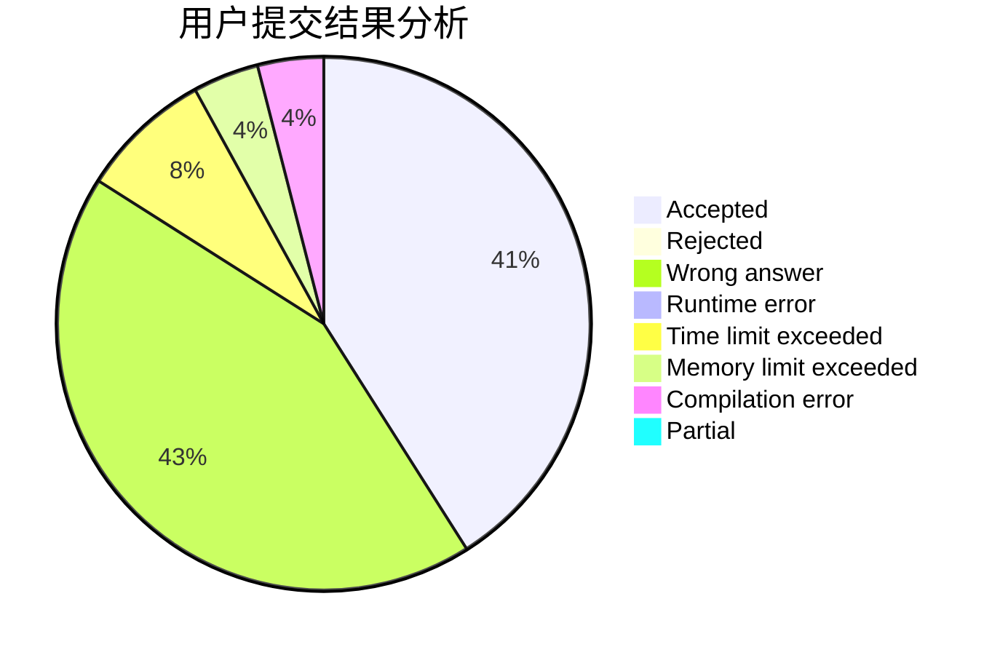
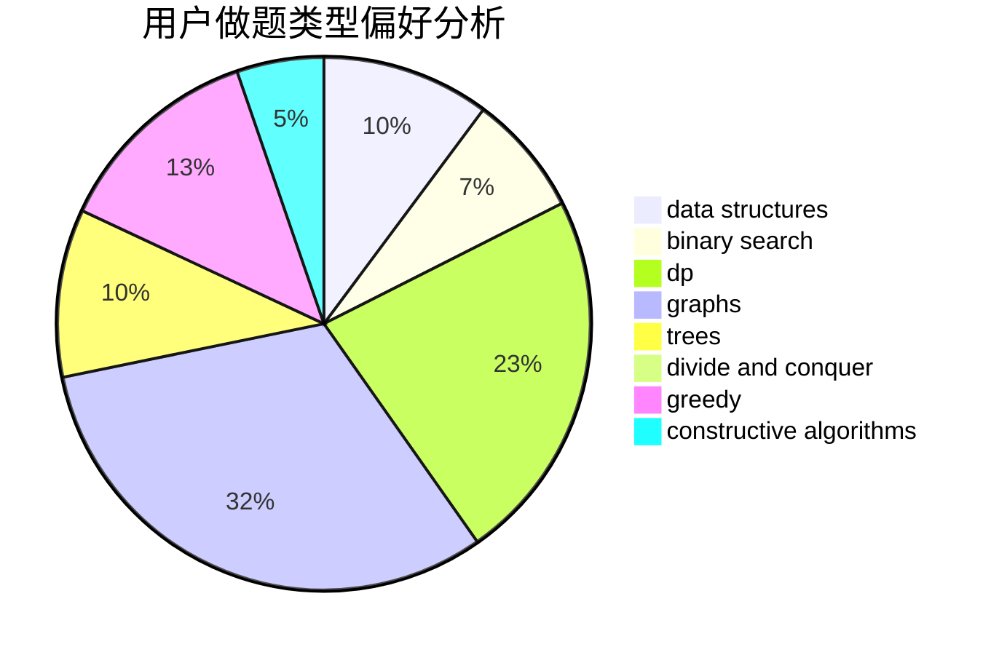
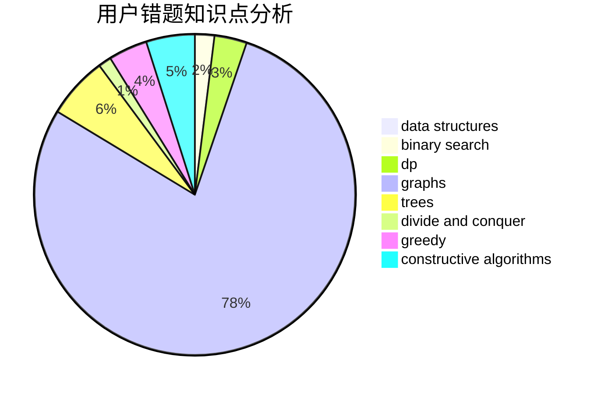

# GavinZheng

<!-- tabs:start -->

#### **用户提交结果分析**

#### **用户做题类型偏好分析**

#### **用户错题知识点分析**

<!-- tabs:end -->
# 推荐题目
[1096D](https://codeforces.com/contest/1096/problem/D)		dp		  
[1065B](https://codeforces.com/contest/1065/problem/B)		constructive algorithms,
                        graphs		  
[7E](https://codeforces.com/contest/7/problem/E)		dp,
                        expression parsing,
                        implementation		  
[559D](https://codeforces.com/contest/559/problem/D)		combinatorics,
                        geometry,
                        probabilities		  
[901C](https://codeforces.com/contest/901/problem/C)		binary search,
                        data structures,
                        dfs and similar,
                        dsu,
                        graphs,
                        two pointers		  
[866C](https://codeforces.com/contest/866/problem/C)		dsu,graphs,sortings,trees		  
[897B](https://codeforces.com/contest/897/problem/B)		brute force		  
[1085G](https://codeforces.com/contest/1085/problem/G)		combinatorics,
                        data structures,
                        dp		  
[254B](https://codeforces.com/contest/254/problem/B)		brute force,
                        implementation		  
[1008E](https://codeforces.com/contest/1008/problem/E)		dsu,graphs,sortings,trees		  
