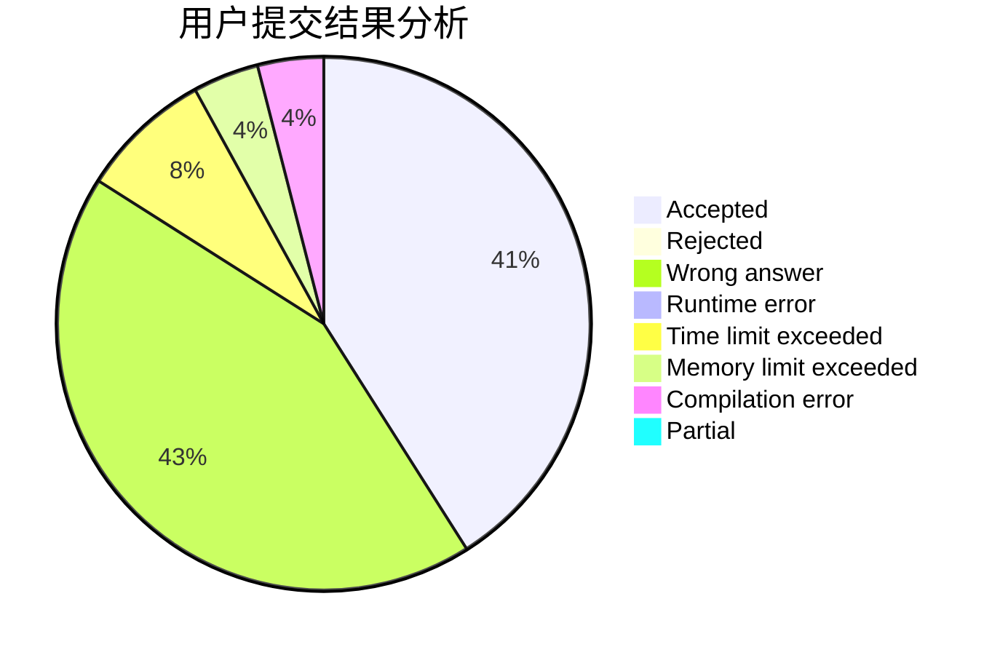
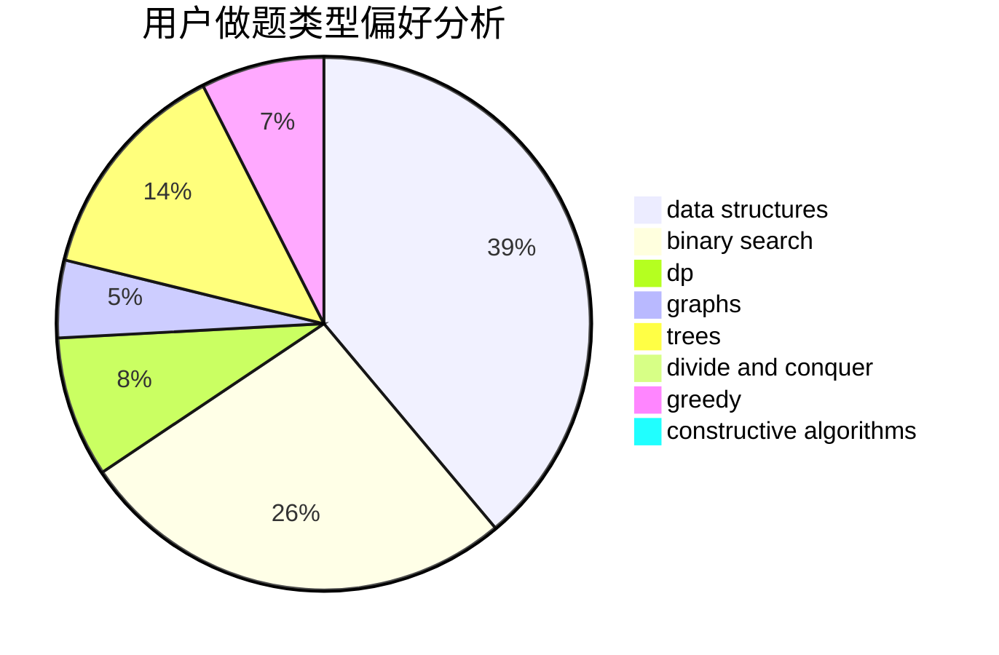
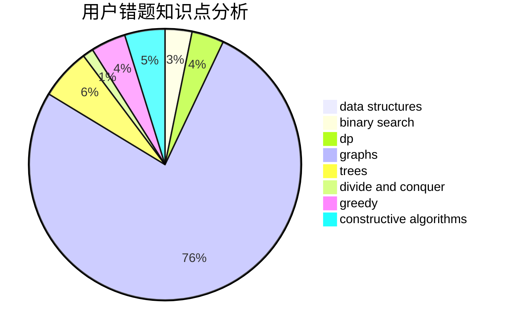

# GavinZheng

<!-- tabs:start -->

#### **用户提交结果分析**

#### **用户做题类型偏好分析**

#### **用户错题知识点分析**

<!-- tabs:end -->
# 推荐题目
[1096A](https://codeforces.com/contest/1096/problem/A)		greedy,
                        implementation,
                        math		  
[1064E](https://codeforces.com/contest/1064/problem/E)		dsu,graphs,sortings,trees		  
[782A](https://codeforces.com/contest/782/problem/A)		dsu,graphs,sortings,trees		  
[538C](https://codeforces.com/contest/538/problem/C)		binary search,
                        brute force,
                        greedy,
                        implementation,
                        math		  
[883I](https://codeforces.com/contest/883/problem/I)		binary search,
                        dp		  
[847K](https://codeforces.com/contest/847/problem/K)		greedy,
                        implementation,
                        sortings		  
[876F](https://codeforces.com/contest/876/problem/F)		dsu,graphs,sortings,trees		  
[1085B](https://codeforces.com/contest/1085/problem/B)		math		  
[232C](https://codeforces.com/contest/232/problem/C)		constructive algorithms,
                        divide and conquer,
                        dp,
                        graphs,
                        shortest paths		  
[1008B](https://codeforces.com/contest/1008/problem/B)		greedy,
                        sortings		  
